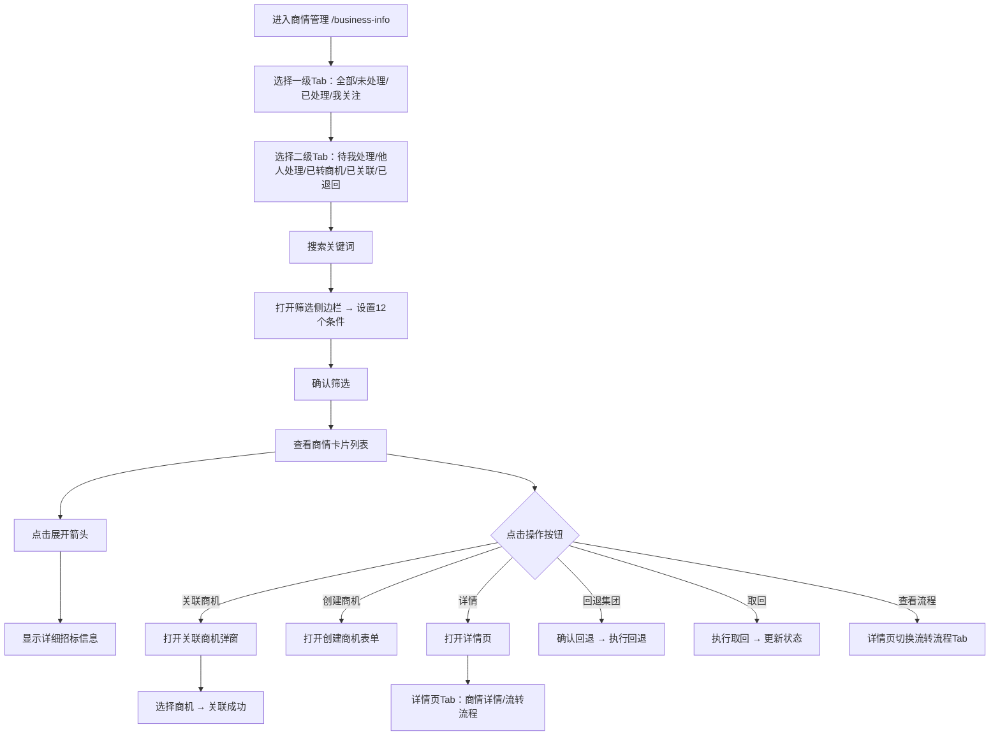

# 商情管理 Business Info PRD

## 需求背景

### 痛点
- **问题现象**：客户经理需要管理从集团派发的商情信息，包括招标信息、中标信息，需要转商机、关联商机、回退集团等操作
- **发生频率**：高
- **当前 workaround**：通过CRM系统或电话处理

### 业务目标
- **量化指标**：商情列表加载 < 1s，操作响应 < 300ms
- **目标期限**：持续可用

### 涉及系统/模块
- **模块名称**：商情管理
- **变更类型**：新增
- **对接接口**：暂无（Mock数据）

---

## 用户故事

### 故事1
- **角色**：客户经理
- **功能**：按全部/未处理/已处理/我关注的四个维度查看商情列表
- **收益**：快速找到需要处理的商情
- **验收条件**：四个Tab正确切换，数字角标显示对应数量

### 故事2
- **角色**：客户经理
- **功能**：通过关键词搜索、高级筛选（行业/状态/部门/区域/数据类型/时间/金额等）找到目标商情
- **收益**：精确定位目标商机
- **验收条件**：搜索和筛选正确过滤列表

### 故事3
- **角色**：客户经理
- **功能**：对未处理商情执行关联商机/创建商机/回退集团/取回/回退驳回操作
- **收益**：一站式处理商情全流程
- **验收条件**：未处理状态显示全部5个操作按钮

### 故事4
- **角色**：客户经理
- **功能**：展开卡片查看详细招标信息，查看详情页或流转流程
- **收益**：查看完整商情数据，了解流转历史
- **验收条件**：展开显示详细字段；详情页展示完整信息+操作按钮

---

## 需求清单

| 序号 | 需求描述 | 优先级 | 状态 | 负责人 | 截止日期 |
|------|----------|--------|------|--------|----------|
| 1    | 一级Tab（全部/未处理/已处理/我关注的） | P0 | DONE | | |
| 2    | 二级Tab（根据一级Tab动态变化） | P0 | DONE | | |
| 3    | 搜索面板 | P0 | DONE | | |
| 4    | 筛选侧边栏（12个筛选项） | P0 | DONE | | |
| 5    | 商情卡片列表（状态/标签/展开详情） | P0 | DONE | | |
| 6    | 操作按钮（关联商机/创建商机/回退集团/取回/回退驳回） | P0 | DONE | | |
| 7    | 详情页（全屏，Tab：商情详情/流转流程） | P0 | DONE | | |
| 8    | 关联商机弹窗 LinkOpportunityDialog | P0 | DONE | | |

---

## 业务流程图

---

## 页面结构

### 路由信息
- **路由路径** - 类型：文本；必填：是；示例：`/business-info`
- **页面标题** - 类型：文本；必填：是；示例：`商情管理`
- **访问权限** - 类型：枚举（登录）；描述：客户经理

### 布局结构
- **布局类型** - 类型：单栏
- **区域-顶部** - 返回按钮 + 标题 + 搜索图标 + 筛选图标 + 一级Tab栏 + 二级Tab行（横向滚动）
- **区域-搜索面板** - 搜索输入框 + 重置按钮 + 查询按钮
- **区域-筛选侧边栏** - 固定右侧，宽320px，含12个筛选项
- **区域-商情列表** - 垂直滚动的商情卡片列表
- **区域-详情页** - 全屏覆盖路由，子Tab（商情详情/流转流程）

---

## 功能描述

### 功能点1：一级Tab（全部/未处理/已处理/我关注）

#### Tab 级
- **Tab名称** - 类型：文本；示例：`全部`
- **操作按钮字段**：
  | 字段名 | 类型 | 必填 | 默认值 | 来源 | 校验规则 | 展示形式 | 交互约束 |
  |--------|------|------|--------|------|----------|----------|----------|
  | 全部 | Tab | 是 | 激活 | 预置 | - | Tab按钮+数量角标 | 点击切换 |
  | 未处理 | Tab | 是 | 未激活 | 预置 | - | Tab按钮+数量角标 | 点击切换 |
  | 已处理 | Tab | 是 | 未激活 | 预置 | - | Tab按钮+数量角标 | 点击切换 |
  | 我关注的 | Tab | 是 | 未激活 | 预置 | - | Tab按钮+数量角标 | 点击切换 |

### 功能点2：二级Tab（动态变化）

#### Tab 级
- **Tab名称** - 类型：文本；示例：根据一级Tab动态变化
- **操作按钮字段**：
  | 一级Tab | 二级Tab选项 |
  |---------|-------------|
  | 全部 | 未处理（待我处理）、未处理（他人处理）、转商机、已关联商机、已退回集团 |
  | 未处理 | 待我处理、他人处理 |
  | 已处理 | 已转商机、已关联商机、已退回集团 |
  | 我关注 | 未处理（待我处理）、未处理（他人处理）、转商机、已关联商机、已退回集团 |

### 功能点3：搜索面板

#### Tab 级
- **查询条件字段**：
  | 字段名 | 类型 | 必填 | 默认值 | 来源 | 校验规则 | 展示形式 | 交互约束 |
  |--------|------|------|--------|------|----------|----------|----------|
  | 搜索关键词 | 文本 | 否 | 空 | 用户输入 | - | 文本输入框（placeholder：商情编号、项目名称、项目编码、招标单位） | 可编辑 |
  | 重置按钮 | 按钮 | 否 | - | - | - | 灰边按钮 | 点击清空关键词 |
  | 查询按钮 | 按钮 | 否 | - | - | - | 蓝色填充按钮 | 点击执行搜索，关闭面板 |

### 功能点4：筛选侧边栏

#### 弹窗级
- **弹窗：筛选侧边栏**
  - **触发入口**：点击顶部"筛选"图标
  - **关闭方式**：遮罩层点击 / 关闭图标
  - **字段列表**：
    | 字段名 | 类型 | 必填 | 默认值 | 来源 | 校验规则 | 展示形式 | 交互约束 |
    |--------|------|------|--------|------|----------|----------|----------|
    | 行业类型 | 下拉选择 | 否 | 空 | 预置列表 | - | 下拉框（政府/医疗/教育/企业/其他） | 可编辑 |
    | 商情状态 | 复选框组 | 否 | [] | 用户选择 | - | 4个checkbox（未处理/转商机/已关联/已退回） | 多选 |
    | 管控部门 | 下拉选择 | 否 | 空 | 预置列表 | - | 下拉框（政企部/行业部/集团部） | 可编辑 |
    | 商情区域 | 文本 | 否 | 空 | 用户输入 | - | 文本输入框 | 可编辑 |
    | 数据类型 | 下拉选择 | 否 | 空 | 预置列表 | - | 下拉框（招标/中标） | 可编辑 |
    | 运营商标签 | 下拉选择 | 否 | 空 | 预置列表 | - | 下拉框（电信/移动/联通） | 可编辑 |
    | 集团派发时间-开始 | 日期 | 否 | 空 | 用户选择 | - | 日期选择器 | 可编辑 |
    | 集团派发时间-结束 | 日期 | 否 | 空 | 用户选择 | - | 日期选择器 | 可编辑 |
    | 招标/中标金额-最小 | 数字 | 否 | 空 | 用户输入 | 正数 | 数字输入框（万元） | 可编辑 |
    | 招标/中标金额-最大 | 数字 | 否 | 空 | 用户输入 | 正数 | 数字输入框（万元） | 可编辑 |
    | 招标发布时间-开始 | 日期 | 否 | 空 | 用户选择 | - | 日期选择器 | 可编辑 |
    | 招标发布时间-结束 | 日期 | 否 | 空 | 用户选择 | - | 日期选择器 | 可编辑 |
    | 中标时间-开始 | 日期 | 否 | 空 | 用户选择 | - | 日期选择器 | 可编辑 |
    | 中标时间-结束 | 日期 | 否 | 空 | 用户选择 | - | 日期选择器 | 可编辑 |
    | 当前操作步骤 | 文本 | 否 | 空 | 用户输入 | - | 文本输入框 | 可编辑 |
    | 当前操作角色 | 复选框组 | 否 | [] | 用户选择 | - | 4个checkbox（省管理员/地市管理员/区县管理员/客户经理） | 多选 |
  - **确定按钮**：关闭侧边栏，应用筛选条件
  - **重置按钮**：清空所有筛选项

### 功能点5：商情卡片

#### Tab 级
- **字段列表**：
  | 字段名 | 类型 | 必填 | 默认值 | 来源 | 校验规则 | 展示形式 | 交互约束 |
  |--------|------|------|--------|------|----------|----------|----------|
  | 项目名称 | 文本 | 是 | - | Mock数据 | - | 标题文字 | 只读 |
  | 状态标签 | 枚举 | 是 | - | Mock数据 | - | 彩色胶囊（未处理=橙/转商机=蓝/已关联=绿/已退回=灰） | 只读 |
  | 关注按钮 | 按钮 | 是 | - | - | - | 星星图标（已关注=金色填充/未关注=灰色） | 点击切换关注状态 |
  | 商情编号/项目编码 | 文本 | 是 | - | Mock数据 | - | 灰色小号文字 | 只读 |
  | 集团派发时间 | 文本 | 是 | - | Mock数据 | - | 文字时间格式 | 只读 |
  | 当前步骤+角色 | 按钮文字 | 是 | - | Mock数据 | - | "步骤名 → 角色名"，蓝色下划线，点击打开详情页流程Tab | 可点击 |
  | 关联商机信息 | 文本 | 条件 | - | Mock数据 | - | 商机名称+编码，蓝色，点击打开关联商机详情 | 只读 |
  | 区域标签 | 文本 | 是 | - | Mock数据 | - | 蓝底/绿底区域胶囊（城市+区县） | 只读 |
  | 客户经理标签 | 文本 | 是 | - | Mock数据 | - | 紫底胶囊 | 只读 |
  | 展开箭头 | 图标 | 是 | 收起 | 状态 | - | ChevronUp/Down图标 | 点击展开/收起 |
  | 数据类型（展开） | 枚举 | 条件 | - | Mock数据 | - | 招标/中标 | 只读 |
  | 金额（展开） | 数字 | 条件 | - | Mock数据 | - | 橙字加粗（万元） | 只读 |
  | 发布/开标/截至/中标时间（展开） | 日期 | 条件 | - | Mock数据 | - | 日期文字 | 只读 |
  | 招标单位（展开） | 文本 | 是 | - | Mock数据 | - | 文字 | 只读 |
  | 中标单位（展开） | 文本 | 条件 | - | Mock数据 | - | 文字 | 只读 |
  | 运营商（展开） | 文本 | 是 | - | Mock数据 | - | 文字 | 只读 |
  | 项目类型（展开） | 文本 | 是 | - | Mock数据 | - | 文字 | 只读 |
  | 管控部门（展开） | 文本 | 是 | - | Mock数据 | - | 文字 | 只读 |
  | 附件数量（展开） | 数字 | 是 | - | Mock数据 | - | 数字 | 只读 |

- **操作按钮字段**（仅未处理状态显示）：
  | 字段名 | 类型 | 必填 | 默认值 | 来源 | 校验规则 | 展示形式 | 交互约束 |
  |--------|------|------|--------|------|----------|----------|----------|
  | 关联商机 | 按钮 | 条件 | - | 状态=未处理 | - | 蓝边胶囊 | 点击打开关联商机弹窗 |
  | 创建商机 | 按钮 | 条件 | - | 状态=未处理 | - | 蓝边胶囊 | 点击创建商机 |
  | 回退集团 | 按钮 | 条件 | - | 状态=未处理 | - | 灰边胶囊 | 点击回退 |
  | 取回 | 按钮 | 条件 | - | 状态=未处理 | - | 灰边胶囊 | 点击取回 |
  | 回退驳回 | 按钮 | 条件 | - | 状态=未处理 | - | 灰边胶囊 | 点击驳回归还 |
  | 详情 | 按钮 | 是 | - | - | - | 蓝边胶囊 | 点击打开详情页 |

### 功能点6：详情页（全屏覆盖路由）

#### 页面级
- **字段：返回按钮** - 点击关闭详情页，返回列表
- **字段：子Tab** - 类型：Tab；描述：商情详情 / 流转流程
- **字段：商情详情Tab内容**：
  | 字段名 | 类型 | 必填 | 默认值 | 来源 | 校验规则 | 展示形式 | 交互约束 |
  |--------|------|------|--------|------|----------|----------|----------|
  | 基本信息区 | 字段组 | 是 | - | Mock数据 | - | 2列网格：商情编号/区域/商情名称/招标单位/金额/中标单位/开始招标时间/招标截至时间/行政市/区县/中标时间/运营商/项目编码/项目类型/管控部门 | 只读 |
  | 客户归类区 | 字段组 | 是 | - | Mock数据 | - | 2列：一级行业/二级行业 | 只读 |
  | 底部操作按钮 | 按钮组 | 条件 | - | 状态=未处理 | - | 返回/关联商机/创建商机/回退集团/取回/回退驳回 | 可点击 |

- **字段：流转流程Tab内容**：
  | 字段名 | 类型 | 必填 | 默认值 | 来源 | 校验规则 | 展示形式 | 交互约束 |
  |--------|------|------|--------|------|----------|----------|----------|
  | 时间 | 文本 | 是 | - | Mock数据 | - | 卡片顶部蓝色背景日期时间 | 只读 |
  | 操作人 | 文本 | 是 | - | Mock数据 | - | 文字 | 只读 |
  | 执行操作 | 文本 | 是 | - | Mock数据 | - | 文字 | 只读 |
  | 操作内容 | 文本 | 是 | - | Mock数据 | - | 文字 | 只读 |
  | 接收人 | 文本 | 是 | - | Mock数据 | - | 文字 | 只读 |
  | 回退原因 | 文本 | 条件 | - | Mock数据 | - | 红色文字 | 只读 |

### 功能点7：关联商机弹窗

#### 弹窗级
- **弹窗：LinkOpportunityDialog**
  - **触发入口**：点击"关联商机"按钮
  - **关闭方式**：关闭图标
  - **字段列表**：
    | 字段名 | 类型 | 必填 | 默认值 | 来源 | 校验规则 | 展示形式 | 交互约束 |
    |--------|------|------|--------|------|----------|----------|----------|
    | 商机列表 | 列表 | 是 | - | Mock数据 | - | 可选择列表项，含商机名称/编码/客户/金额 | 可点击选中 |
  - **确定按钮**：调用关联接口，成功关闭弹窗，刷新列表
  - **取消按钮**：关闭弹窗

---

## 数据流图

### 接口1：关联商机
- **请求路径** - 类型：文本；示例：`POST /api/business-info/link`
- **请求方法** - 类型：枚举（POST）
- **请求头** - Authorization
- **请求参数**：
  - `businessInfoId` - 类型：字符串；必填：是；来源：当前商情ID
  - `opportunityId` - 类型：字符串；必填：是；来源：弹窗选择的商机ID
- **响应字段**：
  - `success` - 类型：布尔；描述：是否成功
- **存储位置** - 后端数据库

### 数据刷新点
- **刷新时机** - 操作成功后
- **影响字段** - 商情列表、详情页状态

---

## 验收标准

### 正常流程
- [ ] **操作**：打开 `/business-info` → **预期**：显示一级Tab（含数字角标）、二级Tab、搜索图标、筛选图标、商情列表
- [ ] **操作**：点击"未处理"Tab → **预期**：一级Tab高亮，二级Tab切换为"待我处理/他人处理"
- [ ] **操作**：点击搜索图标 → **预期**：搜索面板滑出，输入关键词后查询，列表过滤
- [ ] **操作**：点击筛选图标 → **预期**：右侧筛选栏滑出，显示12个筛选项
- [ ] **操作**：勾选数据类型=招标后确定 → **预期**：筛选栏关闭，列表过滤为招标类型商情
- [ ] **操作**：点击卡片展开箭头 → **预期**：卡片展开，显示详细字段
- [ ] **操作**：点击"详情" → **预期**：全屏详情页打开，含商情详情Tab和流转流程Tab
- [ ] **操作**：点击"关联商机" → **预期**：关联商机弹窗打开

### 异常流程
- [ ] **操作**：不选择商机直接点确定 → **预期**：提示选择商机
- [ ] **操作**：展开后再次点击箭头 → **预期**：卡片收起

---

## 更新记录

### v1 - 2026-05-09
- 初始版本
