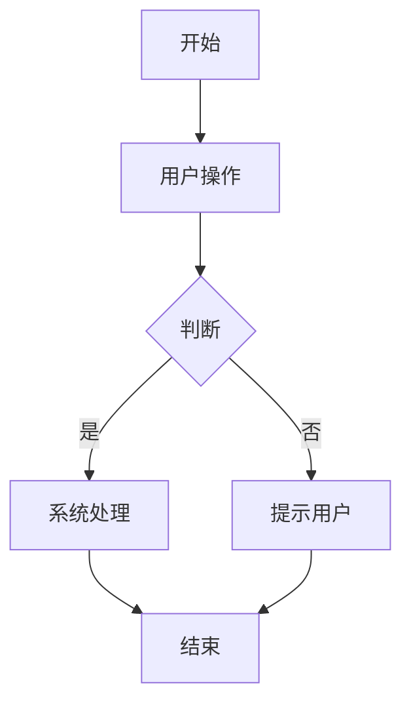

# Dashboard PRD

## 需求背景

### 痛点
- **问题现象**：
- **发生频率**：高 / 中 / 低
- **当前 workaround**：

### 业务目标
- **量化指标**：
- **目标期限**：

### 涉及系统/模块
- **模块名称**：Dashboard
- **变更类型**：新增 / 修改 / 删除 / 对接
- **对接接口**：

---

## 用户故事

### 故事1
- **角色**：
- **功能**：
- **收益**：
- **验收条件**：

---

## 需求清单

| 序号 | 需求描述 | 优先级 | 状态 | 负责人 | 截止日期 |
|------|----------|--------|------|--------|----------|
| 1    |          | P0     | TODO |        |          |

- **优先级**：P0（核心流程阻塞）/ P1（重要功能）/ P2（体验优化）/ P3（未来规划）
- **状态**：TODO / IN PROGRESS / DONE / BLOCKED

---

## 业务流程图

---

## 页面结构

### 路由信息
- **路由路径**：`/dashboard`
- **页面标题**：Dashboard
- **访问权限**：公开 / 登录 / 角色

### 布局结构
- **布局类型**：单栏 / 双栏 / 三栏
- **区域-主内容**：

### Tab 结构（如有）
- **Tab名称**：
- **Tab路由**：
- **加载方式**：预加载 / 懒加载 / keep-alive
- **默认激活**：是 / 否

---

## 功能描述

### 功能点1：{功能名称}

#### 页面级（必须有）
- **字段：功能入口** - 类型：文本；描述：
- **字段：前置条件** - 类型：文本；描述：
- **字段：后置影响** - 类型：字段列表；描述：

#### Tab 级（有 Tab 时才写此节）
- **Tab名称**：
- **查询条件字段**（有查询条件时才写）：
  | 字段名 | 类型 | 必填 | 默认值 | 来源 | 校验规则 | 展示形式 | 交互约束 |
  |--------|------|------|--------|------|----------|----------|----------|
  |        |      |      |        |      |          |          |          |
- **操作按钮字段**（有操作按钮时单独列出）：
  | 字段名 | 类型 | 必填 | 默认值 | 来源 | 校验规则 | 展示形式 | 交互约束 |
  |--------|------|------|--------|------|----------|----------|----------|
  |        |      |      |        |      |          |          |          |
- **字段列表**：
  | 字段名 | 类型 | 必填 | 默认值 | 来源 | 校验规则 | 展示形式 | 交互约束 |
  |--------|------|------|--------|------|----------|----------|----------|
  |        |      |      |        |      |          |          |          |

#### 弹窗级（有弹窗时才写此节）
- **弹窗：{弹窗名称}**
  - **触发入口**：点击 `{按钮}` 按钮打开
  - **关闭方式**：遮罩层 / 关闭图标 / 取消按钮 / Esc
  - **字段列表**：
    | 字段名 | 类型 | 必填 | 默认值 | 来源 | 校验规则 | 展示形式 | 交互约束 |
    |--------|------|------|--------|------|----------|----------|----------|
    |        |      |      |        |      |          |          |          |
  - **确定按钮**：调用 `POST /api/xxx`，成功关闭弹窗刷新列表，失败显示错误
  - **取消按钮**：关闭弹窗，不修改任何数据

---

## 数据流图

### 接口1：{接口名称}
- **请求路径**：`GET /api/xxx`
- **请求方法**：GET / POST / PUT / DELETE
- **请求头**：Authorization / Content-Type
- **请求参数**：
  - `{参数名}` - 类型：字符串；必填：是/否；来源：页面字段；校验：
- **响应字段**：
  - `{响应字段名}` - 类型：字符串/数字/数组/对象；描述：
  - `{关联字段}` - 类型：关联ID；描述：关联到
- **存储位置**：数据库表 / Redis key
- **错误码**：
  - `{错误码}` - `{用户提示}`

### 数据刷新点
- **刷新时机**：页面加载 / 操作成功后 / 定时轮询 / 手动刷新
- **影响字段**：

---

## 验收标准

### 正常流程
- [ ] **操作**：在 `{字段A}` 输入 `{合法值}` → **预期**：
- [ ] **操作**：点击 `{按钮}` → **预期**：`{弹窗名称}` 弹窗打开，各字段显示默认值
- [ ] **操作**：填写完整表单后点击确定 → **预期**：接口被调用，数据更新，提示出现

### 异常流程
- [ ] **操作**：输入 `{非法值}` → **预期**：字段下方显示红色错误提示，提交按钮置灰
- [ ] **操作**：不填写 `{必填字段}` 直接提交 → **预期**：高亮提示 `不能为空`
- [ ] **操作**：网络断开时提交 → **预期**：显示 `{网络异常提示}`
- [ ] **操作**：提交后接口返回 403 → **预期**：显示 `{无权限提示}`
- [ ] **操作**：提交后接口返回 500 → **预期**：显示 `{服务器异常}`，数据未保存

---

## 更新记录

### v1 - 2026-05-09
- 初始版本
