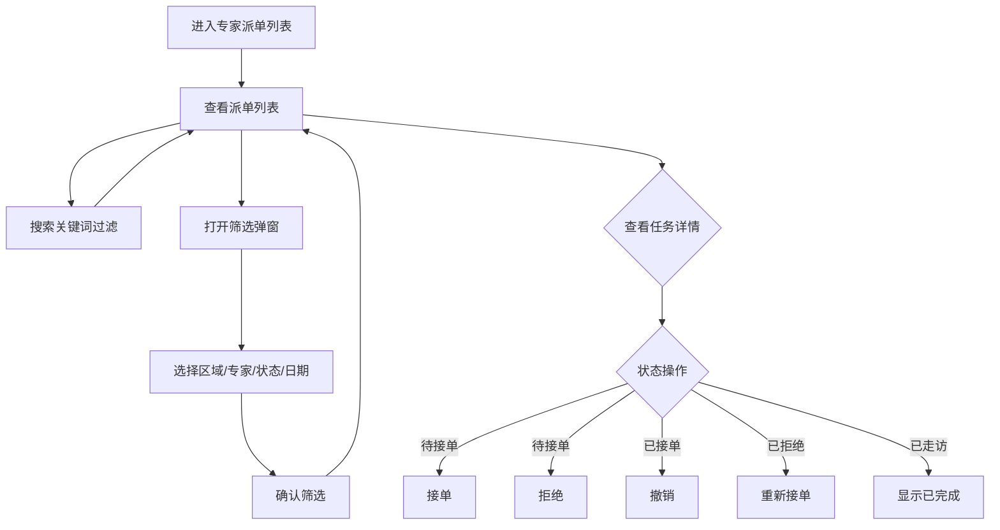

# 专家派单列表 Expert Dispatch PRD

## 需求背景

### 痛点
- **问题现象**：专家需要接收派单通知，对商机走访任务进行接单/拒绝/撤销操作
- **发生频率**：高
- **当前 workaround**：电话或线下通知

### 业务目标
- **量化指标**：派单列表加载 < 1s，状态操作响应 < 300ms
- **目标期限**：持续可用

### 涉及系统/模块
- **模块名称**：专家派单列表
- **变更类型**：新增
- **对接接口**：暂无（Mock数据）

---

## 用户故事

### 故事1
- **角色**：专家（技术支撑人员）
- **功能**：查看自己被派发的商机走访任务列表，按区域/专家/状态/日期筛选
- **收益**：快速找到待处理任务，提高响应效率
- **验收条件**：列表展示派单卡片，含商机信息、客户信息、派单专家、派单时间

### 故事2
- **角色**：专家
- **功能**：对派单任务进行接单/拒绝/撤销操作
- **收益**：在线处理任务分配，无需电话确认
- **验收条件**：待接单状态显示接单+拒绝按钮；已接单显示撤销；已拒绝显示重新接单

---

## 需求清单

| 序号 | 需求描述 | 优先级 | 状态 | 负责人 | 截止日期 |
|------|----------|--------|------|--------|----------|
| 1    | 搜索栏（商机名称/专家名称） | P0 | DONE | | |
| 2    | 筛选条件弹窗（区域/专家名称/状态/日期范围） | P0 | DONE | | |
| 3    | 派单卡片列表（4种状态展示） | P0 | DONE | | |
| 4    | 操作按钮（接单/拒绝/撤销/重新接单） | P0 | DONE | | |

---

## 业务流程图

---

## 页面结构

### 路由信息
- **路由路径** - 类型：文本；必填：是；示例：`/expert-dispatch`
- **页面标题** - 类型：文本；必填：是；示例：`专家派单列表`
- **访问权限** - 类型：枚举（登录）；描述：专家角色

### 布局结构
- **布局类型** - 类型：单栏
- **区域-顶部** - 返回按钮 + 标题 + 搜索栏 + 筛选按钮行
- **区域-派单列表** - 垂直滚动的派单卡片列表
- **区域-筛选弹窗** - 底部弹出的筛选条件选择面板

### Tab 结构
- 无 Tab

---

## 功能描述

### 功能点1：搜索栏

#### 页面级
- **字段：搜索输入框** - 类型：文本；描述：placeholder"搜索商机名称或专家名称"
- **字段：搜索图标** - 类型：图标；描述：Search图标，灰色

### 功能点2：筛选条件

#### 页面级
- **查询条件字段**：
  | 字段名 | 类型 | 必填 | 默认值 | 来源 | 校验规则 | 展示形式 | 交互约束 |
  |--------|------|------|--------|------|----------|----------|----------|
  | 区域筛选 | 按钮 | 否 | 未选中 | 用户选择 | - | MapPin图标+文字胶囊 | 点击打开弹窗 |
  | 专家名称筛选 | 按钮 | 否 | 未选中 | 用户选择 | - | User图标+文字胶囊 | 点击打开弹窗 |
  | 派单状态筛选 | 按钮 | 否 | 未选中 | 用户选择 | - | FileText图标+文字胶囊 | 点击打开弹窗 |
  | 派单日期筛选 | 按钮 | 否 | 未选中 | 用户选择 | - | Calendar图标+文字胶囊 | 点击打开弹窗 |
  | 激活态样式 | 布尔 | 是 | false | 有筛选条件 | - | 蓝色背景+蓝色边框 | 有条件时高亮 |

### 功能点3：筛选弹窗

#### 弹窗级
- **弹窗：筛选条件选择**
  - **触发入口**：点击任意筛选按钮
  - **关闭方式**：关闭图标 / 确定按钮
  - **字段列表**：
    | 字段名 | 类型 | 必填 | 默认值 | 来源 | 校验规则 | 展示形式 | 交互约束 |
    |--------|------|------|--------|------|----------|----------|----------|
    | 区域选项 | 枚举 | 否 | 空 | 预置列表 | - | 列表按钮（镇海区/北仑区/鄞州区/海曙区/江北区） | 单选 |
    | 专家名称选项 | 枚举 | 否 | 空 | 预置列表 | - | 列表按钮（李旭峰/王连宇/杨欣怡/张三/李四/王五/赵六） | 单选 |
    | 派单状态选项 | 枚举 | 否 | 空 | 预置列表 | - | 列表按钮（待接单/已接单/已拒绝/已走访） | 单选 |
    | 开始日期 | 日期 | 否 | 空 | 用户选择 | - | 日期选择器 | 可编辑 |
    | 结束日期 | 日期 | 否 | 空 | 用户选择 | - | 日期选择器 | 可编辑 |
  - **确定按钮**：关闭弹窗，应用筛选条件，刷新列表
  - **取消按钮**：重置当前筛选项，关闭弹窗

### 功能点4：派单卡片

#### 页面级
- **字段列表**：
  | 字段名 | 类型 | 必填 | 默认值 | 来源 | 校验规则 | 展示形式 | 交互约束 |
  |--------|------|------|--------|------|----------|----------|----------|
  | 商机名称 | 文本 | 是 | - | Mock数据 | - | 标题文字 | 只读 |
  | 商机编码 | 文本 | 是 | - | Mock数据 | - | 文字标签 | 只读 |
  | 状态标签 | 枚举 | 是 | - | Mock数据 | - | 彩色胶囊（待接单=橙/已接单=蓝/已拒绝=红/已走访=绿） | 只读 |
  | 支局名称 | 文本 | 是 | - | Mock数据 | - | 灰色标签 | 只读 |
  | 派单人 | 文本 | 是 | - | Mock数据 | - | User图标+文字 | 只读 |
  | 派单专家 | 文本 | 是 | - | Mock数据 | - | User图标+文字 | 只读 |
  | 客户名称 | 文本 | 是 | - | Mock数据 | - | 文字 | 只读 |
  | 客户地址 | 文本 | 是 | - | Mock数据 | - | MapPin图标+文字 | 只读 |
  | 创建时间 | 文本 | 是 | - | Mock数据 | - | Calendar图标+文字 | 只读 |
  | 派单时间 | 文本 | 是 | - | Mock数据 | - | Calendar图标+文字 | 只读 |

- **操作按钮字段**（根据状态显示不同按钮）：
  | 字段名 | 类型 | 必填 | 默认值 | 来源 | 校验规则 | 展示形式 | 交互约束 |
  |--------|------|------|--------|------|----------|----------|----------|
  | 接单按钮 | 按钮 | 条件 | - | 状态=待接单 | - | 蓝色填充按钮 | 点击接单 |
  | 拒绝按钮 | 按钮 | 条件 | - | 状态=待接单 | - | 红色边框按钮 | 点击拒绝 |
  | 撤销按钮 | 按钮 | 条件 | - | 状态=已接单 | - | 灰色边框按钮 | 点击撤销 |
  | 重新接单按钮 | 按钮 | 条件 | - | 状态=已拒绝 | - | 蓝色填充按钮 | 点击重新接单 |
  | 已完成走访提示 | 文本 | 条件 | - | 状态=已走访 | - | 置灰居中文字 | 只读 |

---

## 数据流图

### 接口1：派单操作
- **请求路径** - 类型：文本；示例：`POST /api/dispatch/action`
- **请求方法** - 类型：枚举（POST）
- **请求头** - Authorization
- **请求参数**：
  - `id` - 类型：字符串；必填：是；来源：页面字段 `item.id`；校验：非空
  - `action` - 类型：枚举；必填：是；来源：用户操作；校验：accept/reject/cancel
- **响应字段**：
  - `success` - 类型：布尔；描述：是否成功
- **存储位置** - 后端数据库
- **错误码**：
  - `401` - 用户未登录
  - `403` - 无权限操作该派单
  - `500` - 服务器异常

### 数据刷新点
- **刷新时机** - 操作成功后（页面刷新列表）
- **影响字段** - 派单卡片状态标签、操作按钮

---

## 验收标准

### 正常流程
- [ ] **操作**：打开 `/expert-dispatch` → **预期**：显示搜索栏、4个筛选按钮、Mock派单列表
- [ ] **操作**：在搜索框输入"李旭峰" → **预期**：列表过滤为包含"李旭峰"的派单
- [ ] **操作**：点击"区域"筛选按钮 → **预期**：底部弹出筛选弹窗
- [ ] **操作**：选择"镇海区"后点确定 → **预期**：弹窗关闭，按钮变为蓝色高亮，列表过滤
- [ ] **操作**：点击"接单"按钮 → **预期**：派单状态变为已接单，显示撤销按钮

### 异常流程
- [ ] **操作**：网络断开时点击接单 → **预期**：显示错误提示，操作未生效

---

## 更新记录

### v1 - 2026-05-09
- 初始版本
