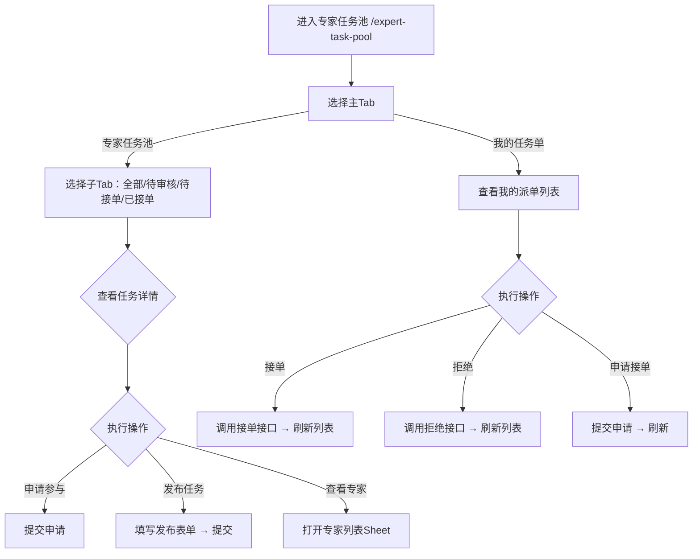

# 专家任务池 Expert Task Pool PRD

## 需求背景

### 痛点
- **问题现象**：专家和项目经理需要管理专家任务池，包括发布任务、专家列表查看、我的任务单管理
- **发生频率**：高
- **当前 workaround**：电话或线下分配

### 业务目标
- **量化指标**：任务列表加载 < 1s，发布/接单/拒绝操作响应 < 300ms
- **目标期限**：持续可用

### 涉及系统/模块
- **模块名称**：专家任务池
- **变更类型**：新增
- **对接接口**：暂无（Mock数据）

---

## 用户故事

### 故事1
- **角色**：项目经理
- **功能**：发布新任务，选择任务类型、填写任务描述、选择区域、设置时间、邀请专家
- **收益**：在线发布任务，专家在线接单，全流程可追踪
- **验收条件**：点击发布按钮弹出表单，填写完整后提交

### 故事2
- **角色**：专家
- **功能**：查看专家任务池列表，按任务状态（待审核/待接单/已接单）筛选
- **收益**：专家找到待接单任务，申请参与
- **验收条件**：列表展示任务卡片，含任务名/描述/发布时间/预计工时/类别/区域

### 故事3
- **角色**：专家/项目经理
- **功能**：管理"我的任务单"，查看派发给自己的任务，支持接单/拒绝/申请操作
- **收益**：统一管理自己参与的任务
- **验收条件**：我的任务单Tab展示派单列表，支持接单/拒绝操作

---

## 需求清单

| 序号 | 需求描述 | 优先级 | 状态 | 负责人 | 截止日期 |
|------|----------|--------|------|--------|----------|
| 1    | 主Tab（专家任务池/我的任务单） | P0 | DONE | | |
| 2    | 专家任务池子Tab（全部/待审核/待接单/已接单） | P0 | DONE | | |
| 3    | 任务卡片列表（状态/标签/详情） | P0 | DONE | | |
| 4    | 发布任务弹窗（PublishTaskForm） | P0 | DONE | | |
| 5    | 专家列表查看 | P0 | DONE | | |
| 6    | 我的任务单列表（派单/申请来源） | P0 | DONE | | |
| 7    | 接单/拒绝/申请接单操作 | P0 | DONE | | |

---

## 业务流程图

---

## 页面结构

### 路由信息
- **路由路径** - 类型：文本；必填：是；示例：`/expert-task-pool`
- **页面标题** - 类型：文本；必填：是；示例：`专家任务池`
- **访问权限** - 类型：枚举（登录）；描述：项目经理/专家

### 布局结构
- **布局类型** - 类型：单栏
- **区域-顶部** - 返回按钮 + 标题 + 主Tab栏（专家任务池/我的任务单）
- **区域-专家任务池子Tab** - 全部/待审核/待接单/已接单
- **区域-任务列表** - 垂直滚动的任务卡片
- **区域-发布任务弹窗** - 底部Sheet弹窗
- **区域-专家列表Sheet** - 右侧Sheet
- **区域-任务详情Sheet** - 右侧Sheet

---

## 功能描述

### 功能点1：主Tab（专家任务池/我的任务单）

#### 页面级
- **字段列表**：
  | 字段名 | 类型 | 必填 | 默认值 | 来源 | 校验规则 | 展示形式 | 交互约束 |
  |--------|------|------|--------|------|----------|----------|----------|
  | 专家任务池 | Tab | 是 | 激活 | 预置 | - | Tab按钮 | 点击切换 |
  | 我的任务单 | Tab | 是 | 未激活 | 预置 | - | Tab按钮 | 点击切换 |

### 功能点2：专家任务池 - 子Tab

#### Tab 级
- **Tab名称** - 类型：文本；示例：`全部`
- **操作按钮字段**：
  | 字段名 | 类型 | 必填 | 默认值 | 来源 | 校验规则 | 展示形式 | 交互约束 |
  |--------|------|------|--------|------|----------|----------|----------|
  | 全部 | Tab | 是 | 激活 | 预置 | - | Tab按钮 | 点击切换 |
  | 待审核 | Tab | 是 | 未激活 | 预置 | - | Tab按钮 | 点击切换 |
  | 待接单 | Tab | 是 | 未激活 | 预置 | - | Tab按钮 | 点击切换 |
  | 已接单 | Tab | 是 | 未激活 | 预置 | - | Tab按钮 | 点击切换 |

### 功能点3：任务卡片

#### 页面级
- **字段列表**：
  | 字段名 | 类型 | 必填 | 默认值 | 来源 | 校验规则 | 展示形式 | 交互约束 |
  |--------|------|------|--------|------|----------|----------|----------|
  | 任务名称 | 文本 | 是 | - | Mock数据 | - | 标题文字 | 只读 |
  | 状态标签 | 枚举 | 是 | - | Mock数据 | - | 彩色胶囊（待审核=黄/待接单=蓝/已接单=绿） | 只读 |
  | 描述 | 文本 | 是 | - | Mock数据 | - | 描述文字 | 只读 |
  | 发布人 | 文本 | 是 | - | Mock数据 | - | 文字 | 只读 |
  | 发布时间 | 文本 | 是 | - | Mock数据 | - | 文字时间格式 | 只读 |
  | 审核人 | 文本 | 条件 | - | Mock数据 | - | 文字 | 只读 |
  | 审核时间 | 文本 | 条件 | - | Mock数据 | - | 文字时间格式 | 只读 |
  | 预计工时 | 数字 | 是 | - | Mock数据 | - | X小时 | 只读 |
  | 类别标签 | 枚举 | 是 | - | Mock数据 | - | 彩色胶囊（营销/产数/云网/综合） | 只读 |
  | 任务类型标签 | 枚举 | 是 | - | Mock数据 | - | 彩色胶囊（走访支撑/综合支撑） | 只读 |
  | 区域 | 文本 | 是 | - | Mock数据 | - | 文字 | 只读 |
  | 需求人数 | 数字 | 是 | - | Mock数据 | - | X人 | 只读 |
  | 开始时间 | 文本 | 是 | - | Mock数据 | - | 日期文字 | 只读 |
  | 结束时间 | 文本 | 是 | - | Mock数据 | - | 日期文字 | 只读 |
  | 附件列表 | 文本数组 | 否 | [] | Mock数据 | - | 附件名称列表 | 只读 |
  | 查看专家按钮 | 按钮 | 否 | - | - | - | 胶囊按钮 | 点击打开专家列表Sheet |
  | 发布任务按钮 | 按钮 | 否 | - | - | - | 胶囊按钮 | 点击打开发布任务弹窗 |

- **操作按钮字段**：
  | 字段名 | 类型 | 必填 | 默认值 | 来源 | 校验规则 | 展示形式 | 交互约束 |
  |--------|------|------|--------|------|----------|----------|----------|
  | 申请参与 | 按钮 | 条件 | - | 状态=待接单 | - | 胶囊按钮 | 点击申请 |
  | 取消申请 | 按钮 | 条件 | - | 来源=申请中 | - | 胶囊按钮 | 点击取消 |

### 功能点4：我的任务单列表

#### 页面级
- **字段列表**：
  | 字段名 | 类型 | 必填 | 默认值 | 来源 | 校验规则 | 展示形式 | 交互约束 |
  |--------|------|------|--------|------|----------|----------|----------|
  | 任务名称 | 文本 | 是 | - | Mock数据 | - | 标题文字 | 只读 |
  | 派单人/申请人 | 文本 | 是 | - | Mock数据 | - | 文字 | 只读 |
  | 派单专家/申请人 | 文本 | 是 | - | Mock数据 | - | 文字 | 只读 |
  | 客户名称 | 文本 | 是 | - | Mock数据 | - | 文字 | 只读 |
  | 派单时间 | 文本 | 是 | - | Mock数据 | - | 文字时间格式 | 只读 |
  | 状态标签 | 枚举 | 是 | - | Mock数据 | - | 彩色胶囊（待接单=蓝/已接单=绿/已拒绝=红） | 只读 |
  | 来源标签 | 枚举 | 是 | - | Mock数据 | - | 标签（派单/申请） | 只读 |

- **操作按钮字段**：
  | 字段名 | 类型 | 必填 | 默认值 | 来源 | 校验规则 | 展示形式 | 交互约束 |
  |--------|------|------|--------|------|----------|----------|----------|
  | 接单按钮 | 按钮 | 条件 | - | 状态=待接单 | - | 胶囊按钮 | 点击接单 |
  | 拒绝按钮 | 按钮 | 条件 | - | 状态=待接单 | - | 红色胶囊按钮 | 点击拒绝 |

### 功能点5：发布任务弹窗

#### 弹窗级
- **弹窗：PublishTaskForm**
  - **触发入口**：点击"发布任务"按钮
  - **关闭方式**：关闭图标
  - **字段列表**（完整表单字段）：
    | 字段名 | 类型 | 必填 | 默认值 | 来源 | 校验规则 | 展示形式 | 交互约束 |
    |--------|------|------|--------|------|----------|----------|----------|
    | 任务名称 | 文本 | 是 | 空 | 用户输入 | 非空 | 文本输入框 | 可编辑 |
    | 任务描述 | 文本 | 是 | 空 | 用户输入 | 非空 | textarea | 可编辑 |
    | 任务类型 | 单选 | 是 | 空 | 用户选择 | 非空 | RadioGroup（走访支撑/综合支撑） | 可编辑 |
    | 任务类别 | 多选 | 是 | [] | 用户选择 | 至少选1 | Checkbox组（营销/产数/云网/综合） | 可编辑 |
    | 区域 | 下拉选择 | 是 | 空 | 用户选择 | 非空 | 下拉框 | 可编辑 |
    | 预计工时 | 数字 | 是 | 空 | 用户输入 | 正整数 | 数字输入框 | 可编辑 |
    | 需求人数 | 数字 | 是 | 空 | 用户输入 | 正整数 | 数字输入框 | 可编辑 |
    | 开始时间 | 日期 | 是 | 空 | 用户选择 | 非空 | 日期选择器 | 可编辑 |
    | 结束时间 | 日期 | 是 | 空 | 用户选择 | 非空 | 日期选择器 | 可编辑 |
    | 附件上传 | 文件数组 | 否 | [] | 用户上传 | - | 上传区域+文件列表 | 可编辑 |
    | 邀请专家 | 多选 | 否 | [] | 用户选择 | - | 专家多选列表 | 可编辑 |
  - **确定按钮**：调用发布接口，关闭弹窗，刷新列表
  - **取消按钮**：关闭弹窗

---

## 数据流图

### 接口1：发布任务
- **请求路径** - 类型：文本；示例：`POST /api/task/publish`
- **请求方法** - 类型：枚举（POST）
- **请求头** - Authorization
- **请求参数**：
  - `name` - 类型：字符串；必填：是；来源：表单字段
  - `description` - 类型：字符串；必填：是；来源：表单字段
  - `taskType` - 类型：枚举；必填：是；来源：表单字段
  - `category` - 类型：数组；必填：是；来源：表单字段
  - `region` - 类型：字符串；必填：是；来源：表单字段
  - `estimatedHours` - 类型：数字；必填：是；来源：表单字段
  - `requiredCount` - 类型：数字；必填：是；来源：表单字段
  - `startTime` - 类型：字符串；必填：是；来源：表单字段
  - `endTime` - 类型：字符串；必填：是；来源：表单字段
  - `inviteExperts` - 类型：数组；必填：否；来源：表单字段
- **响应字段**：
  - `success` - 类型：布尔；描述：是否成功
  - `taskId` - 类型：字符串；描述：新建任务ID
- **存储位置** - 后端数据库

### 接口2：接单/拒绝
- **请求路径** - 类型：文本；示例：`POST /api/task/action`
- **请求方法** - 类型：枚举（POST）
- **请求参数**：
  - `taskId` - 类型：字符串；必填：是；来源：任务ID
  - `action` - 类型：枚举；必填：是；来源：accept/reject/apply

### 数据刷新点
- **刷新时机** - 发布/接单/拒绝操作成功后
- **影响字段** - 任务列表

---

## 验收标准

### 正常流程
- [ ] **操作**：打开 `/expert-task-pool` → **预期**：显示专家任务池Tab，子Tab含4个筛选
- [ ] **操作**：点击"我的任务单" → **预期**：切换到我的任务单Tab
- [ ] **操作**：点击"发布任务" → **预期**：底部弹出发布任务Sheet表单
- [ ] **操作**：填写发布表单后提交 → **预期**：接口调用，Sheet关闭，列表刷新
- [ ] **操作**：在待接单状态点击"接单" → **预期**：状态更新为已接单

---

## 更新记录

### v1 - 2026-05-09
- 初始版本
