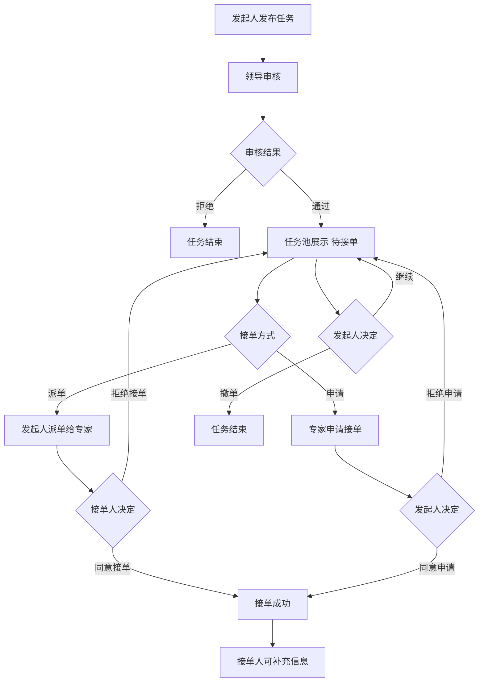
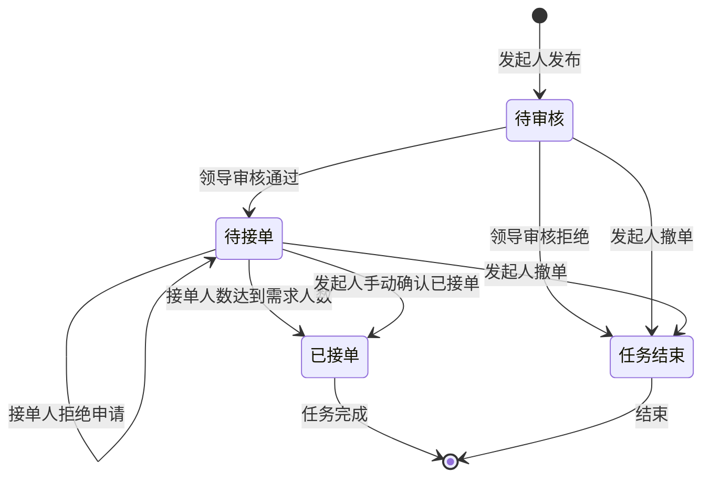

# 专家任务池 Expert Task Pool PRD

## 需求背景

### 痛点
- **问题现象**：专家和项目经理需要管理专家任务池，包括发布任务、专家列表查看、我的任务单管理；商机中也需要组队派单给专家
- **发生频率**：高
- **当前 workaround**：电话或线下分配

### 业务目标
- **量化指标**：任务列表加载 < 1s，发布/接单/拒绝操作响应 < 300ms
- **目标期限**：持续可用

### 涉及系统/模块
- **模块名称**：专家任务池，商机管理
- **变更类型**：新增/修改
- **对接接口**：暂无（Mock数据）

---

## 用户故事

### 故事1：发起任务
- **角色**：项目经理
- **功能**：发布新任务，选择任务类型、填写任务描述、选择区域、设置时间
- **收益**：在线发布任务，全流程可追踪
- **验收条件**：填写完整后提交，状态变为"待审核"

### 故事2：领导审核
- **角色**：领导
- **功能**：审核发起人提交的任务，通过或拒绝
- **收益**：领导把关任务质量
- **验收条件**：审核通过后任务进入"待接单"状态

### 故事3：任务池展示
- **角色**：项目经理/专家
- **功能**：查看待接单任务列表
- **收益**：专家找到可接单的任务
- **验收条件**：审核通过的任务在任务池中展示

### 故事4：派单给指定人
- **角色**：发起人（项目经理）
- **功能**：将任务派单给指定的专家
- **收益**：指定专家负责任务
- **验收条件**：派单后，被派单人收到通知，可选择是否接单

### 故事5：申请接单
- **角色**：任意专家
- **功能**：主动申请接单某个任务
- **收益**：专家主动争取任务
- **验收条件**：申请后，发起人可选择是否同意

### 故事6：接单成功
- **角色**：接单人/发起人
- **功能**：派单后接单人同意接单，或申请后发起人同意
- **收益**：任务有人承接
- **验收条件**：任一方同意后，状态变为"已接单"

### 故事7：补充信息
- **角色**：接单人
- **功能**：已接单的任务可补充信息、提交回单
- **收益**：任务进展可视化
- **验收条件**：可上传补充内容和附件

### 故事8：撤单
- **角色**：发起人
- **功能**：在有人接单之前，可撤消任务
- **收益**：取消不需要的任务
- **验收条件**：状态变为"已撤回"，任务从任务池移除

---

## 业务流程图

### 完整流程



### 状态流转图



---

## 页面结构

### 路由信息
- **路由路径** - 类型：文本；必填：是；示例：`/expert-task-pool`
- **页面标题** - 类型：文本；必填：是；示例：`专家任务池`
- **访问权限** - 类型：枚举（登录）；描述：项目经理/专家

### 布局结构
- **布局类型** - 类型：单栏
- **区域-顶部** - 返回按钮 + 标题 + 主Tab栏（专家任务池/我的任务单）
- **区域-专家任务池子Tab** - 全部/待审核/待接单/已接单
- **区域-我的任务单子Tab** - 我发起的任务/我接收的任务/我审核的任务
- **区域-任务列表** - 垂直滚动的任务卡片
- **区域-发布任务弹窗** - 底部Sheet弹窗
- **区域-任务详情Sheet** - 底部Sheet弹窗

---

## 功能描述

### 功能点1：主Tab

#### 页面级
- **字段列表**：
  | 字段名 | 类型 | 必填 | 默认值 | 来源 | 校验规则 | 展示形式 | 交互约束 |
  |--------|------|------|--------|------|----------|----------|----------|
  | 专家任务池 | Tab | 是 | 激活 | 预置 | - | Tab按钮 | 点击切换 |
  | 我的任务单 | Tab | 是 | 未激活 | 预置 | - | Tab按钮 | 点击切换 |

### 功能点2：专家任务池 - 子Tab

#### Tab 级
- **字段列表**：
  | 字段名 | 类型 | 必填 | 默认值 | 来源 | 校验规则 | 展示形式 | 交互约束 |
  |--------|------|------|--------|------|----------|----------|----------|
  | 全部 | Tab | 是 | 激活 | 预置 | - | Tab按钮 | 点击切换 |
  | 待审核 | Tab | 是 | 未激活 | 预置 | - | Tab按钮 | 点击切换 |
  | 待接单 | Tab | 是 | 未激活 | 预置 | - | Tab按钮 | 点击切换 |
  | 已接单 | Tab | 是 | 未激活 | 预置 | - | Tab按钮 | 点击切换 |

### 功能点3：我的任务单 - 子Tab

#### Tab 级
- **字段列表**：
  | 字段名 | 类型 | 必填 | 默认值 | 来源 | 校验规则 | 展示形式 | 交互约束 |
  |--------|------|------|--------|------|----------|----------|----------|
  | 我发起的任务 | Tab | 是 | 激活 | 预置 | - | Tab按钮 | 点击切换 |
  | 我接收的任务 | Tab | 是 | 未激活 | 预置 | - | Tab按钮 | 点击切换 |
  | 我审核的任务 | Tab | 是 | 未激活 | 预置 | - | Tab按钮 | 点击切换 |

### 功能点4：发布任务

#### 弹窗级
- **弹窗：PublishTaskDialog**
  - **触发入口**：点击"发布任务"按钮
  - **关闭方式**：关闭图标 / 取消按钮
  - **字段列表**：
    | 字段名 | 类型 | 必填 | 默认值 | 来源 | 校验规则 | 展示形式 | 交互约束 |
    |--------|------|------|--------|------|----------|----------|----------|
    | 任务名称 | 文本 | 是 | 空 | 用户输入 | 非空 | 文本输入框 | 可编辑 |
    | 任务描述 | 文本 | 是 | 空 | 用户输入 | 非空 | textarea | 可编辑 |
    | 任务分类 | 单选 | 是 | 营销 | 用户选择 | 非空 | RadioGroup | 可编辑 |
    | 专家类型 | 单选 | 是 | 综合支撑 | 用户选择 | 非空 | RadioGroup | 可编辑 |
    | 客户名称 | 文本 | 条件 | 空 | 用户输入 | 非空（走访支撑时） | 文本输入框 | 可编辑（走访支撑显示） |
    | 客户地址 | 文本 | 条件 | 空 | 用户输入 | 非空（走访支撑时） | 文本输入框 | 可编辑（走访支撑显示） |
    | 商机编码 | 文本 | 条件 | 空 | 用户输入 | 非空（走访支撑时） | 文本输入框 | 可编辑（走访支撑显示） |
    | 区域 | 文本 | 是 | 空 | 用户输入 | 非空 | 文本输入框 | 可编辑 |
    | 需求人数 | 数字 | 是 | 空 | 用户输入 | 正整数 | 数字输入框 | 可编辑 |
    | 预计工时 | 数字 | 是 | 空 | 用户输入 | 正整数 | 数字输入框 | 可编辑 |
    | 开始时间 | 日期 | 是 | 空 | 用户选择 | 非空 | 日期选择器 | 可编辑 |
    | 结束时间 | 日期 | 是 | 空 | 用户选择 | 非空 | 日期选择器 | 可编辑 |
    | 附件上传 | 文件数组 | 否 | [] | 用户上传 | - | 上传区域 | 可编辑 |
  - **确定按钮**：提交后状态变为"待审核"
  - **取消按钮**：关闭弹窗

### 功能点5：领导审核

#### 弹窗级
- **弹窗：AuditDialog**
  - **触发入口**：点击"审核通过"/"审核拒绝"按钮
  - **关闭方式**：关闭图标 / 取消按钮
  - **字段列表**：
    | 字段名 | 类型 | 必填 | 默认值 | 来源 | 校验规则 | 展示形式 | 交互约束 |
    |--------|------|------|--------|------|----------|----------|----------|
    | 通过原因/拒绝原因 | 文本 | 是 | 空 | 用户输入 | 非空 | textarea | 可编辑 |
  - **审核通过**：状态变为"待接单"，任务池展示
  - **审核拒绝**：任务结束
  - **取消按钮**：关闭弹窗

### 功能点6：派单给指定人

#### 页面级
- **字段：功能入口** - 类型：按钮；描述：任务详情页中的"派单"按钮
- **前置条件** - 类型：文本；描述：状态=待接单

#### 弹窗级
- **弹窗：SelectExpertDialog**
  - **触发入口**：点击"派单"按钮
  - **关闭方式**：关闭图标 / 取消按钮
  - **字段列表**：
    | 字段名 | 类型 | 必填 | 默认值 | 来源 | 校验规则 | 展示形式 | 交互约束 |
    |--------|------|------|--------|------|----------|----------|----------|
    | 搜索框 | 文本 | 否 | 空 | 用户输入 | - | 搜索框 | 可编辑 |
    | 专家列表 | 对象数组 | 是 | - | Mock数据 | - | 专家卡片列表（多选） | 可编辑 |
  - **确定按钮**：派单成功，被派单人状态变为"待接单"，可选择是否接单
  - **取消按钮**：关闭弹窗

### 功能点7：申请接单

#### 弹窗级
- **弹窗：ApplyConfirmDialog**
  - **触发入口**：点击"申请接单"按钮
  - **前置条件**：状态=待接单
  - **关闭方式**：关闭图标 / 取消按钮
  - **确定按钮**：申请成功，发起人可选择是否同意

### 功能点8：接单人同意/拒绝

#### 页面级
- **字段：功能入口** - 类型：按钮；描述：我接收的任务中的"接单"/"拒绝"按钮
- **前置条件** - 类型：文本；描述：来源=派单，状态=待接单

#### 操作按钮字段：
  | 字段名 | 类型 | 必填 | 默认值 | 来源 | 校验规则 | 展示形式 | 交互约束 |
  |--------|------|------|--------|------|----------|----------|----------|
  | 接单 | 按钮 | 条件 | - | 来源=派单&状态=待接单 | - | 蓝色胶囊按钮 | 点击同意，状态变为已接单 |
  | 拒绝 | 按钮 | 条件 | - | 来源=派单&状态=待接单 | - | 红色胶囊按钮 | 点击拒绝，从列表移除 |

### 功能点9：发起人同意/拒绝申请

#### 页面级
- **字段：功能入口** - 类型：按钮；描述：我发起的任务中的"同意申请"/"拒绝申请"按钮
- **前置条件** - 类型：文本；描述：来源=申请，状态=待接单

#### 操作按钮字段：
  | 字段名 | 类型 | 必填 | 默认值 | 来源 | 校验规则 | 展示形式 | 交互约束 |
  |--------|------|------|--------|------|----------|----------|----------|
  | 同意申请 | 按钮 | 条件 | - | 来源=申请&状态=待接单 | - | 绿色胶囊按钮 | 点击同意，状态变为已接单 |
  | 拒绝申请 | 按钮 | 条件 | - | 来源=申请&状态=待接单 | - | 红色胶囊按钮 | 点击拒绝，从列表移除 |

### 功能点10：补充信息

#### 弹窗级
- **弹窗：SupplementDialog**
  - **触发入口**：点击"补充信息"按钮
  - **前置条件**：状态=已接单
  - **关闭方式**：关闭图标 / 取消按钮
  - **字段列表**：
    | 字段名 | 类型 | 必填 | 默认值 | 来源 | 校验规则 | 展示形式 | 交互约束 |
    |--------|------|------|--------|------|----------|----------|----------|
    | 任务名称 | 文本 | 是 | - | 任务数据 | - | 文字 | 只读 |
    | 补充内容 | 文本 | 是 | 空 | 用户输入 | 非空 | textarea | 可编辑 |
    | 附件上传 | 文件数组 | 否 | [] | 用户上传 | - | 上传区域 | 可编辑 |
  - **确定按钮**：提交补充内容，添加到回单记录

### 功能点11：撤单

#### 页面级
- **字段：功能入口** - 类型：按钮；描述：我发起的任务中的"撤单"按钮
- **前置条件**：状态=待审核/待接单，且尚未有人接单
- **后置影响**：任务结束，从任务池移除

#### 操作按钮字段：
  | 字段名 | 类型 | 必填 | 默认值 | 来源 | 校验规则 | 展示形式 | 交互约束 |
  |--------|------|------|--------|------|----------|----------|----------|
  | 撤单 | 按钮 | 条件 | - | 状态=待审核/待接单 | - | 胶囊按钮 | 点击撤单 |

### 功能点12：筛选侧边栏

#### 弹窗级
- **弹窗：FilterSidebar**
  - **触发入口**：点击"筛选"按钮
  - **关闭方式**：遮罩层点击 / 关闭图标
  - **字段列表**：
    | 字段名 | 类型 | 必填 | 默认值 | 来源 | 校验规则 | 展示形式 | 交互约束 |
    |--------|------|------|--------|------|----------|----------|----------|
    | 任务名称 | 文本 | 否 | 空 | 用户输入 | - | 文本输入框 | 可编辑 |
    | 任务类型 | 单选 | 否 | 空 | 用户选择 | - | Select（下拉） | 可编辑 |
    | 状态 | 单选 | 否 | 空 | 用户选择 | - | Select（下拉） | 可编辑 |
    | 开始时间 | 日期 | 否 | 空 | 用户选择 | - | 日期选择器 | 可编辑 |
    | 结束时间 | 日期 | 否 | 空 | 用户选择 | - | 日期选择器 | 可编辑 |
  - **确定按钮**：应用筛选条件
  - **重置按钮**：清空筛选条件

---

## 业务逻辑说明

### 状态定义

| 状态 | 说明 | 可执行操作 |
|------|------|-----------|
| 待审核 | 任务刚发布，等待领导审核 | 领导：审核通过/审核拒绝；发起人：撤单 |
| 待接单 | 审核通过，等待有人接单 | 发起人：派单/撤单；专家：申请接单 |
| 已接单 | 接单人数达到需求人数，或发起人手动确认 | 接单人：补充信息 |
| 任务结束 | 审核拒绝/撤单/任务完成 | 无 |

### 接单人状态（TaskMember.status）

| 状态 | 说明 | 触发场景 |
|------|------|----------|
| 待派单 | 发起人已派单，等待确认 | 派单后自动 |
| 申请接单 | 专家已提交申请 | 申请后自动 |
| 已接单 | 已正式接单 | 对方同意后 |
| 已拒绝 | 拒绝接单/被拒绝 | 拒绝操作 |

### 接单规则
- 派单场景：被派单人同意后变为"已接单"，拒绝后从成员列表移除
- 申请场景：发起人同意后变为"已接单"，拒绝后从成员列表移除
- 接单人数量达到任务设置的"需求人数"时，任务整体状态变为"已接单"

### 接单方式

#### 方式一：派单
1. 发起人在任务详情中点击"派单"
2. 选择专家后确认
3. 被派单人收到通知，可选择"接单"或"拒绝"
4. 拒绝：派单取消，任务回到"待接单"状态
5. 接单：接单人数量增加，若达到需求人数则自动变为"已接单"

#### 方式二：申请
1. 专家在任务池点击"申请接单"
2. 发起人在"我发起的任务"中看到申请
3. 发起人选择"同意"或"拒绝"
4. 拒绝：申请取消，任务回到"待接单"状态，其他专家可继续申请
5. 同意：接单人数量增加，若达到需求人数则自动变为"已接单"

### 派单与申请的区别

| 对比项 | 派单 | 申请 |
|--------|------|------|
| 发起方 | 发起人主动指定专家 | 专家主动申请 |
| 同意方 | 被派单人选择接单或拒绝 | 发起人选择同意或拒绝 |
| 来源标识 | 显示"邀请单"标签 | 显示"申请单"标签 |

### 撤单规则
- 发起人可以在"待审核"或"待接单"状态下撤单
- 撤单后任务从所有列表中移除
- 已有人接单后不能再撤单

---

## 数据结构

### Task 任务对象
```typescript
interface Task {
  id: string;                    // 任务ID
  name: string;                  // 任务名称
  description: string;           // 任务描述
  status: '待审核' | '待接单' | '已接单';  // 任务状态
  publisher: string;            // 发布人
  publishTime: string;           // 发布时间
  auditor?: string;             // 审核人
  auditTime?: string;           // 审核时间
  estimatedHours: number;       // 预计工时
  category: '营销' | '产数' | '云网' | '综合';  // 任务分类
  taskType?: '走访支撑' | '综合支撑';  // 任务类型
  region: string;               // 区域
  requiredCount: number;        // 需求人数
  startTime: string;           // 开始时间
  endTime: string;             // 结束时间
  attachments: string[];       // 附件列表
  members: TaskMember[];        // 接单人列表
  customerName?: string;         // 客户名称（走访支撑）
  customerAddress?: string;      // 客户地址（走访支撑）
  opportunityCode?: string;    // 商机编码（走访支撑）
}
```

### TaskMember 接单人员
```typescript
interface TaskMember {
  id: string;                  // 人员ID
  name: string;                 // 姓名
  phone: string;                // 电话
  department: string;           // 部门
  status: '待派单' | '待接单' | '申请接单' | '已接单';  // 状态
  source: '邀请派单' | '申请接单';  // 来源
  dispatchTime?: string;        // 派单时间
  acceptTime?: string;          // 接单时间
  applyTime?: string;           // 申请时间
  actualStartTime?: string;     // 实际开始时间
  actualEndTime?: string;       // 实际结束时间
  reports?: Report[];           // 回单记录
}

interface Report {
  time: string;                // 回单时间
  description: string;         // 回单内容
  attachments?: string[];      // 回单附件
}
```

### DispatchItem 我的任务单项（个人视角）
```typescript
interface DispatchItem {
  id: string;                  // ID
  taskName: string;             // 任务名称
  description?: string;         // 描述
  publisher: string;           // 发布人
  expertName: string;          // 专家名称
  customerName: string;         // 客户名称
  customerAddress: string;      // 客户地址
  createTime: string;          // 创建时间
  dispatchTime: string;        // 派单时间
  status: '待派单' | '待接单' | '已接单' | '已拒绝';  // 个人接单状态
  // 待派单：收到派单，等待确认
  // 待接单：申请后等待发起人同意
  // 已接单：已确认接单
  // 已拒绝：拒绝接单/被拒绝
  area: string;                // 区域
  estimatedHours: number;       // 预计工时
  category?: string;            // 分类
  taskType?: string;            // 类型
  region?: string;             // 区域
  requiredCount?: number;       // 需求人数
  startTime?: string;         // 开始时间
  endTime?: string;           // 结束时间
  customerCode?: string;       // 客户编码
  members?: TaskMember[];       // 接单人列表
  source: 'dispatch' | 'apply';  // 来源：派单/申请
  auditor?: string;            // 审核人
  auditTime?: string;          // 审核时间
}
```

---

## 接口说明

### 接口1：发布任务
- **请求路径**：`POST /api/task/publish`
- **请求方法**：POST
- **请求头**：Authorization
- **请求参数**：
  | 参数名 | 类型 | 必填 | 来源 | 说明 |
  |--------|------|------|------|------|
  | name | string | 是 | 表单 | 任务名称 |
  | description | string | 是 | 表单 | 任务描述 |
  | taskType | string | 是 | 表单 | 任务类型（走访支撑/综合支撑） |
  | category | string | 是 | 表单 | 任务分类（营销/产数/云网/综合） |
  | region | string | 是 | 表单 | 区域 |
  | estimatedHours | number | 是 | 表单 | 预计工时 |
  | requiredCount | number | 是 | 表单 | 需求人数 |
  | startTime | string | 是 | 表单 | 开始时间 |
  | endTime | string | 是 | 表单 | 结束时间 |
  | customerName | string | 否 | 表单 | 客户名称（走访支撑时必填） |
  | customerAddress | string | 否 | 表单 | 客户地址（走访支撑时必填） |
  | opportunityCode | string | 否 | 表单 | 商机编码（走访支撑时必填） |
- **响应**：
  ```json
  {
    "success": true,
    "taskId": "task_xxx"
  }
  ```
- **存储位置**：数据库表 `task`

### 接口2：审核任务
- **请求路径**：`POST /api/task/audit`
- **请求方法**：POST
- **请求参数**：
  | 参数名 | 类型 | 必填 | 来源 | 说明 |
  |--------|------|------|------|------|
  | taskId | string | 是 | 任务ID | 任务ID |
  | action | string | 是 | 操作 | approve/reject |
  | reason | string | 否 | 表单 | 通过/拒绝原因 |
- **响应**：
  ```json
  { "success": true }
  ```
- **存储位置**：数据库表 `task`

### 接口3：派单
- **请求路径**：`POST /api/task/dispatch`
- **请求方法**：POST
- **请求参数**：
  | 参数名 | 类型 | 必填 | 来源 | 说明 |
  |--------|------|------|------|------|
  | taskId | string | 是 | 任务ID | 任务ID |
  | expertIds | string[] | 是 | 选择 | 专家ID列表 |
- **响应**：
  ```json
  { "success": true }
  ```
- **存储位置**：数据库表 `task_member`

### 接口4：申请接单
- **请求路径**：`POST /api/task/apply`
- **请求方法**：POST
- **请求参数**：
  | 参数名 | 类型 | 必填 | 来源 | 说明 |
  |--------|------|------|------|------|
  | taskId | string | 是 | 任务ID | 任务ID |
- **响应**：
  ```json
  { "success": true }
  ```
- **存储位置**：数据库表 `task_member`

### 接口5：接单/拒绝（派单方）
- **请求路径**：`POST /api/task/accept`
- **请求方法**：POST
- **请求参数**：
  | 参数名 | 类型 | 必填 | 来源 | 说明 |
  |--------|------|------|------|------|
  | taskId | string | 是 | 任务ID | 任务ID |
  | memberId | string | 是 | 成员ID | 接单人ID |
  | action | string | 是 | 操作 | accept/reject |
- **响应**：
  ```json
  { "success": true }
  ```
- **存储位置**：数据库表 `task_member`

### 接口6：同意/拒绝申请（发起方）
- **请求路径**：`POST /api/task/approve-apply`
- **请求方法**：POST
- **请求参数**：
  | 参数名 | 类型 | 必填 | 来源 | 说明 |
  |--------|------|------|------|------|
  | taskId | string | 是 | 任务ID | 任务ID |
  | memberId | string | 是 | 成员ID | 申请人ID |
  | action | string | 是 | 操作 | approve/reject |
- **响应**：
  ```json
  { "success": true }
  ```
- **存储位置**：数据库表 `task_member`

### 接口7：撤单
- **请求路径**：`POST /api/task/cancel`
- **请求方法**：POST
- **请求参数**：
  | 参数名 | 类型 | 必填 | 来源 | 说明 |
  |--------|------|------|------|------|
  | taskId | string | 是 | 任务ID | 任务ID |
- **响应**：
  ```json
  { "success": true }
  ```
- **存储位置**：数据库表 `task`

### 接口8：补充信息
- **请求路径**：`POST /api/task/supplement`
- **请求方法**：POST
- **请求参数**：
  | 参数名 | 类型 | 必填 | 来源 | 说明 |
  |--------|------|------|------|------|
  | taskId | string | 是 | 任务ID | 任务ID |
  | content | string | 是 | 表单 | 补充内容 |
  | attachments | string[] | 否 | 表单 | 附件列表 |
- **响应**：
  ```json
  { "success": true }
  ```
- **存储位置**：数据库表 `task_report`

### 数据刷新点
- **刷新时机**：发布/审核/派单/申请/接单/拒绝/撤单/补充操作成功后
- **影响字段**：任务列表

---

## 验收标准

### 正常流程
- [ ] **操作**：发起人打开专家任务池，点击"发布任务" → **预期**：底部弹出发布任务Sheet表单
- [ ] **操作**：填写完整表单后点击"发布" → **预期**：任务创建成功，状态=待审核，出现在"我发起的任务"中
- [ ] **操作**：领导在"我审核的任务"中点击"审核通过" → **预期**：任务状态变为待接单，出现在任务池
- [ ] **操作**：发起人在"我发起的任务"中点击"派单" → **预期**：打开选人弹窗，选择专家后派单
- [ ] **操作**：接单人在"我接收的任务"中点击"接单" → **预期**：任务状态变为已接单
- [ ] **操作**：专家在任务池点击"申请接单" → **预期**：申请成功，发起人可选择是否同意
- [ ] **操作**：发起人点击"同意申请" → **预期**：任务状态变为已接单
- [ ] **操作**：接单人点击"补充信息" → **预期**：打开补充信息弹窗，可提交回单
- [ ] **操作**：发起人在有人接单之前点击"撤单" → **预期**：任务结束，从列表移除

### 异常流程
- [ ] **操作**：不填写必填字段直接提交 → **预期**：提示"不能为空"
- [ ] **操作**：派单后接单人点击"拒绝" → **预期**：任务回到待接单状态，发起人可重新派单
- [ ] **操作**：申请后发起人点击"拒绝申请" → **预期**：任务回到待接单状态，其他专家可继续申请
- [ ] **操作**：已有人接单后点击"撤单" → **预期**：按钮不显示或提示"已有人接单，无法撤单"

---

## 更新记录

### v5 - 2026-05-21
- 修正状态定义：移除"待派单"状态，任务状态只有待审核/待接单/已接单
- 明确已接单触发条件：接单人数达到需求人数 或 发起人手动确认
- 补充接单人状态说明（TaskMember.status）

### v4 - 2026-05-21
- 补充完整业务流程图（状态流转图）
- 补充业务逻辑说明（状态定义、接单方式、派单与申请区别、撤单规则）
- 补充完整接口说明（8个接口）

### v3 - 2026-05-21
- 补充完整业务流程图（发起→审核→派单/申请→任一方同意→接单成功）
- 明确派单和申请两种接单方式的差异
- 派单：接单人选择是否接单（只需接单人同意）
- 申请：发起人选择是否同意（只需发起人同意）
- 撤单时机：有人接单之前
- 补充回单记录数据结构

### v2 - 2026-05-21
- 补充功能点7-13的弹窗组件描述
- 补充数据结构定义（Task、TaskMember、DispatchItem）
- 补充"我审核的任务"Tab功能

### v1 - 2026-05-09
- 初始版本