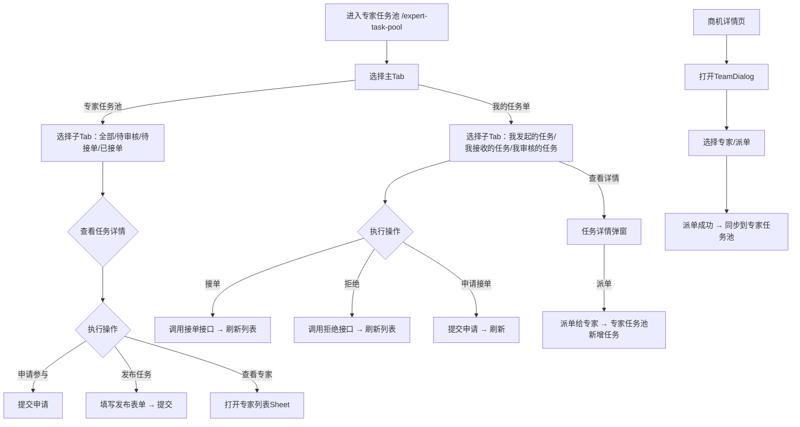

# 专家任务池 Expert Task Pool PRD

## 需求背景

### 痛点
- **问题现象**：专家和项目经理需要管理专家任务池，包括发布任务、专家列表查看、我的任务单管理；商机中也需要组队派单给专家
- **发生频率**：高
- **当前 workaround**：电话或线下分配

### 业务目标
- **量化指标**：任务列表加载 < 1s，发布/接单/拒绝操作响应 < 300ms
- **目标期限**：持续可用

### 涉及系统/模块
- **模块名称**：专家任务池、商机管理
- **变更类型**：新增/修改
- **对接接口**：暂无（Mock数据）

---

## 用户故事

### 故事1
- **角色**：项目经理
- **功能**：发布新任务，选择任务类型、填写任务描述、选择区域、设置时间、邀请专家
- **收益**：在线发布任务，专家在线接单，全流程可追踪
- **验收条件**：点击发布按钮弹出表单，填写完整后提交

### 故事2
- **角色**：专家
- **功能**：查看专家任务池列表，按任务状态（待审核/待接单/已接单）筛选
- **收益**：专家找到待接单任务，申请参与
- **验收条件**：列表展示任务卡片，含任务名/描述/发布时间/预计工时/类别/区域

### 故事3
- **角色**：专家/项目经理
- **功能**：管理"我的任务单"，查看派发给自己的任务，支持接单/拒绝/申请操作
- **收益**：统一管理自己参与的任务
- **验收条件**：我的任务单Tab展示派单列表，支持接单/拒绝操作

### 故事4
- **角色**：客户经理
- **功能**：在商机详情页中组建团队、派单给专家
- **收益**：商机商机中可直接派单给专家，专家任务池同步展示
- **验收条件**：商机详情页组队派单后，任务同步到专家任务池

---

## 需求清单

| 序号 | 需求描述 | 优先级 | 状态 | 负责人 | 截止日期 |
|------|----------|--------|------|--------|----------|
| 1    | 主Tab（专家任务池/我的任务单） | P0 | DONE | | |
| 2    | 专家任务池子Tab（全部/待审核/待接单/已接单） | P0 | DONE | | |
| 3    | 我的任务单子Tab（我发起的任务/我接收的任务/我审核的任务） | P0 | DONE | | |
| 4    | 任务卡片列表（状态/标签/详情） | P0 | DONE | | |
| 5    | 发布任务弹窗（PublishTaskDialog） | P0 | DONE | | |
| 6    | 任务详情弹窗（TaskDetailDialog） | P0 | DONE | | |
| 7    | 审核弹窗（AuditDialog） | P0 | DONE | | |
| 8    | 选人弹窗（SelectExpertDialog） | P0 | DONE | | |
| 9    | 参与详情弹窗（ParticipateDialog） | P0 | DONE | | |
| 10   | 补充信息弹窗（SupplementDialog） | P0 | DONE | | |
| 11   | 筛选侧边栏（FilterSidebar） | P0 | DONE | | |
| 12   | 商机中组队派单（TeamDialog） | P0 | DONE | | |
| 13   | 商机派单同步到专家任务池 | P0 | DONE | | |

---

## 业务流程图



---

## 页面结构

### 路由信息
- **路由路径** - 类型：文本；必填：是；示例：`/expert-task-pool`
- **页面标题** - 类型：文本；必填：是；示例：`专家任务池`
- **访问权限** - 类型：枚举（登录）；描述：项目经理/专家

### 布局结构
- **布局类型** - 类型：单栏
- **区域-顶部** - 返回按钮 + 标题 + 主Tab栏（专家任务池/我的任务单）
- **区域-专家任务池子Tab** - 全部/待审核/待接单/已接单
- **区域-我的任务单子Tab** - 我发起的任务/我接收的任务/我审核的任务
- **区域-任务列表** - 垂直滚动的任务卡片
- **区域-发布任务弹窗** - 底部Sheet弹窗
- **区域-专家列表Sheet** - 右侧Sheet
- **区域-任务详情Sheet** - 底部Sheet弹窗

### Tab 结构
- **Tab名称** - 类型：文本；示例：`专家任务池`
- **Tab路由** - 类型：文本；描述：切换到该 Tab 的 URL 参数
- **加载方式** - 类型：枚举（预加载）
- **默认激活** - 类型：布尔；描述：首次进入时默认激活

---

## 功能描述

### 功能点1：主Tab（专家任务池/我的任务单）

#### 页面级
- **字段：功能入口** - 类型：文本；描述：页面顶部Tab切换
- **字段列表**：
  | 字段名 | 类型 | 必填 | 默认值 | 来源 | 校验规则 | 展示形式 | 交互约束 |
  |--------|------|------|--------|------|----------|----------|----------|
  | 专家任务池 | Tab | 是 | 激活 | 预置 | - | Tab按钮 | 点击切换 |
  | 我的任务单 | Tab | 是 | 未激活 | 预置 | - | Tab按钮 | 点击切换 |

### 功能点2：专家任务池 - 子Tab

#### Tab 级
- **Tab名称** - 类型：文本；示例：`全部`
- **操作按钮字段**：
  | 字段名 | 类型 | 必填 | 默认值 | 来源 | 校验规则 | 展示形式 | 交互约束 |
  |--------|------|------|--------|------|----------|----------|----------|
  | 全部 | Tab | 是 | 激活 | 预置 | - | Tab按钮 | 点击切换 |
  | 待审核 | Tab | 是 | 未激活 | 预置 | - | Tab按钮 | 点击切换 |
  | 待接单 | Tab | 是 | 未激活 | 预置 | - | Tab按钮 | 点击切换 |
  | 已接单 | Tab | 是 | 未激活 | 预置 | - | Tab按钮 | 点击切换 |

### 功能点3：我的任务单 - 子Tab

#### Tab 级
- **Tab名称** - 类型：文本；示例：`我发起的任务`
- **操作按钮字段**：
  | 字段名 | 类型 | 必填 | 默认值 | 来源 | 校验规则 | 展示形式 | 交互约束 |
  |--------|------|------|--------|------|----------|----------|----------|
  | 我发起的任务 | Tab | 是 | 激活 | 预置 | - | Tab按钮 | 点击切换 |
  | 我接收的任务 | Tab | 是 | 未激活 | 预置 | - | Tab按钮 | 点击切换 |
  | 我审核的任务 | Tab | 是 | 未激活 | 预置 | - | Tab按钮 | 点击切换 |

### 功能点4：任务卡片

#### 页面级
- **字段列表**：
  | 字段名 | 类型 | 必填 | 默认值 | 来源 | 校验规则 | 展示形式 | 交互约束 |
  |--------|------|------|--------|------|----------|----------|----------|
  | 任务名称 | 文本 | 是 | - | Mock数据 | - | 标题文字 | 只读 |
  | 状态标签 | 枚举 | 是 | - | Mock数据 | - | 彩色胶囊（待审核=黄/待接单=蓝/已接单=绿） | 只读 |
  | 描述 | 文本 | 是 | - | Mock数据 | - | 描述文字 | 只读 |
  | 发布人 | 文本 | 是 | - | Mock数据 | - | 文字 | 只读 |
  | 发布时间 | 文本 | 是 | - | Mock数据 | - | 文字时间格式 | 只读 |
  | 审核人 | 文本 | 条件 | - | Mock数据 | - | 文字 | 只读 |
  | 审核时间 | 文本 | 条件 | - | Mock数据 | - | 文字时间格式 | 只读 |
  | 预计工时 | 数字 | 是 | - | Mock数据 | - | X人/天 | 只读 |
  | 类别标签 | 枚举 | 是 | - | Mock数据 | - | 彩色胶囊（营销/产数/云网/综合） | 只读 |
  | 任务类型标签 | 枚举 | 是 | - | Mock数据 | - | 彩色胶囊（走访支撑/综合支撑） | 只读 |
  | 区域 | 文本 | 是 | - | Mock数据 | - | 文字 | 只读 |
  | 需求人数 | 数字 | 是 | - | Mock数据 | - | X人 | 只读 |
  | 开始时间 | 文本 | 是 | - | Mock数据 | - | 日期文字 | 只读 |
  | 结束时间 | 文本 | 是 | - | Mock数据 | - | 日期文字 | 只读 |
  | 附件列表 | 文本数组 | 否 | [] | Mock数据 | - | 附件名称列表 | 只读 |
  | 客户名称 | 文本 | 条件 | - | Mock数据 | - | 文字 | 只读（走访支撑类型显示） |
  | 客户地址 | 文本 | 条件 | - | Mock数据 | - | 文字 | 只读（走访支撑类型显示） |
  | 商机编码 | 文本 | 条件 | - | Mock数据 | - | 文字 | 只读（走访支撑类型显示） |
  | 来源标签 | 枚举 | 条件 | - | Mock数据 | - | 标签（邀请单/申请单） | 只读（我接收的任务显示） |

- **操作按钮字段**：
  | 字段名 | 类型 | 必填 | 默认值 | 来源 | 校验规则 | 展示形式 | 交互约束 |
  |--------|------|------|--------|------|----------|----------|----------|
  | 申请参与 | 按钮 | 条件 | - | 状态=待接单 | - | 胶囊按钮 | 点击申请 |
  | 申请接单 | 按钮 | 条件 | - | 来源=申请单&状态=待接单 | - | 胶囊按钮 | 点击接单 |
  | 接单 | 按钮 | 条件 | - | 来源=邀请单&状态=待接单 | - | 胶囊按钮 | 点击接单 |
  | 拒绝 | 按钮 | 条件 | - | 来源=邀请单&状态=待接单 | - | 红色胶囊按钮 | 点击拒绝 |
  | 派单 | 按钮 | 条件 | - | 状态=待接单 | - | 胶囊按钮 | 点击派单 |
  | 撤单 | 按钮 | 条件 | - | 状态=待审核/待接单 | - | 胶囊按钮 | 点击撤单 |
  | 审核通过 | 按钮 | 条件 | - | 状态=待审核&我审核的任务 | - | 绿色胶囊按钮 | 点击通过 |
  | 审核拒绝 | 按钮 | 条件 | - | 状态=待审核&我审核的任务 | - | 红色胶囊按钮 | 点击拒绝 |
  | 补充信息 | 按钮 | 条件 | - | 状态=已接单 | - | 绿色胶囊按钮 | 点击补充 |

### 功能点5：发布任务弹窗

#### 弹窗级
- **弹窗：PublishTaskDialog**
  - **触发入口**：点击"发布任务"按钮
  - **关闭方式**：关闭图标 / 取消按钮
  - **字段列表**：
    | 字段名 | 类型 | 必填 | 默认值 | 来源 | 校验规则 | 展示形式 | 交互约束 |
    |--------|------|------|--------|------|----------|----------|----------|
    | 任务名称 | 文本 | 是 | 空 | 用户输入 | 非空 | 文本输入框 | 可编辑 |
    | 任务描述 | 文本 | 是 | 空 | 用户输入 | 非空 | textarea | 可编辑 |
    | 任务分类 | 单选 | 是 | 营销 | 用户选择 | 非空 | RadioGroup（营销/产数/云网/综合） | 可编辑 |
    | 专家类型 | 单选 | 是 | 综合支撑 | 用户选择 | 非空 | RadioGroup（走访支撑/综合支撑） | 可编辑 |
    | 客户名称 | 文本 | 条件 | 空 | 用户输入 | 非空（走访支撑时） | 文本输入框 | 可编辑（走访支撑显示） |
    | 客户地址 | 文本 | 条件 | 空 | 用户输入 | 非空（走访支撑时） | 文本输入框 | 可编辑（走访支撑显示） |
    | 商机编码 | 文本 | 条件 | 空 | 用户输入 | 非空（走访支撑时） | 文本输入框 | 可编辑（走访支撑显示） |
    | 区域 | 文本 | 是 | 空 | 用户输入 | 非空 | 文本输入框 | 可编辑 |
    | 需求人数 | 数字 | 是 | 空 | 用户输入 | 正整数 | 数字输入框 | 可编辑 |
    | 预计工时 | 数字 | 是 | 空 | 用户输入 | 正整数 | 数字输入框 | 可编辑 |
    | 开始时间 | 日期 | 是 | 空 | 用户选择 | 非空 | 日期选择器 | 可编辑 |
    | 结束时间 | 日期 | 是 | 空 | 用户选择 | 非空 | 日期选择器 | 可编辑 |
    | 附件上传 | 文件数组 | 否 | [] | 用户上传 | - | 上传区域+文件列表 | 可编辑 |
  - **确定按钮**：调用发布接口，关闭弹窗，刷新列表
  - **取消按钮**：关闭弹窗

### 功能点6：任务详情弹窗

#### 弹窗级
- **弹窗：TaskDetailDialog**
  - **触发入口**：点击任务卡片
  - **关闭方式**：关闭图标
  - **字段列表**：
    | 字段名 | 类型 | 必填 | 默认值 | 来源 | 校验规则 | 展示形式 | 交互约束 |
    |--------|------|------|--------|------|----------|----------|----------|
    | 任务名称 | 文本 | 是 | - | 任务数据 | - | 标题文字 | 只读 |
    | 状态标签 | 枚举 | 是 | - | 任务数据 | - | 彩色胶囊 | 只读 |
    | 描述 | 文本 | 是 | - | 任务数据 | - | 描述文字 | 只读 |
    | 发起人 | 文本 | 是 | - | 任务数据 | - | 文字 | 只读 |
    | 发起时间 | 文本 | 是 | - | 任务数据 | - | 文字时间格式 | 只读 |
    | 审核人 | 文本 | 条件 | - | 任务数据 | - | 文字 | 只读（已审核时显示） |
    | 审核时间 | 文本 | 条件 | - | 任务数据 | - | 文字时间格式 | 只读（已审核时显示） |
    | 需求人数 | 数字 | 是 | - | 任务数据 | - | X人 | 只读 |
    | 工时 | 数字 | 是 | - | 任务数据 | - | X人/天 | 只读 |
    | 时间范围 | 文本 | 是 | - | 任务数据 | - | 日期至日期 | 只读 |
    | 附件 | 文本数组 | 否 | [] | 任务数据 | - | 附件名称列表 | 只读 |
    | 接单人列表 | 对象数组 | 条件 | [] | 任务数据 | - | 专家卡片列表 | 只读（已接单时显示） |
  - **操作按钮**：根据 secondTab 和状态动态显示

### 功能点7：审核弹窗

#### 弹窗级
- **弹窗：AuditDialog**
  - **触发入口**：点击"审核通过"/"审核拒绝"按钮
  - **关闭方式**：关闭图标 / 取消按钮
  - **字段列表**：
    | 字段名 | 类型 | 必填 | 默认值 | 来源 | 校验规则 | 展示形式 | 交互约束 |
    |--------|------|------|--------|------|----------|----------|----------|
    | 通过原因/拒绝原因 | 文本 | 是 | 空 | 用户输入 | 非空 | textarea | 可编辑 |
  - **确定按钮**：调用审核接口，关闭弹窗，刷新列表
  - **取消按钮**：关闭弹窗

### 功能点8：选人弹窗

#### 弹窗级
- **弹窗：SelectExpertDialog**
  - **触发入口**：点击"派单"/"邀请专家"按钮
  - **关闭方式**：关闭图标 / 取消按钮
  - **字段列表**：
    | 字段名 | 类型 | 必填 | 默认值 | 来源 | 校验规则 | 展示形式 | 交互约束 |
    |--------|------|------|--------|------|----------|----------|----------|
    | 搜索框 | 文本 | 否 | 空 | 用户输入 | - | 文本输入框 | 可编辑 |
    | 专家列表 | 对象数组 | 是 | - | Mock数据 | - | 专家卡片列表（多选） | 可编辑 |
  - **确定按钮**：确认选择，关闭弹窗
  - **取消按钮**：关闭弹窗

### 功能点9：参与详情弹窗

#### 弹窗级
- **弹窗：ParticipateDialog**
  - **触发入口**：点击"是否参与"按钮
  - **关闭方式**：关闭图标 / 取消按钮
  - **字段列表**：
    | 字段名 | 类型 | 必填 | 默认值 | 来源 | 校验规则 | 展示形式 | 交互约束 |
    |--------|------|------|--------|------|----------|----------|----------|
    | 专家姓名 | 文本 | 是 | - | 成员数据 | - | 文字 | 只读 |
    | 是否参与 | 单选 | 是 | 否 | 用户选择 | - | RadioGroup（是/否） | 可编辑 |
    | 开始时间 | 日期 | 条件 | 空 | 用户选择 | 非空（参与时） | 日期选择器 | 可编辑（参与时显示） |
    | 结束时间 | 日期 | 条件 | 空 | 用户选择 | 非空（参与时） | 日期选择器 | 可编辑（参与时显示） |
  - **确定按钮**：调用接口，关闭弹窗
  - **取消按钮**：关闭弹窗

### 功能点10：补充信息弹窗

#### 弹窗级
- **弹窗：SupplementDialog**
  - **触发入口**：点击"补充信息"按钮
  - **关闭方式**：关闭图标 / 取消按钮
  - **字段列表**：
    | 字段名 | 类型 | 必填 | 默认值 | 来源 | 校验规则 | 展示形式 | 交互约束 |
    |--------|------|------|--------|------|----------|----------|----------|
    | 任务名称 | 文本 | 是 | - | 任务数据 | - | 文字 | 只读 |
    | 补充内容 | 文本 | 是 | 空 | 用户输入 | 非空 | textarea | 可编辑 |
    | 附件上传 | 文件数组 | 否 | [] | 用户上传 | - | 上传区域+文件列表 | 可编辑 |
  - **确定按钮**：调用接口，关闭弹窗，刷新列表
  - **取消按钮**：关闭弹窗

### 功能点11：筛选侧边栏

#### 弹窗级
- **弹窗：FilterSidebar**
  - **触发入口**：点击"筛选"按钮
  - **关闭方式**：遮罩层点击 / 关闭图标
  - **字段列表**：
    | 字段名 | 类型 | 必填 | 默认值 | 来源 | 校验规则 | 展示形式 | 交互约束 |
    |--------|------|------|--------|------|----------|----------|----------|
    | 任务名称 | 文本 | 否 | 空 | 用户输入 | - | 文本输入框 | 可编辑 |
    | 任务类型 | 单选 | 否 | 空 | 用户选择 | - | Select（下拉） | 可编辑 |
    | 状态 | 单选 | 否 | 空 | 用户选择 | - | Select（下拉） | 可编辑 |
    | 开始时间 | 日期 | 否 | 空 | 用户选择 | - | 日期选择器 | 可编辑 |
    | 结束时间 | 日期 | 否 | 空 | 用户选择 | - | 日期选择器 | 可编辑 |
  - **确定按钮**：应用筛选条件，关闭侧边栏
  - **重置按钮**：清空筛选条件

### 功能点12：商机中组队派单

#### 页面级
- **字段：功能入口** - 类型：文本；描述：商机详情页中的"组队"按钮
- **前置条件** - 类型：文本；描述：已打开商机详情页
- **后置影响** - 类型：字段列表；描述：派单成功后，专家任务池中同步展示新任务

#### 弹窗级
- **弹窗：TeamDialog**
  - **触发入口**：点击"组队"/"派单"按钮
  - **关闭方式**：关闭图标 / 取消按钮
  - **字段列表**：
    | 字段名 | 类型 | 必填 | 默认值 | 来源 | 校验规则 | 展示形式 | 交互约束 |
    |--------|------|------|--------|------|----------|----------|----------|
    | 专家搜索 | 文本 | 否 | 空 | 用户输入 | - | 搜索框 | 可编辑 |
    | 专家列表 | 对象数组 | 是 | - | Mock数据 | - | 专家卡片列表（多选） | 可编辑 |
    | 派单说明 | 文本 | 否 | 空 | 用户输入 | - | textarea | 可编辑 |
  - **确定按钮**：派单成功，同步到专家任务池
  - **取消按钮**：关闭弹窗

---

## 数据流图

### 接口1：发布任务
- **请求路径** - 类型：文本；示例：`POST /api/task/publish`
- **请求方法** - 类型：枚举（POST）
- **请求头** - Authorization
- **请求参数**：
  - `name` - 类型：字符串；必填：是；来源：表单字段
  - `description` - 类型：字符串；必填：是；来源：表单字段
  - `taskType` - 类型：枚举；必填：是；来源：表单字段
  - `category` - 类型：数组；必填：是；来源：表单字段
  - `region` - 类型：字符串；必填：是；来源：表单字段
  - `estimatedHours` - 类型：数字；必填：是；来源：表单字段
  - `requiredCount` - 类型：数字；必填：是；来源：表单字段
  - `startTime` - 类型：字符串；必填：是；来源：表单字段
  - `endTime` - 类型：字符串；必填：是；来源：表单字段
  - `customerName` - 类型：字符串；必填：否；来源：表单字段（走访支撑时必填）
  - `customerAddress` - 类型：字符串；必填：否；来源：表单字段（走访支撑时必填）
  - `opportunityCode` - 类型：字符串；必填：否；来源：表单字段（走访支撑时必填）
- **响应字段**：
  - `success` - 类型：布尔；描述：是否成功
  - `taskId` - 类型：字符串；描述：新建任务ID
- **存储位置** - 后端数据库

### 接口2：接单/拒绝
- **请求路径** - 类型：文本；示例：`POST /api/task/action`
- **请求方法** - 类型：枚举（POST）
- **请求参数**：
  - `taskId` - 类型：字符串；必填：是；来源：任务ID
  - `action` - 类型：枚举；必填：是；来源：accept/reject/apply/dispatch/approve/reject

### 接口3：商机派单
- **请求路径** - 类型：文本；示例：`POST /api/opportunity/dispatch`
- **请求方法** - 类型：枚举（POST）
- **请求参数**：
  - `opportunityId` - 类型：字符串；必填：是；来源：商机ID
  - `expertIds` - 类型：数组；必填：是；来源：选择的专家ID列表
  - `message` - 类型：字符串；必填：否；来源：派单说明
- **响应字段**：
  - `success` - 类型：布尔；描述：是否成功
  - `taskId` - 类型：字符串；描述：新建任务ID
- **存储位置** - 后端数据库

### 数据刷新点
- **刷新时机** - 发布/接单/拒绝/派单操作成功后
- **影响字段** - 任务列表

---

## 数据结构

### Task 任务对象
```typescript
interface Task {
  id: string;                    // 任务ID
  name: string;                  // 任务名称
  description: string;           // 任务描述
  status: '待审核' | '待接单' | '已接单';  // 任务状态
  publisher: string;            // 发布人
  publishTime: string;           // 发布时间
  auditor?: string;             // 审核人
  auditTime?: string;           // 审核时间
  estimatedHours: number;       // 预计工时
  category: '营销' | '产数' | '云网' | '综合';  // 任务分类
  taskType?: '走访支撑' | '综合支撑';  // 任务类型
  region: string;               // 区域
  requiredCount: number;        // 需求人数
  startTime: string;           // 开始时间
  endTime: string;             // 结束时间
  attachments: string[];       // 附件列表
  members: TaskMember[];        // 接单人列表
  customerName?: string;         // 客户名称（走访支撑）
  customerAddress?: string;      // 客户地址（走访支撑）
  opportunityCode?: string;    // 商机编码（走访支撑）
}
```

### TaskMember 接单人员
```typescript
interface TaskMember {
  id: string;                  // 人员ID
  name: string;                 // 姓名
  phone: string;                // 电话
  department: string;           // 部门
  status: '待派单' | '待接单' | '申请接单' | '已接单';  // 状态
  source: '邀请派单' | '申请接单';  // 来源
  dispatchTime?: string;        // 派单时间
  acceptTime?: string;          // 接单时间
  applyTime?: string;           // 申请时间
  actualStartTime?: string;     // 实际开始时间
  actualEndTime?: string;       // 实际结束时间
  reports?: Report[];           // 回单记录
}

interface Report {
  time: string;                // 回单时间
  description: string;         // 回单内容
  attachments?: string[];      // 回单附件
}
```

### DispatchItem 我的任务单项
```typescript
interface DispatchItem {
  id: string;                  // ID
  taskName: string;             // 任务名称
  description?: string;         // 描述
  publisher: string;           // 发布人
  expertName: string;          // 专家名称
  customerName: string;         // 客户名称
  customerAddress: string;      // 客户地址
  createTime: string;          // 创建时间
  dispatchTime: string;        // 派单时间
  status: '待接单' | '已接单' | '已拒绝';  // 状态
  area: string;                // 区域
  estimatedHours: number;       // 预计工时
  category?: string;            // 分类
  taskType?: string;            // 类型
  region?: string;             // 区域
  requiredCount?: number;       // 需求人数
  startTime?: string;         // 开始时间
  endTime?: string;           // 结束时间
  customerCode?: string;       // 客户编码
  members?: TaskMember[];       // 接单人列表
  source: 'dispatch' | 'apply';  // 来源：派单/申请
  auditor?: string;            // 审核人
  auditTime?: string;          // 审核时间
}
```

---

## 验收标准

### 正常流程
- [ ] **操作**：打开 `/expert-task-pool` → **预期**：显示专家任务池Tab，子Tab含4个筛选
- [ ] **操作**：点击"我的任务单" → **预期**：切换到我的任务单Tab，显示3个子Tab
- [ ] **操作**：点击"发布任务" → **预期**：底部弹出发布任务Sheet表单
- [ ] **操作**：填写发布表单后提交 → **预期**：接口调用，Sheet关闭，列表刷新，新任务状态=待审核
- [ ] **操作**：在待审核状态点击"审核通过" → **预期**：任务状态更新为待接单
- [ ] **操作**：在待接单状态点击"接单" → **预期**：状态更新为已接单
- [ ] **操作**：在商机详情页点击"组队" → **预期**：打开TeamDialog，选择专家后派单
- [ ] **操作**：商机派单后 → **预期**：专家任务池中出现新任务

### 异常流程
- [ ] **操作**：不填写必填字段直接提交 → **预期**：接口返回错误，对应字段高亮
- [ ] **操作**：网络断开时点击提交 → **预期**：弹窗显示加载状态，3s后显示网络异常提示

---

## 更新记录

### v2 - 2026-05-21
- 补充功能点7-12的弹窗组件描述（审核、选人、参与详情、补充信息、筛选、组队派单）
- 补充数据结构定义（Task、TaskMember、DispatchItem）
- 补充商机中组队派单功能（TeamDialog）
- 补充商机派单接口和数据同步说明
- 补充"我审核的任务"Tab功能
- 补充来源标签（邀请单/申请单）展示

### v1 - 2026-05-09
- 初始版本