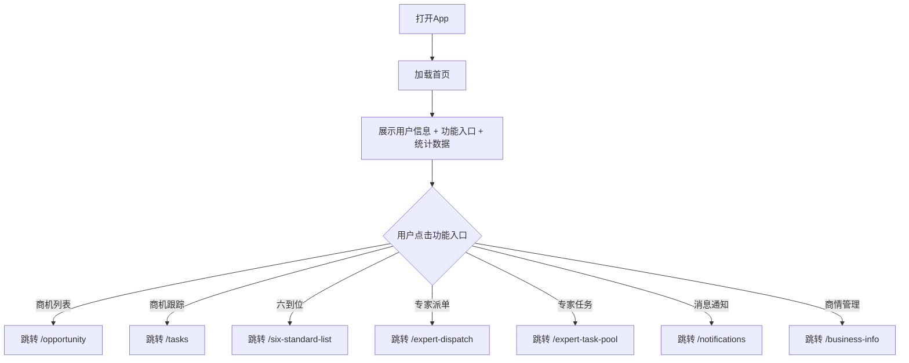

# 首页 Dashboard PRD

## 需求背景

### 痛点
- **问题现象**：用户登录后需要一个统一的入口，快速访问各业务模块并查看核心指标
- **发生频率**：高
- **当前 workaround**：用户通过深层导航或记忆URL访问各模块

### 业务目标
- **量化指标**：首页加载时间 < 1s，功能入口点击响应 < 100ms
- **目标期限**：持续可用

### 涉及系统/模块
- **模块名称**：首页 Dashboard
- **变更类型**：新增
- **对接接口**：暂无接口（纯前端展示）

---

## 用户故事

### 故事1
- **角色**：客户经理 / 销售
- **功能**：打开App后快速了解自己的线索统计和近期动态
- **收益**：一眼掌握核心KPI，快速进入工作状态
- **验收条件**：登录后首页展示用户姓名、所属分部、4项统计数据

### 故事2
- **角色**：客户经理
- **功能**：通过首页菜单快速跳转到各业务模块
- **收益**：减少操作路径，提升工作效率
- **验收条件**：点击菜单项正确导航至对应页面

---

## 需求清单

| 序号 | 需求描述 | 优先级 | 状态 | 负责人 | 截止日期 |
|------|----------|--------|------|--------|----------|
| 1    | 首页布局：头部信息区 | P0 | DONE | | |
| 2    | 功能入口网格 | P0 | DONE | | |
| 3    | 我创建的线索统计区 | P0 | DONE | | |

---

## 业务流程图

---

## 页面结构

### 路由信息
- **路由路径** - 类型：文本；必填：是；示例：`/`
- **页面标题** - 类型：文本；必填：是；示例：`首页`（无显式标题，靠布局传达）
- **访问权限** - 类型：枚举（公开/登录/角色）；描述：登录用户

### 布局结构
- **布局类型** - 类型：单栏
- **区域-头部** - 用户姓名、所属分部、电话；样式：蓝色渐变背景，白色文字
- **区域-功能入口** - 4×3 网格，11个功能入口按钮，含图标+文字
- **区域-统计数据** - 2×2 网格，4项统计数据卡片，含数值+趋势箭头

### Tab 结构
- 无 Tab

---

## 功能描述

### 功能点1：头部信息展示

#### 页面级
- **字段：用户姓名** - 类型：文本；描述：固定文字"您好！费佳"
- **字段：分部信息** - 类型：文本；描述："📍 宁波市 镇海云中台分部"
- **字段：电话信息** - 类型：文本；描述："📞 电话：15305606921"

### 功能点2：功能入口网格

#### 页面级
- **字段：菜单按钮** - 类型：枚举（跳转/占位）；描述：共11个，其中8个有路由，3个为占位符（#）
- **跳转按钮列表**：
  | 字段名 | 类型 | 必填 | 默认值 | 来源 | 校验规则 | 展示形式 | 交互约束 |
  |--------|------|------|--------|------|----------|----------|----------|
  | 商机列表 | 跳转 | 是 | - | 路由配置 | - | 图标+文字按钮 | 可点击 |
  | 商机跟踪列表 | 跳转 | 是 | - | 路由配置 | - | 图标+文字按钮 | 可点击 |
  | 六到位 | 跳转 | 是 | - | 路由配置 | - | 图标+文字按钮 | 可点击 |
  | 专家派单列表 | 跳转 | 是 | - | 路由配置 | - | 图标+文字按钮 | 可点击 |
  | 专家任务 | 跳转 | 是 | - | 路由配置 | - | 图标+文字按钮 | 可点击 |
  | 消息通知列表 | 跳转 | 是 | - | 路由配置 | - | 图标+文字按钮 | 可点击 |
  | 商情管理 | 跳转 | 是 | - | 路由配置 | - | 图标+文字按钮 | 可点击 |
- **占位按钮**（path='#'，点击无响应）：线索管理、审批、商机评分、产数钱包

### 功能点3：我创建的线索统计

#### 页面级
- **字段：统计卡片** - 类型：字段列表；描述：4张卡片，横向2×2网格
  | 字段名 | 类型 | 必填 | 默认值 | 来源 | 校验规则 | 展示形式 | 交互约束 |
  |--------|------|------|--------|------|----------|----------|----------|
  | 线索统计 | 数字 | 是 | 198 | Mock数据 | - | 数字+绿色上箭头 | 只读 |
  | 线索通过统计 | 数字 | 是 | 181 | Mock数据 | - | 数字+绿色上箭头 | 只读 |
  | 转商机统计 | 数字 | 是 | 26 | Mock数据 | - | 数字+绿色上箭头 | 只读 |
  | 转商机通过统计 | 数字 | 是 | 19 | Mock数据 | - | 数字+绿色上箭头 | 只读 |

---

## 数据流图

### 数据刷新点
- **刷新时机** - 页面加载（首次渲染）
- **影响字段** - 用户信息、统计数据

---

## 验收标准

### 正常流程
- [ ] **操作**：打开首页 → **预期**：显示用户姓名"您好！费佳"、分部信息、电话信息
- [ ] **操作**：点击"商机列表" → **预期**：导航至 `/opportunity` 页面
- [ ] **操作**：点击"六到位" → **预期**：导航至 `/six-standard-list` 页面
- [ ] **操作**：查看统计数据 → **预期**：4张卡片显示正确数值，带绿色上箭头

### 异常流程
- [ ] **操作**：点击占位按钮（线索管理等） → **预期**：无任何响应（不报错）

---

## 更新记录

### v1 - 2026-05-09
- 初始版本
