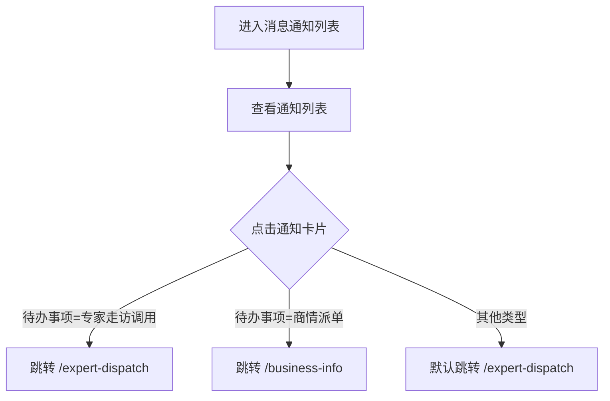

# 消息通知列表 Notifications PRD

## 需求背景

### 痛点
- **问题现象**：用户需要集中查看工作通知，包含专家走访调用、商情派单等事项
- **发生频率**：高
- **当前 workaround**：通过短信或电话接收通知

### 业务目标
- **量化指标**：通知列表加载 < 1s，点击跳转响应 < 200ms
- **目标期限**：持续可用

### 涉及系统/模块
- **模块名称**：消息通知列表
- **变更类型**：新增
- **对接接口**：暂无（Mock数据）

---

## 用户故事

### 故事1
- **角色**：客户经理 / 专家
- **功能**：查看自己收到的所有工作通知列表
- **收益**：不遗漏重要工作事项，统一入口查看所有待办
- **验收条件**：列表展示通知卡片，含商机名称、编码、发起时间、待办事项、提醒内容

### 故事2
- **角色**：客户经理 / 专家
- **功能**：点击查看详情，跳转到对应的处理页面
- **收益**：从通知直接进入处理流程，减少操作路径
- **验收条件**：点击"查看详情"根据待办事项类型跳转到对应页面

---

## 需求清单

| 序号 | 需求描述 | 优先级 | 状态 | 负责人 | 截止日期 |
|------|----------|--------|------|--------|----------|
| 1    | 顶部 Header | P0 | DONE | | |
| 2    | 通知卡片列表 | P0 | DONE | | |
| 3    | 查看详情跳转逻辑 | P0 | DONE | | |

---

## 业务流程图

---

## 页面结构

### 路由信息
- **路由路径** - 类型：文本；必填：是；示例：`/notifications`
- **页面标题** - 类型：文本；必填：是；示例：`工作通知·浙江电信`
- **访问权限** - 类型：枚举（登录）；描述：登录用户

### 布局结构
- **布局类型** - 类型：单栏
- **区域-顶部** - 返回按钮 + 标题 + 通知数量角标
- **区域-通知列表** - 垂直滚动的通知卡片列表

---

## 功能描述

### 功能点1：通知卡片

#### 页面级
- **字段列表**：
  | 字段名 | 类型 | 必填 | 默认值 | 来源 | 校验规则 | 展示形式 | 交互约束 |
  |--------|------|------|--------|------|----------|----------|----------|
  | 通知图标 | 图片 | 是 | - | Figma资源 | - | 灰色背景+图标图片，固定大小 | 只读 |
  | 商机名称 | 文本 | 是 | - | Mock数据 | - | 靠右文字 | 只读 |
  | 商机编码 | 文本 | 是 | - | Mock数据 | - | 靠右文字 | 只读 |
  | 发起时间 | 文本 | 是 | - | Mock数据 | - | 靠右文字，日期格式 | 只读 |
  | 待办事项 | 文本 | 是 | - | Mock数据 | - | 靠右文字 | 只读 |
  | 提醒事项 | 文本 | 是 | - | Mock数据 | - | 靠右红色文字 | 只读 |
  | 查看详情按钮 | 按钮 | 是 | - | - | - | 整行可点击，右侧箭头图标 | 点击跳转 |

### 功能点2：跳转逻辑

#### 页面级
- **字段：待办事项类型** - 类型：枚举；描述：决定跳转目标
  | 待办事项值 | 跳转路由 |
  |------------|----------|
  | 专家走访调用 | /expert-dispatch |
  | 商情派单 | /business-info |
  | 其他 | /expert-dispatch（默认） |

---

## 数据流图

### 数据刷新点
- **刷新时机** - 页面加载
- **影响字段** - 通知列表

---

## 验收标准

### 正常流程
- [ ] **操作**：打开 `/notifications` → **预期**：显示通知列表卡片，每张卡片含图标+5项信息+查看详情按钮
- [ ] **操作**：点击"专家走访调用"通知的查看详情 → **预期**：跳转 `/expert-dispatch`
- [ ] **操作**：点击"商情派单"通知的查看详情 → **预期**：跳转 `/business-info`

### 异常流程
- [ ] **操作**：点击空列表区域的任意位置 → **预期**：无响应

---

## 更新记录

### v1 - 2026-05-09
- 初始版本
