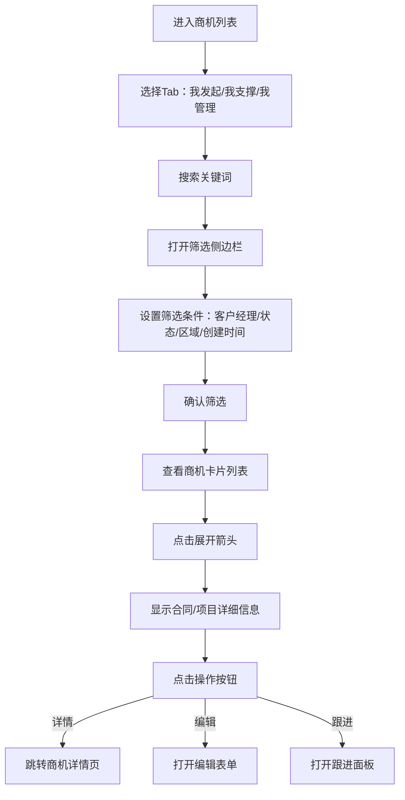

# 商机列表 Opportunity PRD

## 需求背景

### 痛点
- **问题现象**：客户经理需要管理商机列表，按多种条件筛选，查看商机详情和合同/项目信息
- **发生频率**：高
- **当前 workaround**：通过CRM系统或Excel管理

### 业务目标
- **量化指标**：列表加载 < 1s，筛选操作响应 < 200ms
- **目标期限**：持续可用

### 涉及系统/模块
- **模块名称**：商机列表
- **变更类型**：新增
- **对接接口**：暂无（Mock数据）

---

## 用户故事

### 故事1
- **角色**：客户经理
- **功能**：切换"我发起的/我支撑的/我管理的"三个Tab查看不同视角的商机
- **收益**：按职责分工查看对应的商机数据
- **验收条件**：三个Tab可切换，切换后列表内容对应变化

### 故事2
- **角色**：客户经理
- **功能**：通过关键词搜索、高级筛选（客户经理/状态/区域/时间）找到目标商机
- **收益**：快速定位目标商机，减少查找时间
- **验收条件**：搜索和筛选条件应用后，列表正确过滤

### 故事3
- **角色**：客户经理
- **功能**：展开商机卡片查看合同/项目详细信息，对商机进行操作
- **收益**：一站式查看和操作商机全量信息
- **验收条件**：展开显示合同名称/编码、项目名称/编码；底部操作按钮可点击

---

## 需求清单

| 序号 | 需求描述 | 优先级 | 状态 | 负责人 | 截止日期 |
|------|----------|--------|------|--------|----------|
| 1    | Tab切换（我发起的/我支撑的/我管理的） | P0 | DONE | | |
| 2    | 搜索面板（关键词） | P0 | DONE | | |
| 3    | 筛选侧边栏（客户经理/状态/区域/创建时间） | P0 | DONE | | |
| 4    | 商机卡片列表（可展开详情） | P0 | DONE | | |
| 5    | 卡片操作按钮（详情/编辑/跟进） | P0 | DONE | | |

---

## 业务流程图

---

## 页面结构

### 路由信息
- **路由路径** - 类型：文本；必填：是；示例：`/opportunity`
- **页面标题** - 类型：文本；必填：是；示例：`商机列表`
- **访问权限** - 类型：枚举（登录）；描述：客户经理

### 布局结构
- **布局类型** - 类型：单栏
- **区域-顶部** - 返回按钮 + 标题 + 搜索图标 + 筛选图标 + Tab栏
- **区域-搜索面板** - 搜索输入框 + 重置按钮 + 查询按钮（条件展开）
- **区域-筛选侧边栏** - 固定右侧，宽320px，含所有筛选条件（条件展开）
- **区域-商机列表** - 垂直滚动的商机卡片列表

### Tab 结构
- **Tab名称** - 类型：文本；示例：`我发起的`
- **Tab路由** - 类型：文本；描述：内部状态切换（无URL变化）
- **加载方式** - 预加载
- **默认激活** - `我发起的`

---

## 功能描述

### 功能点1：Tab栏

#### Tab 级
- **Tab名称** - 类型：文本；示例：`我发起的`
- **操作按钮字段**：
  | 字段名 | 类型 | 必填 | 默认值 | 来源 | 校验规则 | 展示形式 | 交互约束 |
  |--------|------|------|--------|------|----------|----------|----------|
  | 我发起的 | Tab | 是 | 激活 | 预置 | - | 胶囊按钮，蓝下边框=激活 | 点击切换 |
  | 我支撑的 | Tab | 是 | 未激活 | 预置 | - | 同上 | 点击切换 |
  | 我管理的 | Tab | 是 | 未激活 | 预置 | - | 同上 | 点击切换 |

### 功能点2：搜索面板

#### Tab 级
- **查询条件字段**：
  | 字段名 | 类型 | 必填 | 默认值 | 来源 | 校验规则 | 展示形式 | 交互约束 |
  |--------|------|------|--------|------|----------|----------|----------|
  | 搜索关键词 | 文本 | 否 | 空 | 用户输入 | - | 文本输入框，placeholder提示多个字段 | 可编辑 |
  | 重置按钮 | 按钮 | 否 | - | - | - | 灰边按钮 | 点击清空关键词 |
  | 查询按钮 | 按钮 | 否 | - | - | - | 蓝色填充按钮 | 点击执行搜索，关闭面板 |

### 功能点3：筛选侧边栏

#### 弹窗级
- **弹窗：筛选侧边栏**
  - **触发入口**：点击顶部"筛选"图标
  - **关闭方式**：遮罩层点击 / 关闭图标
  - **字段列表**：
    | 字段名 | 类型 | 必填 | 默认值 | 来源 | 校验规则 | 展示形式 | 交互约束 |
    |--------|------|------|--------|------|----------|----------|----------|
    | 客户经理 | 下拉选择 | 否 | 空 | 预置列表 | - | 下拉框 | 可编辑 |
    | 商机状态 | 复选框组 | 否 | [] | 用户选择 | - | 4个checkbox（跟进中/已签约/已失效/已关闭） | 多选 |
    | 商机区域 | 文本 | 否 | 空 | 用户输入 | - | 文本输入框 | 可编辑 |
    | 创建时间-开始 | 日期 | 否 | 空 | 用户选择 | - | 日期选择器 | 可编辑 |
    | 创建时间-结束 | 日期 | 否 | 空 | 用户选择 | - | 日期选择器 | 可编辑 |
  - **确定按钮**：关闭侧边栏，应用筛选条件
  - **取消按钮**：重置所有筛选项

### 功能点4：商机卡片

#### Tab 级
- **字段列表**：
  | 字段名 | 类型 | 必填 | 默认值 | 来源 | 校验规则 | 展示形式 | 交互约束 |
  |--------|------|------|--------|------|----------|----------|----------|
  | 商机名称 | 文本 | 是 | - | Mock数据 | - | 标题文字 | 只读 |
  | 商机编码 | 文本 | 是 | - | Mock数据 | - | 小号灰色文字 | 只读 |
  | 状态标签 | 枚举 | 是 | - | Mock数据 | - | 彩色胶囊（跟进中=蓝/已签约=绿/已失效=橙/已关闭=灰） | 只读 |
  | 区域标签 | 文本 | 是 | - | Mock数据 | - | 蓝底白字胶囊（城市+区县） | 只读 |
  | 客户经理标签 | 文本 | 是 | - | Mock数据 | - | 紫底胶囊 | 只读 |
  | 金额标签 | 数字 | 是 | - | Mock数据 | - | 橙底胶囊（X万） | 只读 |
  | 阶段标签 | 文本 | 是 | - | Mock数据 | - | 青底胶囊 | 只读 |
  | 客户名称 | 文本 | 是 | - | Mock数据 | - | 小号文字 | 只读 |
  | 创建时间 | 文本 | 是 | - | Mock数据 | - | 小号文字 | 只读 |
  | 展开箭头 | 图标 | 是 | 收起 | 状态 | - | ChevronUp/Down图标 | 点击展开/收起 |
  | 合同名称（展开） | 文本 | 条件 | - | Mock数据 | - | 灰色背景区域内的字段 | 只读 |
  | 合同编码（展开） | 文本 | 条件 | - | Mock数据 | - | 同上 | 只读 |
  | 项目名称（展开） | 文本 | 条件 | - | Mock数据 | - | 同上 | 只读 |
  | 项目编码（展开） | 文本 | 条件 | - | Mock数据 | - | 同上 | 只读 |

- **操作按钮字段**：
  | 字段名 | 类型 | 必填 | 默认值 | 来源 | 校验规则 | 展示形式 | 交互约束 |
  |--------|------|------|--------|------|----------|----------|----------|
  | 详情 | 按钮 | 否 | - | - | - | 蓝边胶囊按钮 | 点击跳转详情 |
  | 编辑 | 按钮 | 否 | - | - | - | 灰边胶囊按钮 | 点击打开编辑 |
  | 跟进 | 按钮 | 否 | - | - | - | 灰边胶囊按钮 | 点击打开跟进 |

---

## 数据流图

### 数据刷新点
- **刷新时机** - 页面加载
- **影响字段** - 商机列表内容

---

## 验收标准

### 正常流程
- [ ] **操作**：打开 `/opportunity` → **预期**：显示3个Tab、搜索图标、筛选图标、商机卡片列表
- [ ] **操作**：点击"我支撑的"Tab → **预期**：Tab高亮，列表切换为支撑类商机
- [ ] **操作**：点击搜索图标 → **预期**：搜索面板从顶部滑出
- [ ] **操作**：输入关键词并点击查询 → **预期**：列表过滤
- [ ] **操作**：点击筛选图标 → **预期**：筛选侧边栏从右侧滑出
- [ ] **操作**：勾选"跟进中"后点确定 → **预期**：侧边栏关闭，列表过滤为跟进中状态
- [ ] **操作**：点击卡片展开箭头 → **预期**：卡片展开，显示合同/项目详细信息

### 异常流程
- [ ] **操作**：展开后再次点击展开箭头 → **预期**：卡片收起

---

## 更新记录

### v1 - 2026-05-09
- 初始版本
