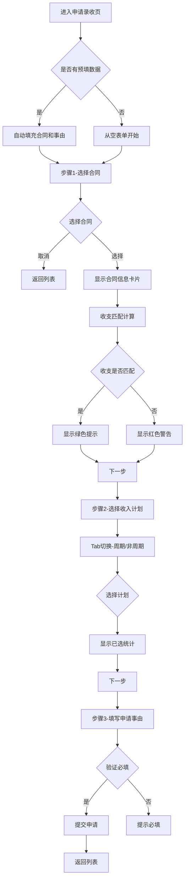

# 申请录收表单页

## 需求背景

### 痛点
- **问题现象**：业务人员申请录收需要在PC端完成，移动办公场景不便
- **发生频率**：高频率使用
- **当前 workaround**：通过PC端系统进行录收申请操作

### 业务目标
- **量化指标**：提升录收申请效率，减少审批等待时间
- **目标期限**：2026年Q2完成

### 涉及系统/模块
- **模块名称**：录收管理模块
- **变更类型**：新增
- **对接接口**：待定

## 用户故事

### 故事1
- **角色**：一线业务人员
- **功能**：通过手机选择合同/项目并申请录收
- **收益**：随时随地通过手机完成录收申请，提升工作效率
- **验收条件**：能够在手机上完成录收申请流程

### 故事2
- **角色**：一线业务人员
- **功能**：复制已有录收记录快速申请
- **收益**：减少重复填写信息的时间
- **验收条件**：能够复制已有录收记录并快速申请

## 需求清单

| 序号 | 需求描述 | 优先级 | 状态 | 负责人 | 截止日期 |
|------|----------|--------|------|--------|----------|
| 1 | 步骤1-选择合同/项目 | P0 | DONE | | |
| 2 | 步骤2-选择收入计划 | P0 | DONE | | |
| 3 | 步骤3-填写申请事由 | P0 | DONE | | |
| 4 | 收支不匹配提醒 | P1 | DONE | | |
| 5 | 六到位附件状态显示 | P1 | DONE | | |

## 业务流程图

## 页面结构

### 路由信息
- **路由路径** - 类型：文本；必填：是；示例：`/revenue-apply`
- **页面标题** - 类型：文本；必填：是；示例：`申请录收`
- **访问权限** - 类型：枚举（登录）；描述：需要登录后访问

### 布局结构
- **布局类型** - 类型：单栏；描述：移动端单列布局
- **区域-顶部栏** - 返回按钮、页面标题、步骤指示器
- **区域-表单内容** - 动态显示当前步骤表单
- **区域-底部操作栏** - 上一步/下一步/提交按钮

### 步骤结构
- **步骤1-选择合同** - 合同选择卡片、收支匹配状态、项目进度
- **步骤2-选择收入计划** - Tab切换（周期性/非周期性）、计划列表、已选统计
- **步骤3-填写申请事由** - 申请事由文本域、六到位附件状态、形象进度表上传

## 功能描述

### 功能点1：步骤1-选择合同

#### 合同选择字段
| 字段名 | 类型 | 必填 | 默认值 | 来源 | 校验规则 | 展示形式 | 交互约束 |
|--------|------|------|--------|------|----------|----------|----------|
| 客户名称 | 文本 | 是 | | 接口返回 | 非空 | 文本 | 只读 |
| 客户编码 | 文本 | 是 | | 接口返回 | 非空 | 文本 | 只读 |
| 合同名称 | 文本 | 是 | | 接口返回 | 非空 | 文本 | 只读 |
| 合同编码 | 文本 | 是 | | 接口返回 | 非空 | 文本 | 只读 |
| 合同金额 | 货币 | 是 | | 接口返回 | 非空 | 蓝色文本 | 只读 |
| 项目名称 | 文本 | 是 | | 接口返回 | 非空 | 文本 | 只读 |
| 项目编码 | 文本 | 是 | | 接口返回 | 非空 | 文本 | 只读 |
| 收支匹配度 | 百分比 | 是 | | 计算得出 | | 数字显示 | 只读 |
| 收支状态 | 枚举 | 是 | | 计算得出 | 匹配/不匹配 | 标签 | 只读 |

### 功能点2：步骤2-选择收入计划

#### Tab字段
| 字段名 | 类型 | 必填 | 默认值 | 来源 | 校验规则 | 展示形式 | 交互约束 |
|--------|------|------|--------|------|----------|----------|----------|
| 周期/非周期Tab | 枚举 | 是 | 周期性 | 用户切换 | | Tab切换 | 可编辑 |

#### 收入计划列表字段
| 字段名 | 类型 | 必填 | 默认值 | 来源 | 校验规则 | 展示形式 | 交互约束 |
|--------|------|------|--------|------|----------|----------|----------|
| 产品收入项 | 文本 | 是 | | 接口返回 | 非空 | 文本 | 只读 |
| 业务类型 | 文本 | 是 | | 接口返回 | | 文本 | 只读 |
| 税率 | 文本 | 是 | | 接口返回 | | 文本 | 只读 |
| 计划确认金额 | 货币 | 是 | | 接口返回 | 非空 | 文本 | 只读 |
| 预计确认日期 | 日期 | 是 | | 接口返回 | | 文本 | 只读 |
| 计划状态 | 枚举 | 是 | | 接口返回 | | 标签 | 只读 |
| 选择框 | 布尔 | 是 | 否 | 用户选择 | | 复选框 | 可编辑 |

### 功能点3：步骤3-填写申请事由

#### 申请事由字段
| 字段名 | 类型 | 必填 | 默认值 | 来源 | 校验规则 | 展示形式 | 交互约束 |
|--------|------|------|--------|------|----------|----------|----------|
| 申请事由 | 文本 | 是 | 空 | 用户输入 | 非空 | 文本域 | 可编辑 |
| 六到位-客情掌握 | 枚举 | 否 | 未录入/已录入 | 接口返回 | | 标签 | 只读 |
| 六到位-方案总控 | 枚举 | 否 | 未录入/已录入 | 接口返回 | | 标签 | 只读 |
| 六到位-谈判/应标自主 | 枚举 | 否 | 未录入/已录入 | 接口返回 | | 标签 | 只读 |
| 六到位-采购自主 | 枚举 | 否 | 未录入/已录入 | 接口返回 | | 标签 | 只读 |
| 六到位-项目强管控 | 枚举 | 否 | 未录入/已录入 | 接口返回 | | 标签 | 只读 |
| 六到位-运维自主 | 枚举 | 否 | 未录入/已录入 | 接口返回 | | 标签 | 只读 |

### 功能点4：提交申请

#### 提交按钮字段
| 字段名 | 类型 | 必填 | 默认值 | 来源 | 校验规则 | 展示形式 | 交互约束 |
|--------|------|------|--------|------|----------|----------|----------|
| 上一步 | 按钮 | 否 | | 用户点击 | | 灰色按钮 | 可点击 |
| 下一步 | 按钮 | 否 | | 用户点击 | 验证当前步骤 | 蓝色按钮 | 可点击 |
| 提交申请 | 按钮 | 否 | | 用户点击 | 验证所有必填 | 蓝色按钮 | 可点击 |

## 数据流图

### 接口1：获取合同列表
- **请求路径** - 类型：文本；示例：`GET /api/contracts`
- **请求方法** - 类型：枚举（GET）
- **请求头** - 字段列表；描述：Authorization
- **响应字段** - 字段列表：
  - `contracts` - 类型：数组；描述：合同列表
  - `customerName` - 类型：字符串；描述：客户名称
  - `contractName` - 类型：字符串；描述：合同名称
  - `contractAmount` - 类型：数字；描述：合同金额

### 接口2：提交录收申请
- **请求路径** - 类型：文本；示例：`POST /api/revenue/apply`
- **请求方法** - 类型：枚举（POST）
- **请求头** - 字段列表；描述：Authorization, Content-Type
- **请求参数** - 字段列表：
  - `contractId` - 类型：字符串；必填：是；来源：页面字段 `已选合同`
  - `selectedPlans` - 类型：数组；必填：是；来源：页面字段 `已选计划`
  - `applyReason` - 类型：字符串；必填：是；来源：页面字段 `申请事由`
- **响应字段** - 字段列表：
  - `success` - 类型：布尔；描述：是否成功
  - `message` - 类型：字符串；描述：响应消息

## 验收标准

### 正常流程
- [ ] **操作**：点击申请录收按钮 → **预期**：进入申请录收页面，显示步骤1
- [ ] **操作**：点击选择合同 → **预期**：打开合同选择弹窗
- [ ] **操作**：选择合同后 → **预期**：显示合同信息卡片和收支状态
- [ ] **操作**：收支不匹配超10%时 → **预期**：显示红色警告
- [ ] **操作**：点击下一步 → **预期**：进入步骤2，显示收入计划列表
- [ ] **操作**：切换Tab → **预期**：切换周期/非周期计划列表
- [ ] **操作**：选择计划 → **预期**：显示已选统计
- [ ] **操作**：点击下一步 → **预期**：进入步骤3，显示申请事由表单
- [ ] **操作**：填写申请事由后点击提交 → **预期**：调用提交接口，成功后返回列表

### 异常流程
- [ ] **操作**：未选择合同点击下一步 → **预期**：按钮置灰不可点击
- [ ] **操作**：未选择计划点击下一步 → **预期**：按钮置灰不可点击
- [ ] **操作**：未填写申请事由点击提交 → **预期**：按钮置灰不可点击

## 更新记录

### v1 - 2026-05-13
- 初始版本，申请录收表单页功能开发完成