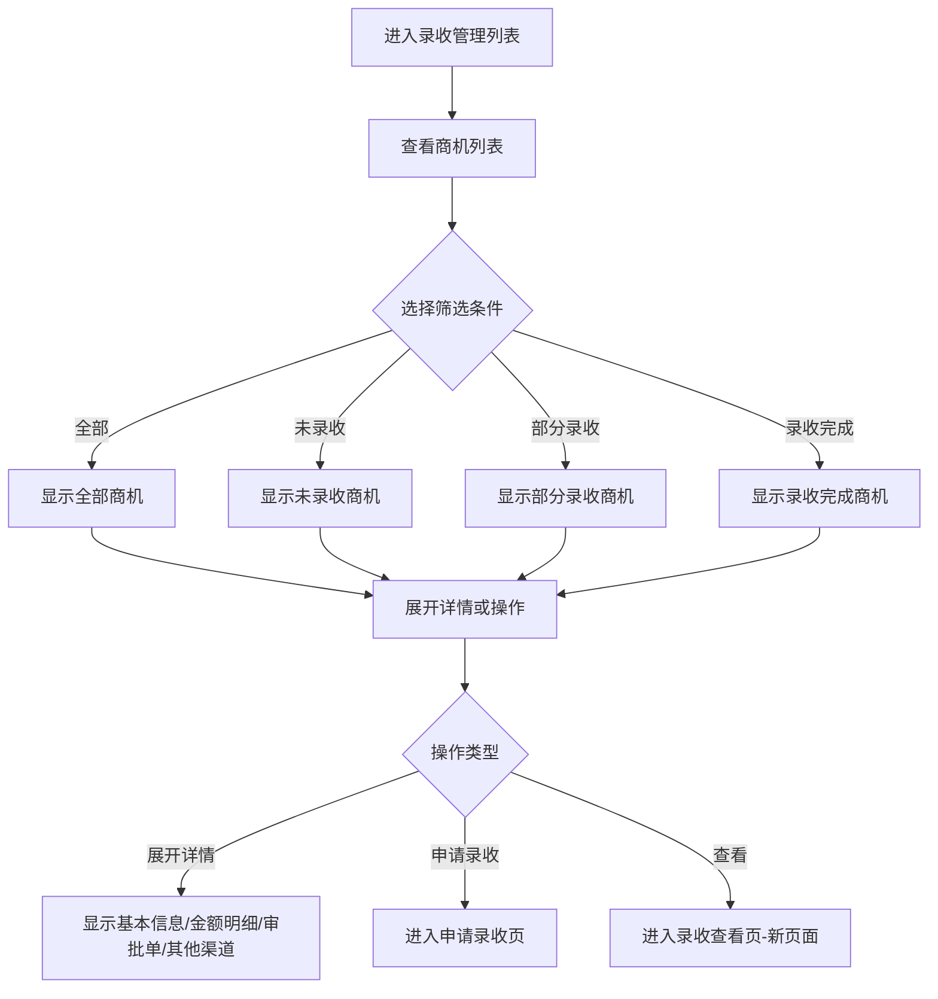

# 录收管理列表页

## 需求背景

### 痛点
- **问题现象**：业务人员无法快速查看商机录收情况，需要登录PC端系统才能进行录收管理操作
- **发生频率**：高频率使用，移动办公场景下尤为不便
- **当前 workaround**：通过PC端系统进行录收管理操作

### 业务目标
- **量化指标**：提升业务人员录收管理效率，减少审批等待时间
- **目标期限**：2026年Q2完成

### 涉及系统/模块
- **模块名称**：录收管理模块
- **变更类型**：新增
- **对接接口**：待定

## 用户故事

### 故事1
- **角色**：一线业务人员
- **功能**：快速查看当前商机录收状态
- **收益**：随时随地通过手机查看录收情况，提升工作效率
- **验收条件**：能够在手机上查看所有商机录收状态和金额明细

### 故事2
- **角色**：一线业务人员
- **功能**：快速申请录收
- **收益**：减少PC端操作时间，提升录收申请效率
- **验收条件**：能够在手机上完成录收申请流程

## 需求清单

| 序号 | 需求描述 | 优先级 | 状态 | 负责人 | 截止日期 |
|------|----------|--------|------|--------|----------|
| 1 | 录收管理列表展示 | P0 | DONE | | |
| 2 | 搜索和状态筛选 | P0 | DONE | | |
| 3 | 金额卡片展示 | P0 | DONE | | |
| 4 | 申请录收功能 | P0 | DONE | | |
| 5 | 内嵌详情折叠展示 | P0 | DONE | | |
| 6 | 查看按钮跳转新页面 | P1 | DONE | | |

## 业务流程图

## 页面结构

### 路由信息
- **路由路径** - 类型：文本；必填：是；示例：`/revenue-management`
- **页面标题** - 类型：文本；必填：是；示例：`录收管理`
- **访问权限** - 类型：枚举（登录）；描述：需要登录后访问

### 布局结构
- **布局类型** - 类型：单栏；描述：移动端单列布局
- **区域-顶部栏** - 返回按钮、页面标题
- **区域-搜索栏** - 搜索输入框、筛选按钮
- **区域-列表内容** - 卡片式录收记录列表，支持展开详情
- **区域-底部悬浮** - 新增申请按钮

## 功能描述

### 功能点1：录收管理列表

#### 列表字段
| 字段名 | 类型 | 必填 | 默认值 | 来源 | 校验规则 | 展示形式 | 交互约束 |
|--------|------|------|--------|------|----------|----------|----------|
| 商机名称 | 文本 | 是 | | 接口返回 | 非空 | 文本 | 只读 |
| 录收状态 | 枚举 | 是 | 全部 | 接口返回 | | 彩色标签 | 只读，位于标题后同行 |
| 项目总金额 | 货币 | 是 | | 接口返回 | 非空 | 三列卡片 | 只读 |
| 已确认金额 | 货币 | 是 | | 接口返回 | 非空 | 三列卡片 | 只读 |
| 未确认金额 | 货币 | 是 | | 接口返回 | 非空 | 三列卡片 | 只读 |
| 最新录收时间 | 日期 | 否 | | 接口返回 | | 文本 | 只读 |
| 展开/收起详情 | 按钮 | 否 | 收起 | 用户点击 | | 折叠按钮 | 可编辑 |
| 查看按钮 | 按钮 | 否 | | 用户点击 | | 蓝色链接 | 可点击跳转新页面 |

### 功能点2：内嵌详情折叠

#### 详情区块（四个区块独立折叠）
| 区块名 | 包含字段 | 交互约束 |
|--------|----------|----------|
| 基本信息 | 客户名称、客户编码、商机编码、合同编码、项目编码、合同金额 | 点击标题展开/收起 |
| 金额明细 | 产数服务、产数标品、基本面、设备销售、代收代付的总额/已确认/未确认 | 点击标题展开/收起 |
| 录收审批单 | 审批单名称、金额、状态、EIP文号、同步时间等 | 点击标题展开/收起 |
| 其他渠道录收 | 产品收入项、金额、合同、账期等 | 点击标题展开/收起 |

### 功能点3：列表操作

#### 操作按钮字段
| 字段名 | 类型 | 必填 | 默认值 | 来源 | 校验规则 | 展示形式 | 交互约束 |
|--------|------|------|--------|------|----------|----------|----------|
| 申请录收 | 按钮 | 否 | | 用户点击 | | 蓝色按钮 | 未录收状态显示，可点击 |
| 查看 | 按钮 | 否 | | 用户点击 | | 蓝色链接 | 非未录收状态显示，可点击跳转新页面 |

## 数据流图

### 数据刷新点
- **刷新时机** - 类型：枚举（页面加载）
- **影响字段** - 字段列表；描述：整个列表内容刷新

## 验收标准

### 正常流程
- [ ] **操作**：进入录收管理列表页 → **预期**：显示录收记录卡片列表，无序号
- [ ] **操作**：查看商机名称和状态 → **预期**：状态标签显示在商机名称后面，同一行
- [ ] **操作**：点击展开详情 → **预期**：显示基本信息、金额明细、审批单、其他渠道四个可折叠区块
- [ ] **操作**：点击收起详情 → **预期**：隐藏详情内容
- [ ] **操作**：点击查看按钮 → **预期**：跳转到录收查看新页面
- [ ] **操作**：点击申请录收 → **预期**：跳转到申请录收页面

### 异常流程
- [ ] **操作**：无数据时 → **预期**：显示空状态提示"暂无录收记录"

## 更新记录

### v2 - 2026-05-13
- 去掉"共多少条"统计
- 去掉卡片序号
- 状态标签放在商机名称后面同行
- 列表内嵌所有详情（基本信息、金额明细、审批单、其他渠道）
- 查看按钮跳转到录收查看新页面

### v1 - 2026-05-13
- 初始版本，录收管理列表页功能开发完成