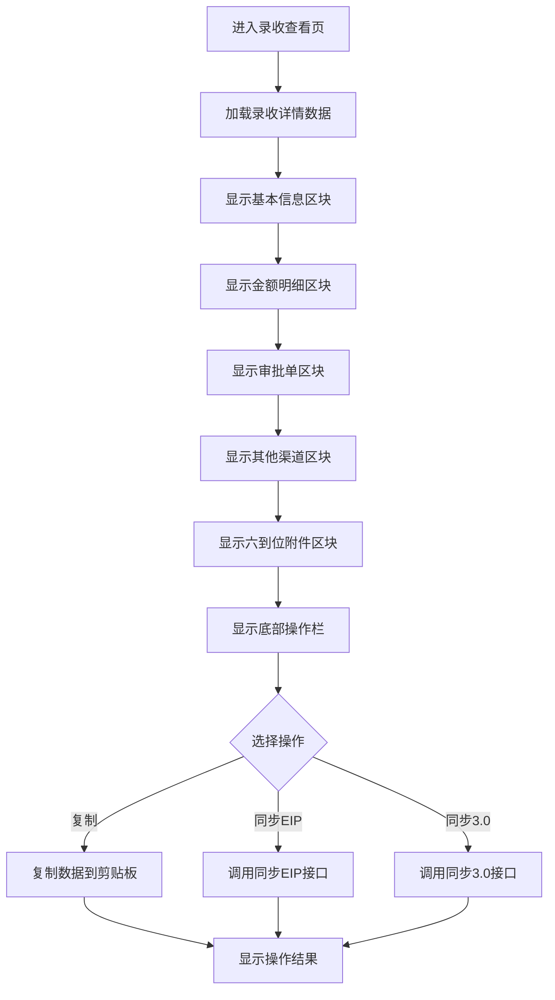

# 录收查看页面

## 需求背景

### 痛点
- **问题现象**：业务人员需要查看录收详情和操作时，只能通过PC端操作
- **发生频率**：中高频率使用
- **当前 workaround**：通过PC端系统查看录收详情和同步操作

### 业务目标
- **量化指标**：提升业务人员录收管理便捷性，减少PC端依赖
- **目标期限**：2026年Q2完成

### 涉及系统/模块
- **模块名称**：录收管理模块
- **变更类型**：新增
- **对接接口**：待定

## 用户故事

### 故事1
- **角色**：一线业务人员
- **功能**：通过手机查看录收详情
- **收益**：随时随地查看录收状态和金额明细，提升工作效率
- **验收条件**：能够在一页内查看完整的录收详情信息

### 故事2
- **角色**：一线业务人员
- **功能**：通过手机进行复制、同步EIP、同步3.0操作
- **收益**：减少PC端操作时间，快速完成录收同步
- **验收条件**：能够通过底部按钮完成复制、同步EIP、同步3.0操作

## 需求清单

| 序号 | 需求描述 | 优先级 | 状态 | 负责人 | 截止日期 |
|------|----------|--------|------|--------|----------|
| 1 | 录收详情一页展示 | P0 | DONE | | |
| 2 | 折叠区块展示 | P0 | DONE | | |
| 3 | 底部三按钮 | P0 | DONE | | |
| 4 | 复制功能 | P1 | DONE | | |
| 5 | 同步EIP功能 | P1 | DONE | | |
| 6 | 同步3.0功能 | P1 | DONE | | |

## 业务流程图

## 页面结构

### 路由信息
- **路由路径** - 类型：文本；必填：是；示例：`/revenue-view/:id`
- **页面标题** - 类型：文本；必填：是；示例：`录收查看`
- **访问权限** - 类型：枚举（登录）；描述：需要登录后访问

### 布局结构
- **布局类型** - 类型：单栏；描述：移动端单列布局
- **区域-顶部栏** - 返回按钮、页面标题
- **区域-详情内容** - 五个可折叠的详情区块
- **区域-底部操作栏** - 三个操作按钮

## 功能描述

### 功能点1：基本信息展示

#### 页面级
- **字段：功能入口** - 类型：文本；描述：从列表页点击查看按钮进入
- **字段：前置条件** - 类型：文本；描述：已知录收记录ID
- **字段：后置影响** - 类型：字段列表；描述：显示录收基本信息

#### 基本信息字段
| 字段名 | 类型 | 必填 | 默认值 | 来源 | 校验规则 | 展示形式 | 交互约束 |
|--------|------|------|--------|------|----------|----------|----------|
| 录收状态 | 枚举 | 是 | | 接口返回 | | 彩色标签 | 只读 |
| 最新录收时间 | 日期 | 否 | | 接口返回 | | 文本 | 只读 |
| 商机名称 | 文本 | 是 | | 接口返回 | 非空 | 文本 | 只读 |
| 客户名称 | 文本 | 是 | | 接口返回 | 非空 | 文本 | 只读 |
| 客户编码 | 文本 | 是 | | 接口返回 | 非空 | 文本 | 只读 |
| 商机编码 | 文本 | 是 | | 接口返回 | 非空 | 文本 | 只读 |
| 合同编码 | 文本 | 是 | | 接口返回 | 非空 | 文本 | 只读 |
| 项目名称 | 文本 | 是 | | 接口返回 | 非空 | 文本 | 只读 |
| 项目编码 | 文本 | 是 | | 接口返回 | 非空 | 文本 | 只读 |
| 合同名称 | 文本 | 是 | | 接口返回 | 非空 | 文本 | 只读 |
| 合同金额 | 货币 | 是 | | 接口返回 | 非空 | 蓝色文本 | 只读 |
| 确认录收金额 | 货币 | 是 | | 接口返回 | 非空 | 绿色文本 | 只读 |
| 未确认录收金额 | 货币 | 是 | | 接口返回 | 非空 | 橙色文本 | 只读 |
| 累计确认收款 | 货币 | 是 | | 接口返回 | 非空 | 文本 | 只读 |
| 剩余未收款 | 货币 | 是 | | 接口返回 | 非空 | 红色文本 | 只读 |
| 收支匹配状态 | 枚举 | 是 | | 计算得出 | 匹配/不匹配超10% | 标签 | 只读 |
| 计划列收/已列收 | 货币 | 是 | | 接口返回 | | 文本 | 只读 |
| 计划列账/已列支 | 货币 | 是 | | 接口返回 | | 文本 | 只读 |

### 功能点2：金额明细展示

#### 金额概览字段
| 字段名 | 类型 | 必填 | 默认值 | 来源 | 校验规则 | 展示形式 | 交互约束 |
|--------|------|------|--------|------|----------|----------|----------|
| 项目总金额 | 货币 | 是 | | 接口返回 | 非空 | 三列卡片 | 只读 |
| 已确认金额 | 货币 | 是 | | 接口返回 | 非空 | 绿色高亮 | 只读 |
| 未确认金额 | 货币 | 是 | | 接口返回 | 非空 | 橙色高亮 | 只读 |

#### 金额明细表格字段
| 字段名 | 类型 | 必填 | 默认值 | 来源 | 校验规则 | 展示形式 | 交互约束 |
|--------|------|------|--------|------|----------|----------|----------|
| 类别 | 枚举 | 是 | | 接口返回 | | 文本 | 只读 |
| 产数服务 | 货币 | 是 | | 接口返回 | | 文本 | 只读 |
| 产数标品 | 货币 | 是 | | 接口返回 | | 文本 | 只读 |
| 基本面 | 货币 | 是 | | 接口返回 | | 文本 | 只读 |
| 设备销售 | 货币 | 是 | | 接口返回 | | 文本 | 只读 |
| 代收代付 | 货币 | 是 | | 接口返回 | | 文本 | 只读 |

### 功能点3：录收审批单列表

#### 审批单列表字段
| 字段名 | 类型 | 必填 | 默认值 | 来源 | 校验规则 | 展示形式 | 交互约束 |
|--------|------|------|--------|------|----------|----------|----------|
| 序号 | 数字 | 是 | 自增 | 系统生成 | | 圆形序号 | 只读 |
| 审批单名称 | 文本 | 是 | | 接口返回 | 非空 | 文本 | 只读 |
| 审批金额 | 货币 | 是 | | 接口返回 | 非空 | 绿色文本 | 只读 |
| 审批状态 | 枚举 | 是 | | 接口返回 | | 彩色标签 | 只读 |
| EIP文号 | 文本 | 是 | | 接口返回 | | 文本+复制按钮 | 只读 |
| 起草部门 | 文本 | 是 | | 接口返回 | | 文本 | 只读 |
| 同步EIP时间 | 日期 | 是 | | 接口返回 | | 文本 | 只读 |
| 同步30时间 | 日期 | 是 | | 接口返回 | | 文本 | 只读 |
| 预占工单号 | 文本 | 是 | | 接口返回 | | 文本 | 只读 |
| 工单编码 | 文本 | 是 | | 接口返回 | | 文本 | 只读 |

### 功能点4：其他渠道录收列表

#### 其他渠道录收字段
| 字段名 | 类型 | 必填 | 默认值 | 来源 | 校验规则 | 展示形式 | 交互约束 |
|--------|------|------|--------|------|----------|----------|----------|
| 序号 | 数字 | 是 | 自增 | 系统生成 | | 圆形序号 | 只读 |
| 产品收入项 | 文本 | 是 | | 接口返回 | 非空 | 文本 | 只读 |
| 金额 | 货币 | 是 | | 接口返回 | 非空 | 绿色文本 | 只读 |
| 合同编码 | 文本 | 是 | | 接口返回 | | 文本 | 只读 |
| 账期 | 文本 | 是 | | 接口返回 | | 文本 | 只读 |
| 收入项编码 | 文本 | 是 | | 接口返回 | | 文本 | 只读 |

### 功能点5：六到位附件情况

#### 六到位字段
| 字段名 | 类型 | 必填 | 默认值 | 来源 | 校验规则 | 展示形式 | 交互约束 |
|--------|------|------|--------|------|----------|----------|----------|
| 客情掌握 | 枚举 | 是 | | 接口返回 | 已录入/未录入 | 标签 | 只读 |
| 方案总控 | 枚举 | 是 | | 接口返回 | 已录入/未录入 | 标签 | 只读 |
| 谈判/应标自主 | 枚举 | 是 | | 接口返回 | 已录入/未录入 | 标签 | 只读 |
| 采购自主 | 枚举 | 是 | | 接口返回 | 已录入/未录入 | 标签 | 只读 |
| 项目强管控 | 枚举 | 是 | | 接口返回 | 已录入/未录入 | 标签 | 只读 |
| 运维自主 | 枚举 | 是 | | 接口返回 | 已录入/未录入 | 标签 | 只读 |

### 功能点6：底部操作按钮

#### 操作按钮字段
| 字段名 | 类型 | 必填 | 默认值 | 来源 | 校验规则 | 展示形式 | 交互约束 |
|--------|------|------|--------|------|----------|----------|----------|
| 复制 | 按钮 | 否 | | 用户点击 | | 灰色按钮 | 可点击，调用剪贴板API |
| 同步EIP | 按钮 | 否 | | 用户点击 | | 蓝色按钮 | 可点击，调用同步EIP接口 |
| 同步3.0 | 按钮 | 否 | | 用户点击 | | 蓝色按钮 | 可点击，调用同步3.0接口 |

### 功能点7：复制功能

#### 复制内容
| 字段名 | 类型 | 描述 |
|--------|------|------|
| 商机名称 | 文本 | 录收记录的商机名称 |
| 合同名称 | 文本 | 录收记录的合同名称 |
| 项目名称 | 文本 | 录收记录的项目名称 |
| 总金额 | 货币 | 录收记录的总金额 |

## 数据流图

### 接口1：获取录收详情
- **请求路径** - 类型：文本；示例：`GET /api/revenue/detail/:id`
- **请求方法** - 类型：枚举（GET）
- **请求头** - 字段列表；描述：Authorization
- **请求参数** - 字段列表：
  - `id` - 类型：字符串；必填：是；来源：URL参数 `id`
- **响应字段** - 字段列表：
  - 全部字段同功能描述中的详情字段

### 接口2：同步EIP
- **请求路径** - 类型：文本；示例：`POST /api/revenue/sync-eip`
- **请求方法** - 类型：枚举（POST）
- **请求头** - 字段列表；描述：Authorization
- **请求参数** - 字段列表：
  - `id` - 类型：字符串；必填：是；来源：URL参数 `id`
- **响应字段** - 字段列表：
  - `success` - 类型：布尔；描述：是否成功
  - `message` - 类型：字符串；描述：响应消息

### 接口3：同步3.0
- **请求路径** - 类型：文本；示例：`POST /api/revenue/sync-30`
- **请求方法** - 类型：枚举（POST）
- **请求头** - 字段列表；描述：Authorization
- **请求参数** - 字段列表：
  - `id` - 类型：字符串；必填：是；来源：URL参数 `id`
- **响应字段** - 字段列表：
  - `success` - 类型：布尔；描述：是否成功
  - `message` - 类型：字符串；描述：响应消息

## 验收标准

### 正常流程
- [ ] **操作**：点击查看按钮 → **预期**：进入录收查看页面，显示所有详情
- [ ] **操作**：点击区块标题 → **预期**：展开/收起对应区块内容
- [ ] **操作**：点击复制按钮 → **预期**：复制数据到剪贴板，显示成功提示
- [ ] **操作**：点击同步EIP按钮 → **预期**：调用同步EIP接口，显示成功提示
- [ ] **操作**：点击同步3.0按钮 → **预期**：调用同步3.0接口，显示成功提示
- [ ] **操作**：点击EIP文号复制按钮 → **预期**：复制EIP文号到剪贴板

### 异常流程
- [ ] **操作**：接口返回错误 → **预期**：显示错误提示

## 更新记录

### v1 - 2026-05-13
- 初始版本，录收查看页面功能开发完成
- 一页展示所有详情数据
- 底部三个操作按钮：复制、同步EIP、同步3.0