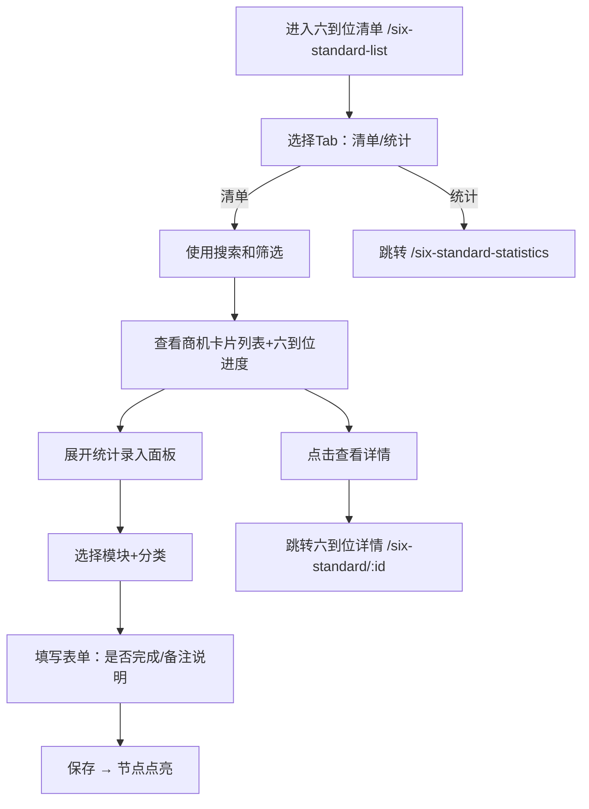

# 六到位清单 Six Standard List PRD

## 需求背景

### 痛点
- **问题现象**：客户经理需要按商机维度查看所有六到位项目的清单，支持搜索、筛选、查看详情和统计录入
- **发生频率**：高
- **当前 workaround**：通过Excel管理

### 业务目标
- **量化指标**：列表加载 < 1s，六到位进度条实时反映完成情况
- **目标期限**：持续可用

### 涉及系统/模块
- **模块名称**：六到位清单
- **变更类型**：新增
- **对接接口**：暂无（Mock数据）

---

## 用户故事

### 故事1
- **角色**：客户经理
- **功能**：查看六到位项目清单，每个商机显示六大维度完成进度
- **收益**：一眼掌握各项目六到位完成情况
- **验收条件**：列表卡片展示商机基本信息+六个到位进度条

### 故事2
- **角色**：客户经理
- **功能**：搜索或筛选商机，快速定位目标
- **收益**：减少查找时间
- **验收条件**：搜索和筛选正确过滤列表

### 故事3
- **角色**：客户经理
- **功能**：切换到"六到位统计"视图，查看全省/各市区完成率统计
- **收益**：从宏观角度了解团队工作进度
- **验收条件**：点击Tab跳转到 `/six-standard-statistics`

### 故事4
- **角色**：客户经理
- **功能**：在清单Tab中展开"统计录入"面板，对六大模块进行表单录入
- **收益**：在列表页直接录入统计数据，无需进入详情
- **验收条件**：展开统计录入面板，填写表单后保存

---

## 需求清单

| 序号 | 需求描述 | 优先级 | 状态 | 负责人 | 截止日期 |
|------|----------|--------|------|--------|----------|
| 1    | 顶部Tab（清单/统计） | P0 | DONE | | |
| 2    | 搜索面板 | P0 | DONE | | |
| 3    | 筛选侧边栏（9个筛选项） | P0 | DONE | | |
| 4    | 六到位卡片列表（可展开详情/六到位进度条） | P0 | DONE | | |
| 5    | 统计录入Tab | P0 | DONE | | |
| 6    | 统计录入表单Sheet | P0 | DONE | | |

---

## 业务流程图

---

## 页面结构

### 路由信息
- **路由路径** - 类型：文本；必填：是；示例：`/six-standard-list`
- **页面标题** - 类型：文本；必填：是；示例：`六到位详情`
- **访问权限** - 类型：枚举（登录）；描述：客户经理

### 布局结构
- **布局类型** - 类型：单栏
- **区域-顶部** - 返回按钮 + 标题 + 搜索图标 + 筛选图标 + Tab栏（清单/统计）
- **区域-清单内容** - 搜索面板 + 六到位卡片列表
- **区域-统计录入内容** - 六大模块统计录入面板
- **区域-筛选侧边栏** - 固定右侧，宽320px

---

## 功能描述

### 功能点1：Tab栏（清单/统计）

#### Tab 级
- **Tab名称** - 类型：文本；示例：`六到位清单`
- **操作按钮字段**：
  | 字段名 | 类型 | 必填 | 默认值 | 来源 | 校验规则 | 展示形式 | 交互约束 |
  |--------|------|------|--------|------|----------|----------|----------|
  | 六到位清单 | Tab | 是 | 激活 | 预置 | - | Tab按钮，蓝下边框=激活 | 点击切换 |
  | 六到位统计 | Tab | 是 | 未激活 | 预置 | - | Tab按钮 | 点击跳转 /six-standard-statistics |

### 功能点2：清单Tab - 搜索面板

#### Tab 级
- **查询条件字段**：
  | 字段名 | 类型 | 必填 | 默认值 | 来源 | 校验规则 | 展示形式 | 交互约束 |
  |--------|------|------|--------|------|----------|----------|----------|
  | 搜索关键词 | 文本 | 否 | 空 | 用户输入 | - | 文本输入框（placeholder：输入商机名称/编码、合同名称/编码、项目名称/编码） | 可编辑 |
  | 重置按钮 | 按钮 | 否 | - | - | - | 灰边按钮 | 点击清空关键词 |
  | 查询按钮 | 按钮 | 否 | - | - | - | 蓝色填充按钮 | 点击搜索，关闭面板 |

### 功能点3：清单Tab - 筛选侧边栏

#### 弹窗级
- **弹窗：筛选侧边栏**
  - **触发入口**：点击顶部"筛选"图标
  - **关闭方式**：遮罩层点击 / 关闭图标
  - **字段列表**：
    | 字段名 | 类型 | 必填 | 默认值 | 来源 | 校验规则 | 展示形式 | 交互约束 |
    |--------|------|------|--------|------|----------|----------|----------|
    | 客户经理 | 下拉选择 | 否 | 空 | 预置列表 | - | 下拉框 | 可编辑 |
    | 商机状态 | 复选框组 | 否 | [] | 用户选择 | - | 4个checkbox | 多选 |
    | 商机区域 | 文本 | 否 | 空 | 用户输入 | - | 文本输入框 | 可编辑 |
    | 商机名称 | 文本 | 否 | 空 | 用户输入 | - | 文本输入框 | 可编辑 |
    | 商机编码 | 文本 | 否 | 空 | 用户输入 | - | 文本输入框 | 可编辑 |
    | 合同名称 | 文本 | 否 | 空 | 用户输入 | - | 文本输入框 | 可编辑 |
    | 合同编码 | 文本 | 否 | 空 | 用户输入 | - | 文本输入框 | 可编辑 |
    | 项目名称 | 文本 | 否 | 空 | 用户输入 | - | 文本输入框 | 可编辑 |
    | 项目编码 | 文本 | 否 | 空 | 用户输入 | - | 文本输入框 | 可编辑 |
    | 创建时间-开始 | 日期 | 否 | 空 | 用户选择 | - | 日期选择器 | 可编辑 |
    | 创建时间-结束 | 日期 | 否 | 空 | 用户选择 | - | 日期选择器 | 可编辑 |
  - **确定按钮**：关闭侧边栏，应用筛选条件
  - **重置按钮**：清空所有筛选项

### 功能点4：清单Tab - 六到位卡片

#### Tab 级
- **字段列表**：
  | 字段名 | 类型 | 必填 | 默认值 | 来源 | 校验规则 | 展示形式 | 交互约束 |
  |--------|------|------|--------|------|----------|----------|----------|
  | 商机名称 | 文本 | 是 | - | Mock数据 | - | 标题 | 只读 |
  | 商机编码 | 文本 | 是 | - | Mock数据 | - | 小号灰色文字 | 只读 |
  | 状态标签 | 枚举 | 是 | - | Mock数据 | - | 彩色胶囊 | 只读 |
  | 区域标签 | 文本 | 是 | - | Mock数据 | - | 蓝底文字胶囊 | 只读 |
  | 客户经理标签 | 文本 | 是 | - | Mock数据 | - | 紫底文字胶囊 | 只读 |
  | 金额标签 | 数字 | 是 | - | Mock数据 | - | 橙底文字胶囊（X万） | 只读 |
  | 阶段标签 | 文本 | 是 | - | Mock数据 | - | 青底文字胶囊 | 只读 |
  | 六个到位进度条 | 进度数组 | 是 | - | Mock数据 | - | 彩色进度条（客情=蓝/方案=绿/谈判=紫/采购=橙/项目=红/运维=青），显示"名称 完成数/总数"，绿色=已完成，红色=未完成，灰色=总数为0 | 只读 |
  | 创建时间 | 文本 | 是 | - | Mock数据 | - | 小号文字 | 只读 |
  | 展开箭头 | 图标 | 是 | 收起 | 状态 | - | ChevronUp/Down图标 | 点击展开/收起 |
  | 合同/项目信息（展开） | 文本 | 条件 | - | Mock数据 | - | 灰色背景区域内的字段 | 只读 |

- **操作按钮字段**：
  | 字段名 | 类型 | 必填 | 默认值 | 来源 | 校验规则 | 展示形式 | 交互约束 |
  |--------|------|------|--------|------|----------|----------|----------|
  | 查看详情 | 按钮 | 否 | - | - | - | 蓝色胶囊按钮 | 点击跳转 `/six-standard/:id` |

### 功能点5：统计录入Tab

#### Tab 级
- **字段列表**：
  | 字段名 | 类型 | 必填 | 默认值 | 来源 | 校验规则 | 展示形式 | 交互约束 |
  |--------|------|------|--------|------|----------|----------|----------|
  | 六大统计模块 | 可折叠面板 | 是 | - | 预置 | - | 展开收起，含模块名+完成数/总数+状态圆点 | 点击展开/收起 |
  | 分类录入项 | 列表项 | 条件 | - | 预置 | - | 分类名称+完成状态图标+箭头 | 点击打开表单Sheet |

- **操作按钮字段**（表单Sheet内）：
  | 字段名 | 类型 | 必填 | 默认值 | 来源 | 校验规则 | 展示形式 | 交互约束 |
  |--------|------|------|--------|------|----------|----------|----------|
  | 是否完成 | 下拉选择 | 是 | 空 | 用户选择 | 非空必填 | 下拉框（是/否） | 可编辑 |
  | 备注说明 | 文本 | 否 | 空 | 用户输入 | - | textarea | 可编辑 |
  | 保存按钮 | 按钮 | 是 | - | - | - | 蓝色填充按钮 | 点击保存 |

---

## 数据流图

### 接口1：保存统计录入
- **请求路径** - 类型：文本；示例：`POST /api/six-standard/stat/save`
- **请求方法** - 类型：枚举（POST）
- **请求头** - Authorization
- **请求参数**：
  - `categoryId` - 类型：字符串；必填：是；来源：分类ID
  - `completed` - 类型：枚举；必填：是；来源：表单字段"是否完成"
  - `remark` - 类型：字符串；必填：否；来源：表单字段"备注说明"
- **响应字段**：
  - `success` - 类型：布尔；描述：是否成功
- **存储位置** - 后端数据库

### 数据刷新点
- **刷新时机** - 页面加载、保存后
- **影响字段** - 列表内容、分类完成状态

---

## 验收标准

### 正常流程
- [ ] **操作**：打开 `/six-standard-list` → **预期**：显示清单Tab，含搜索和筛选图标
- [ ] **操作**：点击筛选图标 → **预期**：侧边栏滑出，显示9个筛选项
- [ ] **操作**：选择"跟进中"状态后点确定 → **预期**：列表过滤为跟进中商机
- [ ] **操作**：点击卡片展开箭头 → **预期**：卡片展开，显示合同/项目信息
- [ ] **操作**：点击"六到位统计"Tab → **预期**：跳转到 `/six-standard-statistics`
- [ ] **操作**：展开统计录入面板的某一分类 → **预期**：右侧Sheet滑出，显示"是否完成"+备注表单

---

## 更新记录

### v1 - 2026-05-09
- 初始版本
