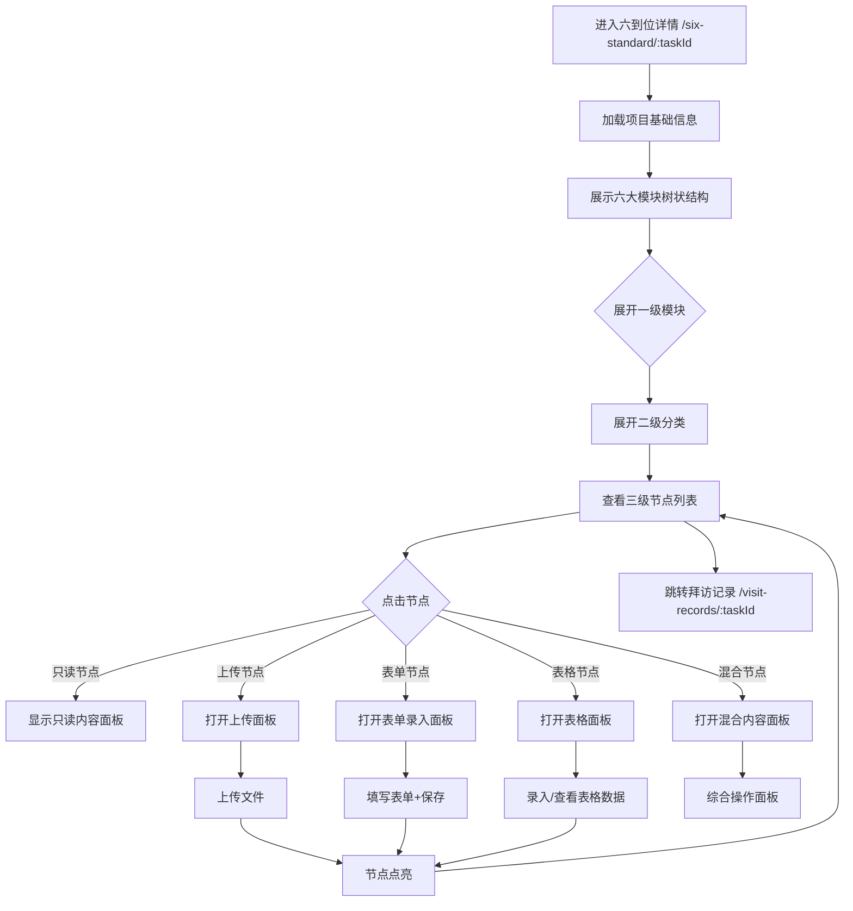

# 六到位详情 Six Standard Detail PRD

## 需求背景

### 痛点
- **问题现象**：客户经理需要对商机项目填写六到位信息，涉及客情掌握、方案总控、谈判应标、采购自主、项目强管控、运维自主六大模块，每个模块下有多个子节点
- **发生频率**：高
- **当前 workaround**：通过Excel或纸质文件管理

### 业务目标
- **量化指标**：页面加载 < 2s，节点点亮操作响应 < 300ms
- **目标期限**：持续可用

### 涉及系统/模块
- **模块名称**：六到位详情
- **变更类型**：新增
- **对接接口**：暂无（Mock数据）

---

## 用户故事

### 故事1
- **角色**：客户经理 / 项目经理
- **功能**：在六到位详情页查看项目的基础信息（客户档案、拜访记录、录入商机、团队成员等）
- **收益**：集中查看项目全量信息，便于评估六到位完成情况
- **验收条件**：页面展示项目基本信息、六大模块树状结构

### 故事2
- **角色**：客户经理 / 项目经理
- **功能**：逐级展开六到位模块树（三级结构：一级模块→二级分类→三级节点），点击节点查看或编辑内容
- **收益**：清晰了解每个节点的状态（已点亮/未点亮），快速定位待完成项
- **验收条件**：树状结构正确展示，点击节点打开对应内容面板

### 故事3
- **角色**：客户经理
- **功能**：上传文件、填写表单、保存节点状态
- **收益**：在线完成六到位信息录入，无需线下整理
- **验收条件**：文件上传成功，表单提交后节点点亮

---

## 需求清单

| 序号 | 需求描述 | 优先级 | 状态 | 负责人 | 截止日期 |
|------|----------|--------|------|--------|----------|
| 1    | 头部信息（项目信息/团队/商机/归档/后向） | P0 | DONE | | |
| 2    | 六大模块树状结构（一级→二级→三级节点） | P0 | DONE | | |
| 3    | 二级节点内容面板（只读/上传/表单/表格/混合） | P0 | DONE | | |
| 4    | 节点点亮状态切换 | P0 | DONE | | |
| 5    | 文件上传弹窗 UploadDialog | P0 | DONE | | |
| 6    | 录入前向投标弹窗 AddBidDialog | P0 | DONE | | |
| 7    | 拜访记录跳转至 /visit-records/:taskId | P0 | DONE | | |

---

## 业务流程图

---

## 页面结构

### 路由信息
- **路由路径** - 类型：文本；必填：是；示例：`/six-standard/:taskId`
- **页面标题** - 类型：文本；必填：是；示例：`六到位详情`
- **访问权限** - 类型：枚举（登录）；描述：客户经理/项目经理

### 布局结构
- **布局类型** - 类型：单栏（内容面板为右侧Sheet覆盖）
- **区域-头部** - 返回按钮 + 标题 + 四个Tab（项目信息/团队成员/录入商机/归档信息）
- **区域-六大模块** - 垂直滚动的六大模块树状结构，每模块含二级分类列表
- **区域-内容面板Sheet** - 从右侧滑出的内容面板（底部弹出式）
- **区域-上传弹窗** - 底部弹出的文件上传弹窗
- **区域-录入前向投标弹窗** - 底部弹出的投标录入弹窗

---

## 功能描述

### 功能点1：头部Tab栏（项目信息/团队成员/录入商机/归档信息）

#### Tab 级
- **Tab名称** - 类型：文本；示例：`项目信息`
- **操作按钮字段**：
  | 字段名 | 类型 | 必填 | 默认值 | 来源 | 校验规则 | 展示形式 | 交互约束 |
  |--------|------|------|--------|------|----------|----------|----------|
  | 项目信息 | Tab | 是 | 激活 | 预置 | - | Tab按钮 | 点击切换 |
  | 团队成员 | Tab | 是 | 未激活 | 预置 | - | Tab按钮 | 点击切换 |
  | 录入商机 | Tab | 是 | 未激活 | 预置 | - | Tab按钮 | 点击切换 |
  | 归档信息 | Tab | 是 | 未激活 | 预置 | - | Tab按钮 | 点击切换 |

### 功能点2：六大模块树状结构

#### 页面级
- **字段列表**：
  | 字段名 | 类型 | 必填 | 默认值 | 来源 | 校验规则 | 展示形式 | 交互约束 |
  |--------|------|------|--------|------|----------|----------|----------|
  | 一级模块名称 | 文本 | 是 | - | 预置 | - | 模块标签（客情掌握/方案总控/谈判应标自主/采购自主/项目强管控/运维自主） | 点击展开 |
  | 一级模块点亮状态 | 布尔 | 是 | false | 自动计算 | - | 圆点图标（全部点亮=绿色，部分=橙色，未点亮=灰色） | 只读 |
  | 一级模块规则说明 | 文本 | 是 | - | 预置 | - | 小号灰色文字 | 只读 |
  | 二级分类名称 | 文本 | 是 | - | 预置 | - | 分类名称文字 | 点击展开 |
  | 二级分类点亮状态 | 布尔 | 是 | false | 自动计算 | - | 圆点图标 | 只读 |
  | 二级分类规则说明 | 文本 | 是 | - | 预置 | - | 小号灰色文字 | 只读 |
  | 二级分类是否纳入六到位 | 布尔 | 是 | - | 预置 | - | "纳入"/不显示 | 只读 |
  | 二级分类同步类型 | 枚举 | 是 | - | 预置 | - | 标签文字（具备两级/具备上送/结构化内容具备下发/具备下发/否/仅省内展示） | 只读 |
  | 二级分类入口系统 | 文本 | 是 | - | 预置 | - | 小号灰色文字 | 只读 |
  | 三级节点名称 | 文本 | 是 | - | 预置 | - | 节点文字 | 点击打开内容面板 |
  | 三级节点点亮状态 | 布尔 | 是 | false | Mock数据 | - | 圆点图标（点亮=绿色，未点亮=灰色） | 点击切换 |

### 功能点3：内容面板（按二级分类ID区分内容类型）

#### 弹窗级
- **弹窗：内容面板 ContentPanel**（底部Sheet，半高）
  - **触发入口**：点击三级节点
  - **关闭方式**：关闭图标 / 面板外区域
  - **内容类型映射**：
    | 分类ID | 内容类型 | 说明 |
    |--------|----------|------|
    | 1-1 客户档案 | readonly | 只读展示客户档案信息 |
    | 1-2 拜访记录 | table | 走访记录列表+新增按钮（跳转 /visit-records/:taskId） |
    | 1-3 录入商机 | readonly | 只读展示商机信息 |
    | 1-4 近三年信息化项目 | table | 近三年合同列表 |
    | 1-5 其他 | upload | 客情掌握其它附件上传 |
    | 2-1 组建团队 | table | 团队成员列表 |
    | 2-2 方案设计与审核 | upload | 多个方案文档上传 |
    | 2-3 方案解构与中台把关 | mixed | 方案解构+中台把关混合 |
    | 2-4 其他 | upload | 方案总控其它附件 |
    | 3-1 参标记录 | form | 参标表单+文件上传 |
    | 3-2 应标结果记录 | form | 应标结果表单+文件上传 |
    | 3-3 商务谈判 | form | 谈判记录表单+文件上传 |
    | 3-4 前向合同信息 | mixed | 前向合同附件+报价清单+图纸 |
    | 3-5 其他 | upload | 谈判应标其它附件 |
    | 4-1 标前决策会 | form | 标前决策会表单 |
    | 4-2 业务解构 | form | 业务解构表单 |
    | 4-3 业务风险及合规审核 | upload | 审核结果+对比结果+省内风险附件 |
    | 4-4 后向资料 | mixed | 后向合同+清单上传 |
    | 4-5 其他 | upload | 采购自主其它附件 |
    | 5-1 项目实施总体设计 | upload | 总体实施方案+监理报告上传 |
    | 5-2 变更记录 | form | 变更记录表单 |
    | 5-3 验收报告 | upload | 初验/终验报告+进度表上传 |
    | 5-4 项目实施文件 | upload | 12种项目文件上传 |
    | 5-5 审计清单 | upload | 5种审计文件上传 |
    | 5-6 其他 | upload | 项目强管控其它附件 |
    | 6-1 数字资产平台 | form | 数字资产平台表单 |
    | 6-2 第一服务界面 | form | 第一服务界面表单 |
    | 6-3 售后其他资料 | upload | 8种运维资料上传 |
    | 6-4 其他 | upload | 运维自主其它附件 |

### 功能点4：上传弹窗 UploadDialog

#### 弹窗级
- **弹窗：UploadDialog**
  - **触发入口**：点击内容面板中的上传按钮
  - **关闭方式**：关闭图标
  - **字段列表**：
    | 字段名 | 类型 | 必填 | 默认值 | 来源 | 校验规则 | 展示形式 | 交互约束 |
    |--------|------|------|--------|------|----------|----------|----------|
    | 文件列表 | 文件数组 | 是 | [] | 用户选择 | - | 文件卡片列表（文件名+大小+上传时间+同步状态） | 可删除 |
    | 选择文件按钮 | 按钮 | 是 | - | - | - | 触发系统文件选择 | 点击 |
  - **确定按钮**：关闭弹窗，刷新文件列表
  - **取消按钮**：关闭弹窗

### 功能点5：录入前向投标弹窗 AddBidDialog

#### 弹窗级
- **弹窗：AddBidDialog**
  - **触发入口**：点击内容面板中的"录入前向投标"按钮
  - **关闭方式**：关闭图标
  - **字段列表**：
    | 字段名 | 类型 | 必填 | 默认值 | 来源 | 校验规则 | 展示形式 | 交互约束 |
    |--------|------|------|--------|------|----------|----------|----------|
    | 投标主体 | 文本 | 是 | 空 | 用户输入 | 非空 | 文本输入框 | 可编辑 |
    | 投标时间 | 日期 | 是 | 空 | 用户选择 | 非空 | 日期选择器 | 可编辑 |
  - **确定按钮**：调用接口保存投标信息
  - **取消按钮**：关闭弹窗

---

## 数据流图

### 接口1：保存节点状态
- **请求路径** - 类型：文本；示例：`POST /api/six-standard/node/save`
- **请求方法** - 类型：枚举（POST）
- **请求头** - Authorization
- **请求参数**：
  - `taskId` - 类型：字符串；必填：是；来源：URL参数
  - `nodeId` - 类型：字符串；必填：是；来源：节点ID
  - `completed` - 类型：布尔；必填：是；来源：节点完成状态
- **响应字段**：
  - `success` - 类型：布尔；描述：是否成功
- **存储位置** - 后端数据库

### 数据刷新点
- **刷新时机** - 页面加载、节点保存后
- **影响字段** - 节点点亮状态

---

## 验收标准

### 正常流程
- [ ] **操作**：打开 `/six-standard/1` → **预期**：显示项目基础信息Tab和六大模块树
- [ ] **操作**：点击"客情掌握"一级模块 → **预期**：展开显示5个二级分类
- [ ] **操作**：点击"拜访记录"二级分类 → **预期**：右侧Sheet滑出，显示走访记录列表和新增按钮
- [ ] **操作**：点击"拜访记录"内容面板的"新增" → **预期**：跳转 `/visit-records/1/new`
- [ ] **操作**：点击三级节点 → **预期**：根据节点内容类型显示对应面板

### 异常流程
- [ ] **操作**：上传文件时网络断开 → **预期**：显示错误提示

---

## 更新记录

### v1 - 2026-05-09
- 初始版本
