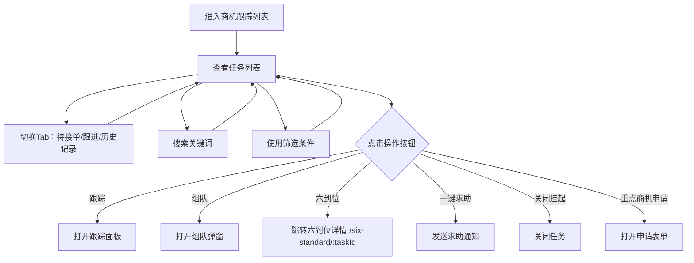

# 商机跟踪列表 Tasks PRD

## 需求背景

### 痛点
- **问题现象**：客户经理需要跟踪商机进展、协调团队成员、处理各种商机操作
- **发生频率**：高
- **当前 workaround**：通过电话或线下协调

### 业务目标
- **量化指标**：任务列表加载 < 1s，操作响应 < 200ms
- **目标期限**：持续可用

### 涉及系统/模块
- **模块名称**：商机跟踪列表
- **变更类型**：新增
- **对接接口**：暂无（Mock数据）

---

## 用户故事

### 故事1
- **角色**：客户经理
- **功能**：查看自己负责的商机跟踪任务列表，了解待接单/跟进/历史任务数量
- **收益**：快速了解商机跟进状态，优先处理待接单任务
- **验收条件**：列表展示任务卡片，含客户经理、售前经理、团队成员、跟进按钮

### 故事2
- **角色**：客户经理
- **功能**：对商机任务进行跟踪、求助、组队、关闭、申请重点商机、六到位录入
- **收益**：一站式处理商机跟进全流程
- **验收条件**：点击各按钮触发对应操作或弹窗

---

## 需求清单

| 序号 | 需求描述 | 优先级 | 状态 | 负责人 | 截止日期 |
|------|----------|--------|------|--------|----------|
| 1    | 顶部Tab（待接单/跟进/历史记录） | P0 | DONE | | |
| 2    | 搜索框 | P0 | DONE | | |
| 3    | 筛选栏（客户经理/售前经理/评分状态/更新周期/日期范围） | P1 | DONE | | |
| 4    | 任务卡片列表 | P0 | DONE | | |
| 5    | 操作按钮（跟踪/一键求助/组队/关闭挂起/重点商机申请/六到位） | P0 | DONE | | |
| 6    | 组队弹窗 TeamDialog | P0 | DONE | | |

---

## 业务流程图

---

## 页面结构

### 路由信息
- **路由路径** - 类型：文本；必填：是；示例：`/tasks`
- **页面标题** - 类型：文本；必填：是；示例：`商机跟踪列表`
- **访问权限** - 类型：枚举（登录）；描述：登录用户

### 布局结构
- **布局类型** - 类型：单栏
- **区域-顶部** - 返回按钮 + 标题 + 三个Tab（待接单/跟进/历史）+ 红点数字
- **区域-搜索** - 搜索输入框 + 取消按钮
- **区域-筛选** - 横向滚动的筛选按钮行
- **区域-任务列表** - 垂直滚动的任务卡片列表

### Tab 结构
- **Tab名称** - 类型：文本；示例：`待接单`、`跟进`、`历史记录`
- **Tab路由** - 类型：文本；描述：URL参数（当前为内部状态切换）
- **加载方式** - 预加载
- **默认激活** - `跟进`

---

## 功能描述

### 功能点1：顶部Tab栏

#### Tab 级
- **Tab名称** - 类型：文本；示例：`待接单`
- **操作按钮字段**：
  | 字段名 | 类型 | 必填 | 默认值 | 来源 | 校验规则 | 展示形式 | 交互约束 |
  |--------|------|------|--------|------|----------|----------|----------|
  | 待接单红点数 | 数字 | 是 | 26 | Mock | - | 红色圆形气泡，角标 | 只读 |
  | 跟进红点数 | 数字 | 是 | 583 | Mock | - | 红色圆形气泡，角标 | 只读 |
  | 历史记录红点数 | 数字 | 是 | 3387 | Mock | - | 红色圆形气泡，角标 | 只读 |
  | 跟进下划线 | 布尔 | 是 | true | 状态 | - | 蓝色2px下划线 | 点击切换Tab |

### 功能点2：搜索栏

#### Tab 级
- **查询条件字段**：
  | 字段名 | 类型 | 必填 | 默认值 | 来源 | 校验规则 | 展示形式 | 交互约束 |
  |--------|------|------|--------|------|----------|----------|----------|
  | 搜索关键词 | 文本 | 否 | 空 | 用户输入 | - | 文本输入框 | 可编辑 |
  | 取消按钮 | 操作 | 否 | - | - | - | 文字按钮 | 点击关闭搜索 |

### 功能点3：筛选栏

#### Tab 级
- **查询条件字段**：
  | 字段名 | 类型 | 必填 | 默认值 | 来源 | 校验规则 | 展示形式 | 交互约束 |
  |--------|------|------|--------|------|----------|----------|----------|
  | 客户经理 | 筛选 | 否 | 未选中 | 用户选择 | - | 横向滚动的胶囊按钮 | 点击选中 |
  | 售前经理 | 筛选 | 否 | 未选中 | 用户选择 | - | 横向滚动的胶囊按钮 | 点击选中 |
  | 评分状态 | 筛选 | 否 | 未选中 | 用户选择 | - | 横向滚动的胶囊按钮 | 点击选中 |
  | 更新周期 | 筛选 | 否 | 未选中 | 用户选择 | - | 横向滚动的胶囊按钮 | 点击选中 |
  | 日期范围 | 筛选 | 否 | 未选中 | 用户选择 | - | 横向滚动的胶囊按钮 | 点击选中 |

### 功能点4：任务卡片

#### Tab 级
- **字段列表**：
  | 字段名 | 类型 | 必填 | 默认值 | 来源 | 校验规则 | 展示形式 | 交互约束 |
  |--------|------|------|--------|------|----------|----------|----------|
  | 任务标题 | 文本 | 是 | - | Mock数据 | - | 文字，超长截断 | 只读 |
  | 客户经理 | 文本 | 是 | - | Mock数据 | - | 标签+文字 | 只读 |
  | 售前经理 | 文本 | 是 | - | Mock数据 | - | 标签+文字 | 只读 |
  | 审核人 | 文本 | 否 | - | Mock数据 | - | 标签+文字 | 只读 |
  | 团队成员 | 文本数组 | 是 | [] | Mock数据 | - | 逗号分隔文字 | 只读 |
  | 支局 | 文本 | 是 | - | Mock数据 | - | 文字 | 只读 |
  | 分局 | 文本 | 是 | - | Mock数据 | - | 文字 | 只读 |
  | 客户名称 | 文本 | 否 | - | Mock数据 | - | 文字 | 只读 |
  | 更新时间 | 文本 | 否 | - | Mock数据 | - | 文字时间格式 | 只读 |

- **操作按钮字段**：
  | 字段名 | 类型 | 必填 | 默认值 | 来源 | 校验规则 | 展示形式 | 交互约束 |
  |--------|------|------|--------|------|----------|----------|----------|
  | 跟踪 | 按钮 | 否 | - | - | - | 胶囊按钮，灰边 | 点击触发跟踪 |
  | 一键求助 | 按钮 | 否 | - | - | - | 胶囊按钮，灰边 | 点击发送求助 |
  | 组队 | 按钮 | 否 | - | - | - | 胶囊按钮，灰边 | 点击打开 TeamDialog |
  | 关闭挂起 | 按钮 | 否 | - | - | - | 胶囊按钮，灰边 | 点击关闭任务 |
  | 重点商机申请 | 按钮 | 否 | - | - | - | 胶囊按钮，灰边 | 点击打开申请表单 |
  | 六到位 | 按钮 | 否 | - | - | - | 蓝色胶囊按钮，蓝边 | 点击跳转六到位详情 |

### 功能点5：组队弹窗 TeamDialog

#### 弹窗级
- **弹窗：TeamDialog**
  - **触发入口**：点击任务卡片的"组队"按钮
  - **关闭方式**：遮罩层点击 / 关闭图标 / 取消按钮
  - **字段列表**：
    | 字段名 | 类型 | 必填 | 默认值 | 来源 | 校验规则 | 展示形式 | 交互约束 |
    |--------|------|------|--------|------|----------|----------|----------|
    | 任务ID | 文本 | 是 | 当前任务ID | URL参数 | - | 只读显示 | 只读 |
  - **确定按钮**：调用 `POST /api/team/create`，成功关闭弹窗刷新列表
  - **取消按钮**：关闭弹窗，不修改数据

---

## 数据流图

### 接口1：创建队伍
- **请求路径** - 类型：文本；示例：`POST /api/team/create`
- **请求方法** - 类型：枚举（POST）
- **请求头** - Authorization
- **请求参数**：
  - `taskId` - 类型：字符串；必填：是；来源：页面字段 `task.id`；校验：非空
- **响应字段**：
  - `success` - 类型：布尔；描述：是否成功
  - `teamId` - 类型：字符串；描述：队伍ID
- **存储位置** - 后端数据库
- **错误码**：
  - `401` - 用户未登录
  - `500` - 服务器异常

### 数据刷新点
- **刷新时机** - 页面加载
- **影响字段** - 任务列表、Tab红点数

---

## 验收标准

### 正常流程
- [ ] **操作**：打开 `/tasks` → **预期**：显示3个Tab、搜索框、筛选栏、Mock任务列表
- [ ] **操作**：点击"跟进"Tab → **预期**：Tab高亮下划线，内容保持
- [ ] **操作**：点击任务卡片"六到位" → **预期**：跳转 `/six-standard/:taskId`
- [ ] **操作**：点击"组队" → **预期**：弹出 TeamDialog 弹窗
- [ ] **操作**：在搜索框输入关键词 → **预期**：搜索框显示输入内容

### 异常流程
- [ ] **操作**：点击占位按钮（线索管理等） → **预期**：无任何响应（不报错）

---

## 更新记录

### v1 - 2026-05-09
- 初始版本
