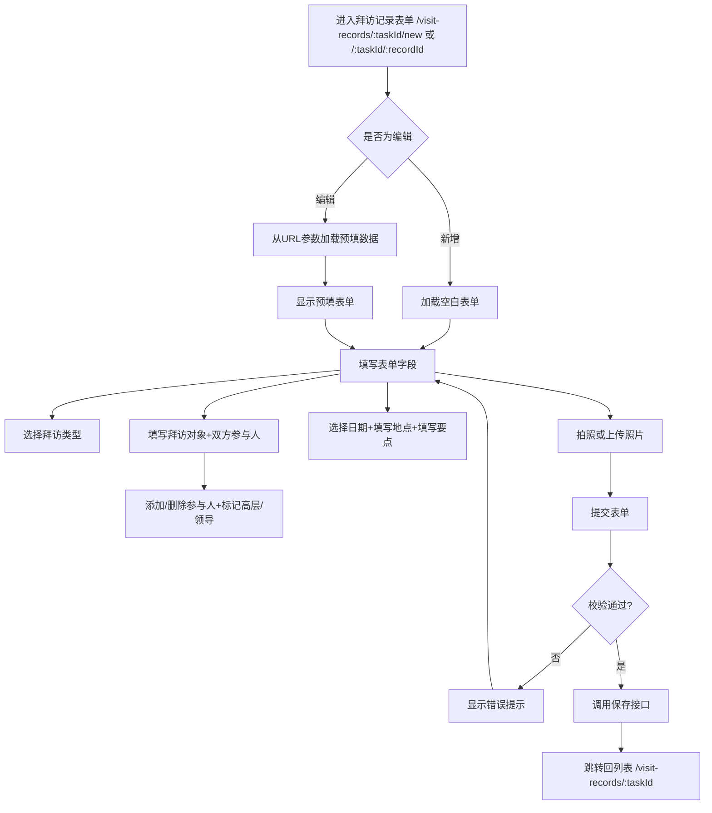

# 拜访记录表单 Visit Record Form PRD

## 需求背景

### 痛点
- **问题现象**：客户经理需要填写或编辑拜访记录，包含基本信息、双方参与人、照片等
- **发生频率**：高
- **当前 workaround**：线下记录

### 业务目标
- **量化指标**：表单加载 < 500ms，提交响应 < 300ms
- **目标期限**：持续可用

### 涉及系统/模块
- **模块名称**：拜访记录表单
- **变更类型**：新增
- **对接接口**：暂无（Mock数据）

---

## 用户故事

### 故事1
- **角色**：客户经理
- **功能**：新增拜访记录，填写拜访类型、对象、双方参与人、日期、地点、会谈要点，上传照片
- **收益**：在线录入拜访信息，支持必填校验和草稿保存
- **验收条件**：表单填写完整后点击保存，校验通过则跳转回列表页

### 故事2
- **角色**：客户经理
- **功能**：编辑已有拜访记录，修改任意字段后保存
- **收益**：修改历史拜访记录信息
- **验收条件**：编辑页预填现有数据，保存后更新记录

---

## 需求清单

| 序号 | 需求描述 | 优先级 | 状态 | 负责人 | 截止日期 |
|------|----------|--------|------|--------|----------|
| 1    | 拜访类型下拉选择 | P0 | DONE | | |
| 2    | 拜访对象输入 | P0 | DONE | | |
| 3    | 对方参加人员管理（增删改+标记高层） | P0 | DONE | | |
| 4    | 我方参加人员管理（增删改+标记领导） | P0 | DONE | | |
| 5    | 拜访日期选择 | P0 | DONE | | |
| 6    | 拜访地点输入 | P0 | DONE | | |
| 7    | 会谈要点文本域 | P0 | DONE | | |
| 8    | 照片上传（拍照+相册，最多9张） | P1 | DONE | | |
| 9    | 保存按钮+前端校验 | P0 | DONE | | |

---

## 业务流程图

---

## 页面结构

### 路由信息
- **路由路径** - 类型：文本；必填：是；示例：`/visit-records/:taskId/new` 或 `/visit-records/:taskId/:recordId`
- **页面标题** - 类型：文本；必填：是；示例：`新增拜访记录` / `编辑拜访记录`
- **访问权限** - 类型：枚举（登录）；描述：客户经理

### 布局结构
- **布局类型** - 类型：单栏
- **区域-顶部** - 返回按钮 + 动态标题（新增/编辑）
- **区域-表单** - 垂直滚动的表单区域，含客户信息+拜访类型+拜访对象+双方参加人+日期+地点+要点+照片

---

## 功能描述

### 功能点1：客户信息区

#### 页面级
- **字段列表**：
  | 字段名 | 类型 | 必填 | 默认值 | 来源 | 校验规则 | 展示形式 | 交互约束 |
  |--------|------|------|--------|------|----------|----------|----------|
  | 客户名称 | 文本 | 是 | 宁波爱地宝商业管理有限公司 | 预填 | - | 只读文字 | 只读 |
  | 客户编码 | 文本 | 是 | CUS20260326001 | 预填 | - | 只读小号灰色 | 只读 |

### 功能点2：拜访类型选择

#### 页面级
- **字段列表**：
  | 字段名 | 类型 | 必填 | 默认值 | 来源 | 校验规则 | 展示形式 | 交互约束 |
  |--------|------|------|--------|------|----------|----------|----------|
  | 拜访类型 | 下拉选择 | 是 | 商机推进拜访 | 表单状态 | 非空 | 下拉框 | 可编辑 |
  - **选项**：日常拜访、商机推进拜访、交流拜访、陌生拜访、签约、其他、战略合作、公开活动

### 功能点3：拜访对象输入

#### 页面级
- **字段列表**：
  | 字段名 | 类型 | 必填 | 默认值 | 来源 | 校验规则 | 展示形式 | 交互约束 |
  |--------|------|------|--------|------|----------|----------|----------|
  | 拜访对象 | 文本 | 是 | 空 | 用户输入 | 非空 | 文本输入框 | 可编辑 |
  | 拜访对象错误 | 文本 | 条件 | 空 | 校验结果 | - | 红色小号错误提示 | 只读（仅显示） |

### 功能点4：对方参加人员

#### 页面级
- **字段列表**：
  | 字段名 | 类型 | 必填 | 默认值 | 来源 | 校验规则 | 展示形式 | 交互约束 |
  |--------|------|------|--------|------|----------|----------|----------|
  | 姓名输入框 | 文本 | 是（每人） | 空 | 用户输入 | 非空（每人） | 文本输入框 | 可编辑 |
  | 高层复选框 | 布尔 | 否 | false | 用户选择 | - | checkbox+文字标签 | 可切换 |
  | 删除按钮 | 按钮 | 条件 | - | - | 至少保留1人 | 红色X图标 | 点击移除该人员 |
  | 添加人员按钮 | 按钮 | 否 | - | - | - | 蓝色文字"+ 添加" | 点击添加新人员行 |
  | 姓名错误提示 | 文本 | 条件 | 空 | 校验结果 | - | 红色小号错误提示 | 只读 |

### 功能点5：我方参加人员

#### 页面级
- **字段列表**：
  | 字段名 | 类型 | 必填 | 默认值 | 来源 | 校验规则 | 展示形式 | 交互约束 |
  |--------|------|------|--------|------|----------|----------|----------|
  | 姓名输入框 | 文本 | 是（每人） | 空 | 用户输入 | 非空（每人） | 文本输入框 | 可编辑 |
  | 领导复选框 | 布尔 | 否 | false | 用户选择 | - | checkbox+文字标签 | 可切换 |
  | 删除按钮 | 按钮 | 条件 | - | - | 至少保留1人 | 红色X图标 | 点击移除该人员 |
  | 添加人员按钮 | 按钮 | 否 | - | - | - | 蓝色文字"+ 添加" | 点击添加新人员行 |
  | 姓名错误提示 | 文本 | 条件 | 空 | 校验结果 | - | 红色小号错误提示 | 只读 |

### 功能点6：拜访日期

#### 页面级
- **字段列表**：
  | 字段名 | 类型 | 必填 | 默认值 | 来源 | 校验规则 | 展示形式 | 交互约束 |
  |--------|------|------|--------|------|----------|----------|----------|
  | 拜访日期 | 日期 | 是 | 空 | 用户选择 | 非空 | 日期选择器 | 可编辑 |
  | 日期错误提示 | 文本 | 条件 | 空 | 校验结果 | - | 红色小号错误提示 | 只读 |

### 功能点7：拜访地点

#### 页面级
- **字段列表**：
  | 字段名 | 类型 | 必填 | 默认值 | 来源 | 校验规则 | 展示形式 | 交互约束 |
  |--------|------|------|--------|------|----------|----------|----------|
  | 拜访地点 | 文本 | 是 | 空 | 用户输入 | 非空 | 文本输入框 | 可编辑 |
  | 地点错误提示 | 文本 | 条件 | 空 | 校验结果 | - | 红色小号错误提示 | 只读 |

### 功能点8：双方会谈要点

#### 页面级
- **字段列表**：
  | 字段名 | 类型 | 必填 | 默认值 | 来源 | 校验规则 | 展示形式 | 交互约束 |
  |--------|------|------|--------|------|----------|----------|----------|
  | 会谈要点 | 文本 | 是 | 空 | 用户输入 | 非空 | textarea，5行高 | 可编辑 |
  | 要点错误提示 | 文本 | 条件 | 空 | 校验结果 | - | 红色小号错误提示 | 只读 |

### 功能点9：照片上传

#### 页面级
- **字段列表**：
  | 字段名 | 类型 | 必填 | 默认值 | 来源 | 校验规则 | 展示形式 | 交互约束 |
  |--------|------|------|--------|------|----------|----------|----------|
  | 照片网格 | 图片数组 | 否 | [] | 用户上传 | 最多9张 | 3列网格，每格显示图片缩略图，右上角X删除按钮 | 可删除任意张 |
  | 拍照按钮 | 按钮 | 否 | - | - | - | 虚线边框按钮，含相机图标 | 点击触发拍照 |
  | 上传按钮 | 按钮 | 否 | - | - | - | 虚线边框按钮，含上传图标 | 点击触发相册选择 |
  | 数量提示 | 文本 | 是 | 最多上传9张照片 | - | - | 小号灰色文字 | 只读 |

### 功能点10：保存按钮

#### 页面级
- **字段：保存按钮** - 类型：按钮；描述：蓝色填充按钮，"保存"，全宽
- **交互约束**：
  - 点击后执行前端校验
  - 所有必填字段为空时，错误提示显示，保存失败
  - 校验通过后调用保存接口，成功跳转回列表页

---

## 数据流图

### 接口1：保存拜访记录
- **请求路径** - 类型：文本；示例：`POST /api/visit-records/save`
- **请求方法** - 类型：枚举（POST）
- **请求头** - Authorization
- **请求参数**：
  - `taskId` - 类型：字符串；必填：是；来源：URL参数
  - `visitType` - 类型：字符串；必填：是；来源：表单字段
  - `visitTarget` - 类型：字符串；必填：是；来源：表单字段
  - `visitDate` - 类型：字符串；必填：是；来源：表单字段
  - `visitLocation` - 类型：字符串；必填：是；来源：表单字段
  - `keyPoints` - 类型：字符串；必填：是；来源：表单字段
  - `theirParticipants` - 类型：数组；必填：是；来源：表单字段
  - `ourParticipants` - 类型：数组；必填：是；来源：表单字段
  - `photos` - 类型：数组；必填：否；来源：表单字段
- **响应字段**：
  - `success` - 类型：布尔；描述：是否成功
- **存储位置** - 后端数据库

### 数据刷新点
- **刷新时机** - 保存成功后
- **影响字段** - 列表页自动更新

---

## 验收标准

### 正常流程
- [ ] **操作**：打开 `/visit-records/1/new` → **预期**：显示空白表单，标题为"新增拜访记录"
- [ ] **操作**：打开 `/visit-records/1/1` → **预期**：显示预填表单，标题为"编辑拜访记录"
- [ ] **操作**：选择拜访类型 → **预期**：下拉列表显示8个选项，选择后高亮
- [ ] **操作**：点击"+ 添加"添加对方参加人员 → **预期**：新增一行姓名输入框+高层复选框
- [ ] **操作**：点击删除 → **预期**：移除该人员行（至少保留1行）
- [ ] **操作**：填写所有必填字段后点击保存 → **预期**：校验通过，调用接口，跳转回列表页

### 异常流程
- [ ] **操作**：不填写拜访对象直接保存 → **预期**：显示红色错误提示"拜访对象不能为空"
- [ ] **操作**：不选择日期直接保存 → **预期**：显示红色错误提示"拜访日期不能为空"
- [ ] **操作**：不填写会谈要点直接保存 → **预期**：显示红色错误提示"会谈要点事项不能为空"

---

## 更新记录

### v1 - 2026-05-09
- 初始版本
