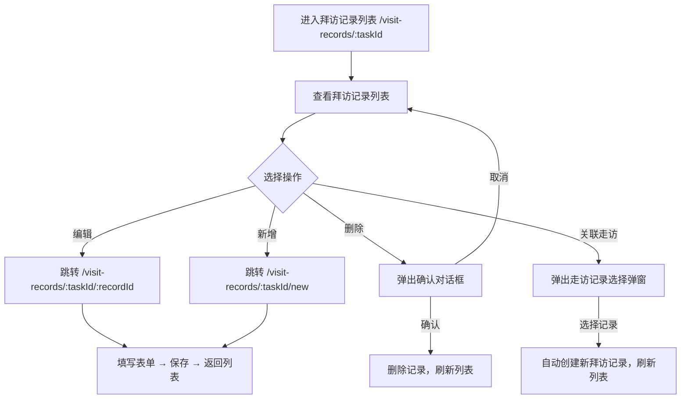

# 拜访记录列表 Visit Records List PRD

## 需求背景

### 痛点
- **问题现象**：客户经理需要管理商机对应的拜访记录，查看、新增、编辑、删除、关联走访
- **发生频率**：高
- **当前 workaround**：通过线下记录或Excel管理

### 业务目标
- **量化指标**：列表加载 < 1s，CRUD操作响应 < 300ms
- **目标期限**：持续可用

### 涉及系统/模块
- **模块名称**：拜访记录列表
- **变更类型**：新增
- **对接接口**：暂无（Mock数据）

---

## 用户故事

### 故事1
- **角色**：客户经理
- **功能**：查看当前商机（taskId）下的所有拜访记录列表
- **收益**：集中管理拜访历史，快速回顾跟进过程
- **验收条件**：列表展示拜访记录卡片，含拜访对象/日期/地点/要点

### 故事2
- **角色**：客户经理
- **功能**：新增拜访记录、编辑已有记录、删除记录
- **收益**：在线管理拜访记录，无需线下整理
- **验收条件**：点击新增跳转表单页；点击编辑跳转表单页（预填）；点击删除弹出确认

### 故事3
- **角色**：客户经理
- **功能**：关联已有的走访记录生成新的拜访记录
- **收益**：复用走访数据，减少重复录入
- **验收条件**：点击关联走访，从弹窗列表选择记录，自动填充表单

---

## 需求清单

| 序号 | 需求描述 | 优先级 | 状态 | 负责人 | 截止日期 |
|------|----------|--------|------|--------|----------|
| 1    | 拜访记录卡片列表 | P0 | DONE | | |
| 2    | 新增按钮 → 跳转表单 | P0 | DONE | | |
| 3    | 编辑按钮 → 跳转表单 | P0 | DONE | | |
| 4    | 删除按钮 + 确认弹窗 | P0 | DONE | | |
| 5    | 关联走访记录弹窗 + 选择功能 | P0 | DONE | | |

---

## 业务流程图

---

## 页面结构

### 路由信息
- **路由路径** - 类型：文本；必填：是；示例：`/visit-records/:taskId`
- **页面标题** - 类型：文本；必填：是；示例：`拜访记录`
- **访问权限** - 类型：枚举（登录）；描述：客户经理

### 布局结构
- **布局类型** - 类型：单栏
- **区域-顶部** - 返回按钮 + 标题 + 关联走访按钮 + 新增按钮
- **区域-记录列表** - 垂直滚动的拜访记录卡片列表（空时显示空状态）
- **区域-删除确认弹窗** - 居中对话框
- **区域-关联走访弹窗** - 居中对话框

---

## 功能描述

### 功能点1：拜访记录卡片

#### 页面级
- **字段列表**：
  | 字段名 | 类型 | 必填 | 默认值 | 来源 | 校验规则 | 展示形式 | 交互约束 |
  |--------|------|------|--------|------|----------|----------|----------|
  | 客户名称 | 文本 | 是 | - | Mock数据 | - | 卡片标题，加粗 | 只读 |
  | 客户编码 | 文本 | 是 | - | Mock数据 | - | 小号灰色文字 | 只读 |
  | 拜访类型标签 | 枚举 | 是 | - | Mock数据 | - | 蓝底白字胶囊（日常拜访/商机推进拜访/交流拜访/陌生拜访/签约/其他/战略合作/公开活动） | 只读 |
  | 拜访对象 | 文本 | 是 | - | Mock数据 | - | User图标+文字 | 只读 |
  | 拜访日期 | 文本 | 是 | - | Mock数据 | - | Calendar图标+文字，YYYY-MM-DD | 只读 |
  | 拜访地点 | 文本 | 是 | - | Mock数据 | - | MapPin图标+文字 | 只读 |
  | 会谈要点 | 文本 | 是 | - | Mock数据 | - | 截断2行的文字 | 只读 |
  | 编辑按钮 | 按钮 | 是 | - | - | - | 蓝边胶囊按钮 | 点击跳转编辑页 |
  | 删除按钮 | 按钮 | 是 | - | - | - | 红边胶囊按钮 | 点击弹出确认 |

### 功能点2：新增按钮

#### 页面级
- **字段：新增按钮** - 类型：按钮；描述：蓝色填充，图标+文字，点击跳转 `/visit-records/:taskId/new`

### 功能点3：关联走访弹窗

#### 弹窗级
- **弹窗：关联走访记录**
  - **触发入口**：点击"关联走访记录"按钮
  - **关闭方式**：关闭图标 / 取消按钮
  - **字段列表**：
    | 字段名 | 类型 | 必填 | 默认值 | 来源 | 校验规则 | 展示形式 | 交互约束 |
    |--------|------|------|--------|------|----------|----------|----------|
    | 走访日期 | 文本 | 是 | - | Mock数据 | - | 列表项中的日期字段 | 只读 |
    | 走访地点 | 文本 | 是 | - | Mock数据 | - | 列表项中的地点字段 | 只读 |
    | 走访对象 | 文本 | 是 | - | Mock数据 | - | 列表项中的对象字段 | 只读 |
    | 参与者 | 文本 | 是 | - | Mock数据 | - | 列表项中的参与者字段 | 只读 |
    | 关闭按钮 | 按钮 | 是 | - | - | - | 灰边按钮 | 点击关闭弹窗 |
  - **选择行为**：点击列表项 → 自动创建新拜访记录 → 关闭弹窗 → 刷新列表

### 功能点4：删除确认弹窗

#### 弹窗级
- **弹窗：删除确认**
  - **触发入口**：点击删除按钮
  - **关闭方式**：遮罩层 / 取消按钮
  - **字段列表**：
    | 字段名 | 类型 | 必填 | 默认值 | 来源 | 校验规则 | 展示形式 | 交互约束 |
    |--------|------|------|--------|------|----------|----------|----------|
    | 提示文字 | 文本 | 是 | 确定要删除这条拜访记录吗？ | - | - | 居中文字 | 只读 |
    | 取消按钮 | 按钮 | 是 | - | - | - | 灰边按钮 | 点击关闭弹窗 |
    | 删除按钮 | 按钮 | 是 | - | - | - | 红色填充按钮 | 点击删除记录 |
  - **确定按钮**：从列表中移除该记录，关闭弹窗
  - **取消按钮**：关闭弹窗，不修改数据

---

## 数据流图

### 接口1：删除拜访记录
- **请求路径** - 类型：文本；示例：`DELETE /api/visit-records/:recordId`
- **请求方法** - 类型：枚举（DELETE）
- **请求头** - Authorization
- **请求参数**：
  - `recordId` - 类型：字符串；必填：是；来源：页面字段
- **响应字段**：
  - `success` - 类型：布尔；描述：是否成功
- **存储位置** - 后端数据库

### 数据刷新点
- **刷新时机** - 删除成功后、新增/编辑保存后
- **影响字段** - 拜访记录列表

---

## 验收标准

### 正常流程
- [ ] **操作**：打开 `/visit-records/1` → **预期**：显示拜访记录列表，或空状态"暂无拜访记录"
- [ ] **操作**：点击"新增" → **预期**：跳转 `/visit-records/1/new`
- [ ] **操作**：点击"编辑" → **预期**：跳转 `/visit-records/1/1`（预填表单）
- [ ] **操作**：点击"删除" → **预期**：弹出确认对话框
- [ ] **操作**：确认删除 → **预期**：记录从列表移除，弹窗关闭
- [ ] **操作**：点击"关联走访记录" → **预期**：弹出走访记录列表弹窗
- [ ] **操作**：选择一条走访记录 → **预期**：自动创建拜访记录，关闭弹窗，列表更新

---

## 更新记录

### v1 - 2026-05-09
- 初始版本
