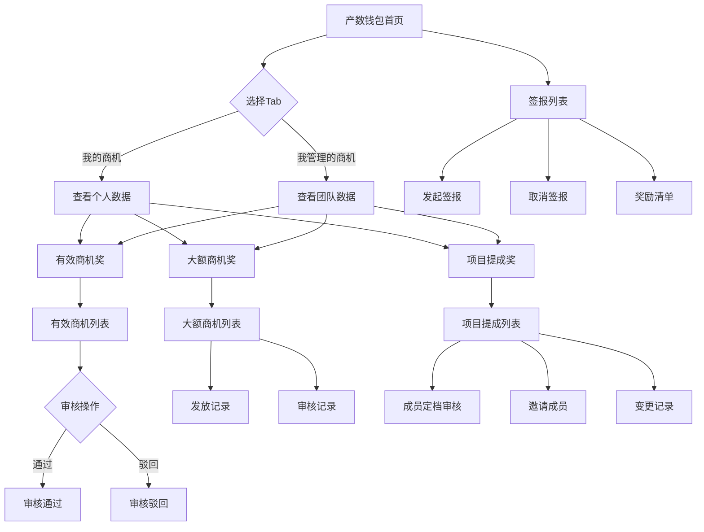

# 产数钱包模块 PRD

## 需求背景

### 痛点
- **问题现象**：营销人员无法便捷查看个人商机奖励、奖金池、排名等数据，需通过后台系统或纸质报表获取
- **发生频率**：高 - 营销人员日常频繁查看
- **当前 workaround**：通过PC端后台系统查看，或依赖管理员下发报表

### 业务目标
- **量化指标**：移动端查看率提升至80%以上，奖励申请流程耗时减少50%
- **目标期限**：2026年Q2完成上线

### 涉及系统/模块
- **模块名称**：LTO手机端 - 产数钱包
- **变更类型**：新增
- **对接接口**：产数钱包后端API（待对接）

---

## 用户故事

### 故事1：查看奖金池和个人排名
- **角色**：地市营销人员
- **功能**：我希望查看当前地市奖金池总额、各区域分配比例，以及本人在支局/分局/地市的排名
- **收益**：快速了解个人业绩位置，明确追赶目标
- **验收条件**：环形图正确显示各区域占比，排名数据与后台一致

### 故事2：查看各类奖励统计
- **角色**：地市营销人员
- **功能**：我希望查看有效商机奖、大额商机奖、项目提成奖的本月发放、累计发放、待审核数据
- **收益**：实时掌握各类奖励情况，便于跟进审核流程
- **验收条件**：三项奖励数据卡片正确展示，点击可跳转对应列表

### 故事3：审核有效商机
- **角色**：支局/分局管理员
- **功能**：我希望对待审核的有效商机进行审核通过或驳回操作
- **收益**：移动端完成审核流程，提升工作效率
- **验收条件**：审核弹窗正常打开，提交后状态更新

### 故事4：管理大额商机发放记录
- **角色**：支局/分局管理员
- **功能**：我希望查看大额商机的发放记录和审核记录
- **收益**：追踪奖励发放进度，确保及时发放
- **验收条件**：底部抽屉正确显示历史记录列表

### 故事5：项目提成成员管理
- **角色**：项目经理/管理员
- **功能**：我希望对项目成员进行定档审核、邀请成员、查看变更记录
- **收益**：规范项目提成分配流程，确保公平透明
- **验收条件**：成员审核、变更记录功能正常可用

### 故事6：签报管理
- **角色**：商机负责人
- **功能**：我希望发起签报、取消签报、查看奖励清单和签批文件
- **收益**：移动端完成签报全流程，减少PC端依赖
- **验收条件**：签报创建、取消、详情查看功能正常

---

## 需求清单

| 序号 | 需求描述 | 优先级 | 状态 | 负责人 | 截止日期 |
|------|----------|--------|------|--------|----------|
| 1 | 产数钱包首页 - 环形图+排名+奖励统计 | P0 | DONE | | |
| 2 | 有效商机列表 + 审核功能 | P0 | DONE | | |
| 3 | 大额商机列表 + 发放/审核记录 | P0 | DONE | | |
| 4 | 项目提成列表 + 成员管理 | P0 | DONE | | |
| 5 | 签报列表 + 发起/取消功能 | P0 | DONE | | |
| 6 | 后端API对接 | P1 | TODO | | |

---

## 业务流程图

---

## 页面结构

### 路由信息
- **路由路径** - `/wallet`
- **页面标题** - 产数钱包
- **访问权限** - 登录用户

### 布局结构
- **布局类型** - 单栏移动端布局
- **区域-顶部栏** - 返回按钮、标题"产数钱包"、更多操作按钮
- **区域-Tab切换** - "我的商机" / "我管理的商机"
- **区域-主内容** - 环形图+排名区、奖励状态卡片、奖励统计卡片、签报入口、区域列表

### 子页面路由
| 路由 | 页面标题 | 说明 |
|------|----------|------|
| `/wallet/valid-opportunity` | 有效商机 | 全量/待审核/已审核商机列表 |
| `/wallet/large-opportunity` | 大额商机 | 全量/待审核/已审核商机列表 |
| `/wallet/project-commission` | 项目提成 | 全量/待审核/已审核项目列表 |
| `/wallet/sign-report` | 签报列表 | 签报申请管理 |

---

## 功能描述

### 功能点1：产数钱包首页

#### 页面级
- **字段：Tab切换** - 类型：枚举；必填：是；默认值："我的商机"；展示形式：底部蓝线指示器
- **字段：环形图** - 类型：图表；描述：展示各区域奖金池占比，中心显示总额
- **字段：排名信息** - 类型：文本；描述：支局/分局/地市排名百分比
- **字段：城市选择** - 类型：按钮；描述：点击打开城市选择弹窗
- **字段：月份选择** - 类型：按钮；描述：点击打开月份选择弹窗

#### 奖励统计卡片
- **字段：有效商机奖卡片** - 类型：卡片组；描述：本月发放/累计发放/待审核三个指标
- **字段：大额商机奖卡片** - 类型：卡片组；描述：本月发放/累计发放/待审核三个指标
- **字段：项目提成奖卡片** - 类型：卡片组；描述：本月发放/累计发放/待审核三个指标
- **字段：查看列表按钮** - 类型：按钮；描述：跳转对应列表页

#### 弹窗：城市选择器
- **触发入口**：点击城市选择按钮
- **关闭方式**：遮罩点击 / 取消按钮 / 确定按钮
- **字段列表**：
  | 字段名 | 类型 | 必填 | 默认值 | 来源 | 校验规则 | 展示形式 | 交互约束 |
  |--------|------|------|--------|------|----------|----------|----------|
  | 城市选项 | 枚举 | 是 | 宁波市 | 接口返回 | 非空 | 3列网格按钮 | 单选 |

#### 弹窗：月份选择器
- **触发入口**：点击月份选择按钮
- **关闭方式**：遮罩点击 / 取消按钮 / 确定按钮
- **字段列表**：
  | 字段名 | 类型 | 必填 | 默认值 | 来源 | 校验规则 | 展示形式 | 交互约束 |
  |--------|------|------|--------|------|----------|----------|----------|
  | 月份选项 | 日期 | 是 | 当前月 | 接口返回 | 非空 | 滚动列表 | 单选 |

---

### 功能点2：有效商机列表

#### Tab级
- **Tab名称** - 全量商机 / 待审核商机 / 已审核商机
- **查询条件字段**：
  | 字段名 | 类型 | 必填 | 默认值 | 来源 | 校验规则 | 展示形式 | 交互约束 |
  |--------|------|------|--------|------|----------|----------|----------|
  | 搜索框 | 文本 | 否 | 空 | 用户输入 | 长度≤100 | 圆角输入框 | 实时过滤 |
  | 审核状态 | 枚举 | 否 | 全部 | 用户选择 | 非空 | 下拉按钮 | 单选 |
  | 时间范围 | 枚举 | 否 | 全部 | 用户选择 | 非空 | 下拉按钮 | 单选 |
  | 客户经理 | 枚举 | 否 | 全部 | 用户选择 | 非空 | 下拉按钮 | 单选 |
  | 支局 | 枚举 | 否 | 全部 | 用户选择 | 非空 | 下拉按钮 | 单选 |

#### 列表项字段
| 字段名 | 类型 | 必填 | 默认值 | 来源 | 校验规则 | 展示形式 | 交互约束 |
|--------|------|------|--------|------|----------|----------|----------|
| 商机名称 | 文本 | 是 | - | 接口返回 | 非空 | 加粗文本+状态标签 | 只读 |
| 客户名称 | 文本 | 是 | - | 接口返回 | 非空 | 图标+文字 | 只读 |
| 录入时间 | 日期 | 是 | - | 接口返回 | 非空 | 图标+文字 | 只读 |
| 客户经理 | 文本 | 是 | - | 接口返回 | 非空 | 图标+文字 | 只读 |
| 支局 | 文本 | 是 | - | 接口返回 | 非空 | 图标+文字 | 只读 |
| 预估金额 | 数字 | 是 | - | 接口返回 | 非空 | 蓝色金额文字 | 只读 |

#### 弹窗：审核弹窗
- **触发入口**：点击"审核"按钮（仅待审核状态显示）
- **关闭方式**：遮罩点击 / 关闭图标
- **字段列表**：
  | 字段名 | 类型 | 必填 | 默认值 | 来源 | 校验规则 | 展示形式 | 交互约束 |
  |--------|------|------|--------|------|----------|----------|----------|
  | 商机名称 | 文本 | 是 | 当前商机 | 接口返回 | 非空 | 只读文本 | 只读 |
  | 审核描述 | 文本 | 否 | 空 | 用户输入 | 长度≤500 | 多行文本框 | 可编辑 |

#### 弹窗：审核记录
- **触发入口**：点击"审核记录"按钮
- **关闭方式**：遮罩点击 / 关闭图标
- **字段列表**：
  | 字段名 | 类型 | 必填 | 默认值 | 来源 | 校验规则 | 展示形式 | 交互约束 |
  |--------|------|------|--------|------|----------|----------|----------|
  | 审核人 | 文本 | 是 | - | 接口返回 | 非空 | 名称+状态标签 | 只读 |
  | 审核时间 | 日期 | 是 | - | 接口返回 | 非空 | 格式化日期 | 只读 |
  | 审核说明 | 文本 | 否 | - | 接口返回 | 可空 | 普通文本 | 只读 |

---

### 功能点3：大额商机列表

#### Tab级
- **Tab名称** - 全量商机 / 待审核商机 / 已审核商机
- **查询条件字段**：
  | 字段名 | 类型 | 必填 | 默认值 | 来源 | 校验规则 | 展示形式 | 交互约束 |
  |--------|------|------|--------|------|----------|----------|----------|
  | 搜索框 | 文本 | 否 | 空 | 用户输入 | 长度≤100 | 圆角输入框 | 实时过滤 |
  | 商机状态 | 枚举 | 否 | 全部 | 用户选择 | 非空 | 下拉按钮 | 单选 |
  | 签报状态 | 枚举 | 否 | 全部 | 用户选择 | 非空 | 下拉按钮 | 单选 |
  | 奖励状态 | 枚举 | 否 | 全部 | 用户选择 | 非空 | 下拉按钮 | 单选 |

#### 列表项字段
| 字段名 | 类型 | 必填 | 默认值 | 来源 | 校验规则 | 展示形式 | 交互约束 |
|--------|------|------|--------|------|----------|----------|----------|
| 商机名称 | 文本 | 是 | - | 接口返回 | 非空 | 加粗文本+状态标签 | 只读 |
| 客户名称 | 文本 | 是 | - | 接口返回 | 非空 | 图标+文字 | 只读 |
| 客户经理 | 文本 | 是 | - | 接口返回 | 非空 | 图标+文字 | 只读 |
| 支局 | 文本 | 是 | - | 接口返回 | 非空 | 图标+文字 | 只读 |
| 预估金额 | 数字 | 是 | - | 接口返回 | 非空 | 蓝色金额 | 只读 |
| 合同金额 | 数字 | 是 | - | 接口返回 | 非空 | 普通金额 | 只读 |
| 已收款 | 数字 | 是 | - | 接口返回 | 非空 | 蓝色金额 | 只读 |

#### 弹窗：发放记录
- **触发入口**：点击"发放记录"按钮
- **关闭方式**：遮罩点击 / 关闭图标
- **字段列表**：
  | 字段名 | 类型 | 必填 | 默认值 | 来源 | 校验规则 | 展示形式 | 交互约束 |
  |--------|------|------|--------|------|----------|----------|----------|
  | 发放类型 | 文本 | 是 | - | 接口返回 | 非空 | 类型名称 | 只读 |
  | 发放金额 | 数字 | 是 | - | 接口返回 | 非空 | 绿色金额 | 只读 |
  | 发放时间 | 日期 | 是 | - | 接口返回 | 非空 | 格式化日期 | 只读 |
  | 状态 | 枚举 | 是 | - | 接口返回 | 非空 | 状态标签 | 只读 |

---

### 功能点4：项目提成列表

#### Tab级
- **Tab名称** - 全量项目 / 待审核项目 / 已审核项目
- **查询条件字段**：
  | 字段名 | 类型 | 必填 | 默认值 | 来源 | 校验规则 | 展示形式 | 交互约束 |
  |--------|------|------|--------|------|----------|----------|----------|
  | 搜索框 | 文本 | 否 | 空 | 用户输入 | 长度≤100 | 圆角输入框 | 实时过滤 |
  | 审核状态 | 枚举 | 否 | 全部 | 用户选择 | 非空 | 下拉按钮 | 单选 |
  | 签约时间 | 枚举 | 否 | 全部 | 用户选择 | 非空 | 下拉按钮 | 单选 |

#### 列表项字段
| 字段名 | 类型 | 必填 | 默认值 | 来源 | 校验规则 | 展示形式 | 交互约束 |
|--------|------|------|--------|------|----------|----------|----------|
| 项目名称 | 文本 | 是 | - | 接口返回 | 非空 | 加粗文本+状态标签 | 只读 |
| 客户名称 | 文本 | 是 | - | 接口返回 | 非空 | 图标+文字 | 只读 |
| 签约时间 | 日期 | 是 | - | 接口返回 | 非空 | 图标+文字 | 只读 |
| 合同金额 | 数字 | 是 | - | 接口返回 | 非空 | 普通金额 | 只读 |
| 提成总额 | 数字 | 是 | - | 接口返回 | 非空 | 普通金额 | 只读 |
| 已发放 | 数字 | 是 | - | 接口返回 | 非空 | 绿色金额 | 只读 |
| 项目成员 | 数组 | 是 | - | 接口返回 | 非空 | 标签组 | 只读 |

#### 弹窗：成员定档审核
- **触发入口**：点击"成员定档审核"按钮（仅待审核状态显示）
- **关闭方式**：遮罩点击 / 关闭图标
- **字段列表**：
  | 字段名 | 类型 | 必填 | 默认值 | 来源 | 校验规则 | 展示形式 | 交互约束 |
  |--------|------|------|--------|------|----------|----------|----------|
  | 成员姓名 | 文本 | 是 | - | 接口返回 | 非空 | 只读文本 | 只读 |
  | 成员角色 | 文本 | 是 | - | 接口返回 | 非空 | 只读文本 | 只读 |
  | 定档级别 | 枚举 | 是 | 当前级别 | 用户选择 | 非空 | 下拉选择 | 可编辑 |
  | 审核备注 | 文本 | 否 | 空 | 用户输入 | 长度≤500 | 多行文本框 | 可编辑 |

---

### 功能点5：签报列表

#### 页面级
- **字段：搜索框** - 类型：文本；默认值：空；展示形式：圆角输入框
- **字段：状态筛选** - 类型：枚举；默认值：全部；展示形式：下拉按钮
- **字段：发起签报按钮** - 类型：按钮；描述：打开发起签报弹窗

#### 列表项字段
| 字段名 | 类型 | 必填 | 默认值 | 来源 | 校验规则 | 展示形式 | 交互约束 |
|--------|------|------|--------|------|----------|----------|----------|
| 签报标题 | 文本 | 是 | - | 接口返回 | 非空 | 加粗文本+状态标签 | 只读 |
| 客户名称 | 文本 | 是 | - | 接口返回 | 非空 | 图标+文字 | 只读 |
| 发起时间 | 日期 | 是 | - | 接口返回 | 非空 | 图标+文字 | 只读 |
| 签报时间 | 日期 | 否 | - | 接口返回 | 可空 | 图标+文字 | 只读 |
| 签报金额 | 数字 | 是 | - | 接口返回 | 非空 | 蓝色金额 | 只读 |
| 签批文件 | 文本 | 否 | - | 接口返回 | 可空 | 蓝色链接 | 只读 |

#### 弹窗：发起签报
- **触发入口**：点击"发起签报"按钮
- **关闭方式**：遮罩点击 / 取消按钮 / 关闭图标
- **字段列表**：
  | 字段名 | 类型 | 必填 | 默认值 | 来源 | 校验规则 | 展示形式 | 交互约束 |
  |--------|------|------|--------|------|----------|----------|----------|
  | 关联商机 | 关联ID | 是 | 空 | 用户选择 | 非空 | 下拉选择 | 单选 |
  | 签报金额 | 数字 | 是 | 空 | 用户输入 | 正数 | 数字输入框 | 可编辑 |
  | 签报说明 | 文本 | 否 | 空 | 用户输入 | 长度≤1000 | 多行文本框 | 可编辑 |
  | 附件 | 文件 | 否 | 空 | 用户上传 | 格式限制 | 上传按钮 | 可编辑 |

#### 弹窗：奖励清单
- **触发入口**：点击"奖励清单"按钮
- **关闭方式**：遮罩点击 / 关闭图标
- **字段列表**：
  | 字段名 | 类型 | 必填 | 默认值 | 来源 | 校验规则 | 展示形式 | 交互约束 |
  |--------|------|------|--------|------|----------|----------|----------|
  | 关联项目 | 文本 | 是 | - | 接口返回 | 非空 | 只读文本 | 只读 |
  | 有效商机奖 | 数字 | 是 | - | 接口返回 | 非空 | 金额 | 只读 |
  | 大额商机奖 | 数字 | 是 | - | 接口返回 | 非空 | 金额 | 只读 |
  | 项目提成奖 | 数字 | 是 | - | 接口返回 | 非空 | 金额 | 只读 |
  | 奖励合计 | 数字 | 是 | - | 计算得出 | 非空 | 加粗蓝色 | 只读 |

---

## 数据流图

### 接口1：获取奖金池数据
- **请求路径** - `GET /api/wallet/bonus-pool`
- **请求方法** - GET
- **请求头** - Authorization: Bearer {token}
- **请求参数** - city(城市) / month(月份)
- **响应字段**：
  - `totalAmount` - 类型：数字；描述：奖金池总额（元）
  - `regionData` - 类型：数组；描述：各区域分配数据
- **存储位置** - 前端状态
- **错误码** - 401未授权 / 500服务器错误

### 接口2：获取奖励统计
- **请求路径** - `GET /api/wallet/reward-stats`
- **请求方法** - GET
- **响应字段**：
  - `validOpportunity` - 类型：对象；描述：有效商机奖统计
  - `largeOpportunity` - 类型：对象；描述：大额商机奖统计
  - `projectCommission` - 类型：对象；描述：项目提成奖统计

### 数据刷新点
- **刷新时机** - 页面加载 / Tab切换 / 选择城市/月份后
- **影响字段** - 环形图数据 / 排名信息 / 奖励统计卡片

---

## 验收标准

### 正常流程
- [ ] **操作**：进入产数钱包首页 → **预期**：环形图正确显示，排名信息展示
- [ ] **操作**：点击城市选择 → **预期**：底部弹窗打开，可选择城市
- [ ] **操作**：点击"查看列表"按钮 → **预期**：跳转对应列表页
- [ ] **操作**：进入有效商机列表 → **预期**：显示商机卡片列表，支持搜索筛选
- [ ] **操作**：点击"审核"按钮 → **预期**：审核弹窗打开，可输入审核描述
- [ ] **操作**：提交审核 → **预期**：弹窗关闭，商机状态更新
- [ ] **操作**：进入大额商机列表 → **预期**：显示商机卡片，含金额信息
- [ ] **操作**：点击"发放记录" → **预期**：底部抽屉显示发放历史
- [ ] **操作**：进入项目提成列表 → **预期**：显示项目卡片，含成员信息
- [ ] **操作**：点击"成员定档审核" → **预期**：审核弹窗打开，显示成员列表
- [ ] **操作**：进入签报列表 → **预期**：显示签报卡片列表
- [ ] **操作**：点击"发起签报" → **预期**：发起弹窗打开，表单可填写

### 异常流程
- [ ] **操作**：网络断开时加载数据 → **预期**：显示加载失败提示，可重试
- [ ] **操作**：审核提交失败 → **预期**：显示错误提示，弹窗保持
- [ ] **操作**：搜索无结果 → **预期**：显示空状态提示

---

## 更新记录

### v1 - 2026-05-15
- 初始版本：完成产数钱包首页、有效商机列表、大额商机列表、项目提成列表、签报列表的前端页面开发
