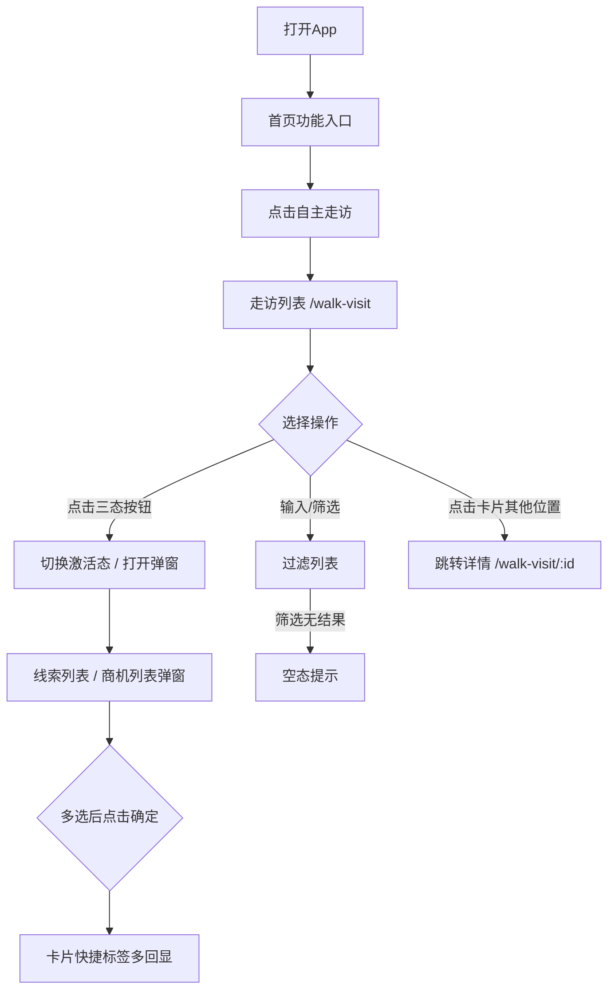

# 自主走访列表 Walk Visit List PRD

## 需求背景

### 痛点
- **问题现象**：客户经理每天需要走访多个客户，但列表过滤入口缺失，无法快速定位"我走访的 / 网通类型 / 含线索"的客户；此外，单击"有线索/有商机"打开弹窗后只能单选一条，无法批量关联，效率低
- **发生频率**：高
- **当前 workaround**：列表全量展示 + 弹窗单条选择，反复切换

### 业务目标
- **量化指标**：列表加载 < 1s，筛选响应 < 200ms，弹窗多选打开/关闭 < 200ms
- **目标期限**：持续可用

### 涉及系统/模块
- **模块名称**：自主走访
- **变更类型**：修改
- **对接接口**：暂无（Mock数据；商机复用 OpportunityList 的 mock 数据源；新增 mockLeads 作为线索池）

---

## 用户故事

### 故事1
- **角色**：客户经理
- **功能**：从首页一键进入走访列表，通过顶部搜索 + 筛选组合快速定位目标客户
- **收益**：减少滚动查找成本，集中管理走访任务
- **验收条件**：首页出现"自主走访"入口，点击跳转 `/walk-visit`，顶部展示搜索框 + 客户类型/走访类型/走访人三个下拉

### 故事2
- **角色**：客户经理
- **功能**：点击卡片上的"有线索/有商机"按钮，弹出池子里所有可选项，支持一次勾选多条回填到卡片
- **收益**：批量关联线索/商机，无需多次开关弹窗
- **验收条件**：打开弹窗后看到 mock 池里的全部线索/商机，多选后卡片快捷标签展示"编码·名称，编码·名称"

### 故事3
- **角色**：客户经理
- **功能**：通过卡片上的"无商机/有线索/有商机"三态按钮标识当前客户的关联内容，点击查看对应列表
- **收益**：一眼掌握客户关联线索/商机，无需切换模块
- **验收条件**：点击激活态按钮，弹出多选列表（与改造后的弹窗共用样式）

### 故事4
- **角色**：客户经理
- **功能**：点击卡片任意位置进入走访详情页
- **收益**：快速查看走访完整记录
- **验收条件**：跳转 `/walk-visit/:walkVisitId`，展示客户基本信息 + 走访信息块

---

## 需求清单

| 序号 | 需求描述 | 优先级 | 状态 | 负责人 | 截止日期 |
|------|----------|--------|------|--------|----------|
| 1    | 首页功能入口新增"自主走访" | P0 | DONE | | |
| 2    | 走访列表卡片展示 | P0 | DONE | | |
| 3    | 卡片三态按钮（无商机/有线索/有商机） | P0 | DONE | | |
| 4    | 顶部新增客户名搜索框 | P0 | DONE | | |
| 5    | 顶部新增客户类型/走访类型/走访人下拉筛选 | P0 | DONE | | |
| 6    | 筛选条件支持清空 | P1 | DONE | | |
| 7    | 线索 mock 池 (mockLeads) 与商机独立维护 | P0 | DONE | | |
| 8    | 线索/商机弹窗支持多选 + 选中计数回显 | P0 | DONE | | |
| 9    | 弹窗打开时预选已关联数据 | P0 | DONE | | |
| 10   | 卡片快捷标签多回显（多条以逗号分隔） | P0 | DONE | | |
| 11   | 卡片点击进入走访详情 | P0 | DONE | | |
| 12   | 移除列表底部"新增走访"占位按钮 | P1 | DONE | | |

---

## 业务流程图

---

## 页面结构

### 路由信息
- **路由路径** - 类型：文本；必填：是；示例：`/walk-visit`
- **页面标题** - 类型：文本；必填：是；示例：`自主走访`
- **访问权限** - 类型：枚举（登录）；描述：客户经理

### 布局结构
- **布局类型** - 类型：单栏
- **区域-顶部栏** - 返回按钮 + 标题「自主走访」+ 搜索框 + 三个下拉筛选（客户类型/走访类型/走访人）+ 清空按钮
- **区域-列表** - 垂直滚动的走访卡片列表
- **区域-弹窗** - 线索/商机多选列表弹窗

---

## 功能描述

### 功能点1：顶部筛选区

#### 页面级
- **字段：搜索框** - 类型：文本输入；描述：客户名模糊匹配
- **字段：客户类型下拉** - 类型：枚举；描述：`全部类型 / 网通 / 蓝海`，联动走访记录 `customerType` 字段
- **字段：走访类型下拉** - 类型：枚举；描述：`全部类型 / 无 / 有线索 / 有商机`，联动走访记录 `tagState` 字段
- **字段：走访人下拉** - 类型：枚举；描述：枚举自所有走访的 `accountManager.name` 与 `collaborators[].name` 去重并集
- **字段：清空按钮** - 类型：按钮；描述：仅当任一筛选条件非默认时显示，点击重置全部筛选

| 字段名 | 类型 | 必填 | 默认值 | 来源 | 校验规则 | 展示形式 | 交互约束 |
|--------|------|------|--------|------|----------|----------|----------|
| 客户名搜索框 | 文本 | 否 | 空 | 用户输入 | 非空时模糊匹配客户名 | 顶部 Input 控件 + 搜索图标 | 输入即过滤 |
| 客户类型 | 枚举 | 否 | 全部类型 | 用户选择 | `全部 / 网通 / 蓝海` | 灰边胶囊内置 select + ▼ | 切换即过滤 |
| 走访类型 | 枚举 | 否 | 全部类型 | 用户选择 | `全部 / 无 / 有线索 / 有商机` | 同上 | 切换即过滤 |
| 走访人 | 枚举 | 否 | 全部走访人 | 用户选择 | 客户经理或协同人任意匹配即命中 | 同上 | 切换即过滤 |
| 清空 | 按钮 | 否 | - | - | 任一筛选非默认时显示 | 蓝色文字按钮「清空」 | 点击重置全部筛选 |

- **过滤规则**：四个筛选条件组合为 AND 关系，符合全部才命中
- **空态**：筛选无结果时，列表区显示「暂无符合条件的走访」

### 功能点2：走访卡片

#### 卡片级
- **字段列表**：
  | 字段名 | 类型 | 必填 | 默认值 | 来源 | 校验规则 | 展示形式 | 交互约束 |
  |--------|------|------|--------|------|----------|----------|----------|
  | 客户名称 | 文本 | 是 | - | Mock数据 | - | 卡片标题 | 只读 |
  | 客户类型标签 | 枚举 | 是 | - | Mock数据 | - | 右侧胶囊（统一橙色样式，bg-orange-50 text-orange-700，跟"本网客户"标签一致） | 只读 |
  | 地址 | 文本 | 否 | - | Mock数据 | - | 客户名称下方一行 | 只读（仅本地网） |
  | 统一社会信用代码 | 文本 | 否 | - | Mock数据 | - | 客户名称下方一行 | 只读（仅蓝海） |
  | 贵宾卡号 | 文本 | 否 | - | Mock数据 | - | 同行展示 | 只读（仅本地网） |
  | 客户等级 | 文本 | 否 | - | Mock数据 | - | 同行展示 | 只读（仅本地网） |
  | 走访日期 | 文本 | 是 | - | Mock数据 | - | 独立一行 | 只读 |
  | 客户经理行 | 行 | 是 | - | Mock数据 | - | UserCircle2图标+「客户经理：姓名 电话」；电话蓝色可拨号 | 只读 + 可拨号 |
  | 协同走访行 | 行 | 否 | - | Mock数据 | - | Users图标+「协同走访 N人」；下方缩进展示岗位-姓名-电话；超过3人时显示「展开全部>」按钮，点击展开全部人员 | 默认展开3人预览，可展开全部 |
  | 线索/商机快捷标签 | 按钮 | 否 | - | 派生状态 | - | 三态按钮上方，蓝底胶囊「`编码·名称，编码·名称 等N条`」+ 右箭头 | 激活态 + 有数据时显示，点击打开弹窗；多条时逗号分隔，超 2 条折叠为「等N条」 |
  | 顶部三态按钮 | 按钮 | 否 | - | 状态 | - | **只显示当前激活态**那个紧凑胶囊（text-[10px]），与客户类型标签同一行右对齐 | 见功能点3 |
  | 底部三态按钮组 | 按钮组 | 是 | 无商机 | 状态 | - | 三个按钮，灰底容器（bg-gray-50）内排列，样式复用 BusinessInfoList「关联商机」按钮：活跃=蓝底白字（bg-blue-500），非活跃=灰底白字（bg-gray-500），均 rounded-xl px-3 py-1.5 text-xs | 与顶部按钮共享同一激活态，点击切换 |
  | 整卡片点击 | - | - | - | - | - | 卡片整体 | 点击跳转详情 |
- **移除字段**：走访记录的「应走访 / 月有效走访 / 有效线索」三个统计字段不在列表卡片上展示（仅作为后端统计指标）
- **移除按钮**：原列表底部全局「新增走访」按钮已移除

### 功能点3：三态按钮组

#### 卡片级
- **按钮列表**：
  | 字段名 | 类型 | 必填 | 默认值 | 来源 | 校验规则 | 展示形式 | 交互约束 |
  |--------|------|------|--------|------|----------|----------|----------|
  | 无商机 | 按钮 | 是 | - | 状态 | - | 灰边胶囊，点击激活后变蓝 | 点击切换激活态 |
  | 有线索 | 按钮 | 是 | - | 状态 | - | 灰边胶囊，点击激活后变蓝 | 点击切换激活态；若已激活，点击打开线索多选弹窗 |
  | 有商机 | 按钮 | 是 | - | 状态 | - | 灰边胶囊，点击激活后变蓝 | 点击切换激活态；若已激活，点击打开商机多选弹窗 |

- **互斥逻辑**：同一时刻只有一个按钮处于激活态；点击新按钮时切换激活态，无关联内容时不打开弹窗
- **顶部只显示激活项**：顶部只渲染当前激活态那一个胶囊按钮；点击激活按钮会打开对应的线索/商机弹窗（若该客户有数据）
- **双位置共享**：顶部三态按钮与底部三态按钮共享同一激活态，任意一处点击都会同步更新两处

### 功能点4：线索/商机多选弹窗

#### 弹窗级
- **弹窗：关联已有线索 / 关联已有商机**
  - **触发入口**：点击已激活的「有线索」/「有商机」按钮（顶部紧凑胶囊或底部蓝色按钮均可触发）；或点击卡片底部「线索/商机快捷标签」
  - **关闭方式**：右上角 × 按钮 / 底部「取消」按钮 / 遮罩层（关闭时重置 keyword/选中态）
  - **数据源**：
    - 商机：复用 [OpportunityList.tsx](lto手机端/src/app/components/OpportunityList.tsx) 的 `mockOpportunities`
    - 线索：新增 `mockLeads` 池子（结构与商机一致，8 条）
  - **视觉规范**：整体样式对齐商情管理 [BusinessInfoList.tsx](lto手机端/src/app/components/BusinessInfoList.tsx) 中「关联已有商机」弹窗（顶部标题+关闭、搜索、四个筛选下拉、多选卡片列表、底部取消+确定）

  - **顶部标题栏**：
    | 字段名 | 类型 | 必填 | 来源 | 展示形式 |
    |--------|------|------|------|----------|
    | 标题 | 文本 | 是 | 派生（线索/商机） | 左侧加粗文字：`关联已有线索` 或 `关联已有商机` |
    | 关闭 | 图标 | 是 | - | 右上角 × 图标按钮 |

  - **搜索区**：
    | 字段名 | 类型 | 必填 | 来源 | 校验规则 | 展示形式 | 交互约束 |
    |--------|------|------|------|----------|----------|----------|
    | 搜索框 | 文本 | 否 | 用户输入 | 模糊匹配名称/编码 | 灰底圆角带搜索图标 | 输入即过滤 |

  - **筛选下拉（占位 UI）**：
    | 字段名 | 类型 | 必填 | 来源 | 展示形式 | 交互约束 |
    |--------|------|------|------|----------|----------|
    | 客户 下拉 | 占位 | - | - | 灰边胶囊 + ▼ | 点击占位（功能开发中） |
    | 时间 下拉 | 占位 | - | - | 同上 | 同上 |
    | 关联状态 下拉 | 占位 | - | - | 同上 | 同上 |
    | 客户经理 下拉 | 占位 | - | - | 同上 | 同上 |

  - **列表项（多选卡片）**：
    | 字段名 | 类型 | 必填 | 来源 | 校验规则 | 展示形式 | 交互约束 |
    |--------|------|------|------|----------|----------|----------|
    | 多选框 | 选择 | 是 | 用户选择 | 与 selectedItemIds 数组互不互斥 | 左侧方块（选中=蓝底白勾） | 点击切换该项的选中状态 |
    | 名称 - 编码 | 文本 | 是 | Mock数据 | - | 加粗标题 | 只读 |
    | 客户-客户编码 | 文本 | 是 | Mock数据 | - | 灰底胶囊：`客户名（客户编码）` | 只读 |
    | 金额 | 文本 | 是 | Mock数据 | - | 橙底胶囊：`0万 / 50万` | 只读 |
    | 关联状态标签 | 枚举 | 条件 | Mock数据 | linkStatus='linked-other' 时显示 | 红底胶囊：`已关联其他商情` | 只读 |
    | 创建时间 | 文本 | 是 | Mock数据 | - | 灰底小字 | 只读 |
    | 客户经理（电话） | 文本 | 是 | Mock数据 | - | 蓝字可拨号：`段丽华（13800138000）` | 点击拨号（tel:） |
    | 整卡片点击 | - | - | - | - | 整张可点 | 切换该项的选中状态 |
  - **预选回显**：弹窗打开瞬间，按当前走访已关联的 id 集合预选（与 mockLeads/mockOpportunities 取交集）
  - **底部按钮**：
    | 字段名 | 类型 | 必填 | 默认值 | 来源 | 校验规则 | 展示形式 | 交互约束 |
    |--------|------|------|--------|------|----------|----------|----------|
    | 取消 | 按钮 | 是 | - | - | - | 蓝边胶囊，占 1/2 宽度 | 点击关闭弹窗 + 重置选中 |
    | 确定 | 按钮 | 是 | 禁用 | - | selectedItemIds 为空时禁用 | 蓝底胶囊（禁用=灰底），占 1/2 宽度，文案 `确定(N)` 显示已选数量 | 点击按 selectedItemIds 顺序回填到该走访的 leads/opportunities，同时自动把 tagState 切到 lead/opp；空选禁用 |

  - **空态**：搜索无结果 → 「未匹配到记录」；列表本身为空 → 「暂无{线索|商机}数据」

---

## 数据流图

### 数据刷新点
- **刷新时机** - 页面加载、三态按钮切换、弹窗确认、筛选条件变化
- **影响字段** - 走访列表筛选结果、卡片标签激活态、卡片快捷标签内容

---

## 验收标准

### 正常流程
- [ ] **操作**：打开首页 → **预期**：功能入口区域出现「自主走访」图标入口
- [ ] **操作**：点击「自主走访」 → **预期**：导航至 `/walk-visit` 页面
- [ ] **操作**：进入 `/walk-visit` → **预期**：顶部展示搜索框 + 三个下拉筛选 + 清空按钮；卡片列表展示 mock 数据
- [ ] **操作**：在搜索框输入「华能」 → **预期**：列表只剩名称包含「华能」的走访
- [ ] **操作**：走访类型下拉切换为「有商机」 → **预期**：列表只剩 tagState==='opp' 的走访
- [ ] **操作**：走访人下拉选择具体走访人 → **预期**：列表只剩该走访人（作为客户经理或协同人）所在的走访
- [ ] **操作**：选择客户类型「蓝海」 → **预期**：列表只剩 customerType==='blueocean' 的走访
- [ ] **操作**：先输入搜索词，再切换下拉 → **预期**：列表为 AND 过滤结果
- [ ] **操作**：筛选出 0 条 → **预期**：列表区显示「暂无符合条件的走访」
- [ ] **操作**：点击任一筛选条件后出现「清空」 → **预期**：点击后所有筛选恢复默认，列表恢复完整
- [ ] **操作**：点击已激活的「有线索」按钮 → **预期**：弹出「关联已有线索」弹窗，列表为 mockLeads 全部 8 条
- [ ] **操作**：弹窗中勾选 2 条线索 → **预期**：右侧多选方块变为蓝底白勾，下方「确定」按钮变为「确定(2)」可点
- [ ] **操作**：点击「确定(2)」 → **预期**：弹窗关闭，卡片 tagState 切到「有线索」，快捷标签显示「`编码·名称，编码·名称`」逗号分隔
- [ ] **操作**：再次点击同一走访的「有线索」按钮 → **预期**：弹窗中已选项预选，回显勾选状态
- [ ] **操作**：弹窗中取消全部勾选 → **预期**：「确定」按钮置灰禁用
- [ ] **操作**：搜索框输入「LEAD202603」 → **预期**：弹窗列表过滤为编码含该子串的条目
- [ ] **操作**：点击走访卡片任意位置（非三态按钮和快捷标签） → **预期**：跳转 `/walk-visit/:walkVisitId`
- [ ] **操作**：底部无「新增走访」按钮 → **预期**：列表底部干净，不再渲染该按钮

### 异常流程
- [ ] **操作**：点击已激活的「有商机」按钮（走访记录无商机） → **预期**：按钮切换激活态，但不弹出空列表
- [ ] **操作**：在列表底部查找「新增走访」按钮 → **预期**：按钮不存在

---

## 更新记录

### v2 - 2026-07-01
- 顶部新增客户名搜索 + 客户类型/走访类型/走访人三个下拉筛选 + 清空按钮
- 弹窗改为多选模式，selectedItemId → selectedItemIds，支持单条 → 多条回显
- 卡片快捷标签支持多条逗号分隔 + 「等 N 条」折叠
- 列表底部「新增走访」占位按钮移除
- 新增 `mockLeads` 作为线索 mock 池，结构与商机对齐
- 弹窗数据源扩展：候选列表不再仅限该走访已关联数据，而是 mock 全集
- 关联确认时按 selectedItemIds 顺序回填，并自动切到对应激活态

### v1 - 2026-07-01
- 初始版本
